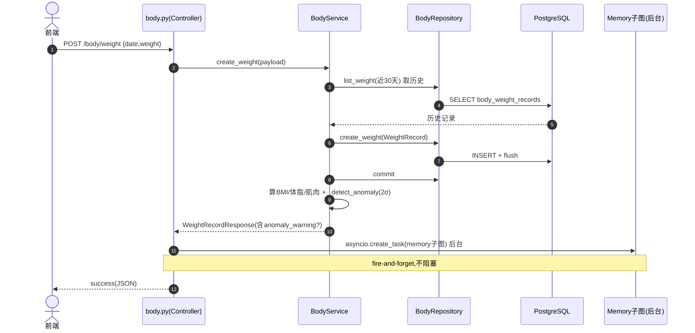
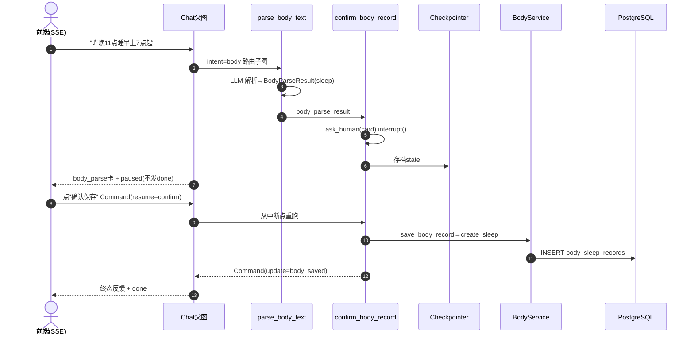

# Body 身体数据模块 · 深度分析

> 基于 PROJECT_MAP，对 **Body（身体数据）模块** 的单模块深度分析。
> 所有结论基于 `health-agent/backend/` 真实代码，推断内容已标注【推断】。分析模板见 `2.md`。

**一句话定位**：Body 模块管理用户六类身体数据（体重/围度/睡眠/运动/饮水/排便）的记录与趋势统计，提供两条入口——标准 REST CRUD（前端表单）和对话式 NLP 录入（Chat 的 body 子图）。它是 PROJECT_MAP 标注的 ★★★☆☆ 中等模块，业务以结构化 CRUD + 派生计算为主，仅 NLP 解析环节用 LLM。

---

## 一、模块职责

### 1.1 解决什么问题
1. **多维身体数据记录**：体重、围度、睡眠、运动、饮水、排便六类数据的增删改查。
2. **派生指标计算**：BMI、体脂率估算、肌肉率估算、运动卡路里、睡眠时长——用户只填原始数据，系统算出衍生指标。
3. **趋势与异常**：按时间段聚合趋势（7/30/90/365 天），统计 min/max/avg/变化量；体重/围度录入时做异常检测（偏离近 30 天均值 2σ 提示确认）。
4. **对话式录入**：用户说"我昨晚 11 点睡的早上 7 点起"，由 body 子图 NLP 解析成结构化睡眠记录。

### 1.2 系统位置
```
前端表单 ──REST──┐
                 ├─▶ 【BodyService】─▶ BodyRepository ─▶ 6 张 body_* 表
Chat body子图 ───┘         │
（NLP 录入）               └─(创建/更新后) 后台异步 ─▶ Memory 子图
                          ▲
                          └─ HealthProfile（身高/目标体重/性别/生日）注入 → 算 BMI/体脂
```
属于**核心数据层**，是计划完成率计算、建议生成的数据来源之一（PROJECT_MAP：Body 被 Plan 依赖做合规计算）。

### 1.3 上下游

| 方向 | 对象 | 关系 |
|------|------|------|
| 上游（REST） | 前端表单 | `/body/*` 全套 CRUD + 聚合查询 |
| 上游（对话） | Chat 父图的 body 子图 | NLP 解析后调 `BodyService` 落库 |
| 下游 | `BodyRepository` → PostgreSQL | 6 张 body_* 表读写 |
| 下游（异步） | Memory 子图 | 创建/更新后 fire-and-forget 提取记忆 |
| 依赖输入 | HealthProfile（身高/目标体重/性别/生日） | 构造 `BodyService` 时注入，用于派生计算 |
| 被依赖 | Plan（合规/完成率）、Suggestion（数据源） | 运动记录带 plan_id/sub_plan_id/task_id/source 反向关联（`plan_check_in_task.py` 写 source=plan_task） |

---

## 二、功能清单

### 2.1 数据记录功能（六类 × CRUD）

| 数据类型 | 创建 | 查询 | 更新 | 删除 | 特殊语义 |
|---------|------|------|------|------|---------|
| 体重 weight | ✓ | ✓分页 | ✓ | ✓软删 | 创建/更新触发异常检测 + BMI/体脂/肌肉派生 |
| 围度 measurement | ✓ | ✓分页 | ✓ | ✓软删 | 腰/臀/腿/臂四项，至少填一项；异常检测 |
| 睡眠 sleep | ✓ | ✓分页 | ✓ | ✓软删 | 自动算 duration（跨午夜处理） |
| 运动 exercise | ✓ | ✓分页 | ✓ | ✓软删 | 未填卡路里则按 MET 公式估算；可关联计划任务 |
| 饮水 water | ✓ | ✓分页 | ✓ | ✓软删 | **按日累加/覆盖**（append/replace），每日唯一 |
| 排便 bowel | ✓ | ✓分页 | ✓ | ✓软删 | 状态分类 + 时间 |

### 2.2 聚合与趋势功能

| 功能 | 方法 | 目的 | 业务价值 |
|------|------|------|---------|
| 当日聚合 | `get_today_records(date)` | 取指定日各类型最新一条 | 首页"今日概览" |
| 最新聚合 | `get_latest()` | 取各类型全局最新一条 | 无日期约束的概览 |
| 趋势查询 | `get_trends(type, period, metric)` | 按时间段出数据点 + 统计 | 体重曲线、运动趋势图；年度按周平均降采样 |

### 2.3 派生计算能力（`BodyService` 内）

| 计算 | 方法 | 说明 |
|------|------|------|
| BMI | `calculate_bmi` | 需身高；体重/(身高m²) |
| BMI 分类 | `calculate_bmi_category` | 偏瘦/正常/超重/肥胖 |
| 体脂率估算 | `calculate_body_fat_rate` | Deurenberg 公式：需 BMI+年龄+性别 |
| 肌肉率估算 | `calculate_muscle_rate` | V1 fallback 估算 |
| 运动卡路里 | `calculate_exercise_calories` | MET × 体重 × 时长 |
| 睡眠时长 | `calculate_sleep_duration` | 跨午夜自动 +24h |
| 异常检测 | `_detect_anomaly` | 偏离近 30 天均值 2σ（样本≥5）提示 |

### 2.4 输入校验（Schema 层，`schemas/body.py`）
- **统一禁止未来日期**：`BodyCreateBase` + 各 Update 的 `model_validator` 校验 `date <= today`，超出抛 `ValueError("日期不能是未来日期")`。
- **字段范围**：体重 30~300kg、体脂 3~70%、肌肉 10~80%、围度腰/臀 30~200cm·腿 10~100·臂 10~80cm、运动时长 1~600 分钟、饮水单次 1~5000ml、睡眠/排便时间 `HH:mm` 正则。
- **饮水 operation 字段**：`WaterRecordCreate.operation` ∈ {append（默认，累加当日）, replace（覆盖当日）}；`BodyParseResult.operation` 对话路径同义（water 默认 append，其余类型恒 replace）。
- **围度至少一项**：`MeasurementRecordCreate` 校验 waist/hip/thigh/arm 不能全空。

### 2.4 功能边界（不做什么）
- **CRUD/计算不调 LLM**：`BodyService` 注释明确"纯业务层，不做 LLM 调用"。LLM 只在 body 子图的 `parse_body_text` 节点。
- **派生值标注来源**：体脂/肌肉率响应带 `*_source`（manual/estimated），区分用户填的还是系统估的。

---

## 三、代码结构分析

| Java 概念 | 本模块对应 | 文件 | 职责 |
|-----------|-----------|------|------|
| Controller | API 路由 | `app/api/v1/body.py` | 26 个端点；CRUD 后调度后台记忆提取 |
| DTO/VO | Pydantic Schema | `app/schemas/body.py` | 六类 Create/Update/Response + 趋势/聚合 |
| Service | 业务服务 | `app/services/body_service.py` | CRUD + 派生计算 + 趋势 + 异常检测（**无 LLM**） |
| DAO/Repository | 仓储 | `app/db/repositories/body_repo.py` | 6 类 × (create/get/list/count/latest/softdelete)，强制 user_id 隔离 |
| Entity | ORM 模型 | `app/db/models/body.py` | 6 张 body_* 表 |
| —（特有 Agent）| body 子图 | `app/agents/body/{subgraph,nodes}.py` | NLP 解析 + interrupt 确认落库 |
| —（特有 Prompt）| 解析 prompt | `app/agents/prompts/body_parse.py` | 身体数据解析提示词 |
| Consumer/MQ | **无** | — | 异步用 `asyncio.create_task` |
| Scheduler | **无** | — | 无定时任务 |

### 各层要点
- **Controller**（`body.py`）：26 个端点（6类×CRUD + 3个聚合）。写操作（create/update）后用 `_schedule_body_memory_extract` fire-and-forget 触发 Memory 子图，`_BACKGROUND_TASKS` set 持引用防 GC。注意：**删除不触发记忆提取**。
- **Service**（`body_service.py`）：最厚的一层。CRUD 之外承载全部派生计算（BMI/体脂/肌肉/卡路里/时长）、趋势聚合（`_trend_points` + `_weekly_average` 年度降采样）、异常检测（`_detect_anomaly` 2σ）。
- **Repository**（`body_repo.py`）：构造绑定 user_id；每类数据有私有 `_xxx_stmt()` 生成带 `user_id == self.user_id` + `deleted_at IS NULL` 的基础查询；`list_*` 支持日期范围 + 分页 + 升降序。
- **Agent**（body 子图）：极简两节点 `parse_body_text → confirm_body_record`，后者用 interrupt 出确认卡，确认后**节点内直接调 BodyService 落库**。

---

## 四、接口清单

> `router = APIRouter(prefix="/body")`，全部需 `CurrentUserWithProfileDep`（带健康档案，用于派生计算）。实际路径含全局前缀（通常 `/api/v1`）。

### 4.1 聚合/趋势（3个）

| 接口 | 路径 | 方式 | 说明 |
|------|------|------|------|
| 当日聚合 | `/body/today?date=` | GET | 指定日各类型最新一条 |
| 最新聚合 | `/body/latest` | GET | 各类型全局最新 |
| 趋势 | `/body/trends?type=&period=&metric=` | GET | 趋势点+统计；period 默认30天 |

### 4.2 六类数据 CRUD（每类 4 个，共 24 个）

| 类型 | 创建 POST | 列表 GET | 更新 PUT | 删除 DELETE |
|------|----------|----------|----------|-------------|
| 体重 | `/body/weight` | `/body/weight` | `/body/weight/{id}` | `/body/weight/{id}` |
| 围度 | `/body/measurement` | `/body/measurement` | `/body/measurement/{id}` | `/body/measurement/{id}` |
| 睡眠 | `/body/sleep` | `/body/sleep` | `/body/sleep/{id}` | `/body/sleep/{id}` |
| 运动 | `/body/exercise` | `/body/exercise` | `/body/exercise/{id}` | `/body/exercise/{id}` |
| 饮水 | `/body/water` | `/body/water` | `/body/water/{id}` | `/body/water/{id}` |
| 排便 | `/body/bowel` | `/body/bowel` | `/body/bowel/{id}` | `/body/bowel/{id}` |

- 列表查询统一支持 `start_date`/`end_date`/`page`(≥1)/`page_size`(1~50)。
- 创建返回 201；更新/删除返回 200。
- **饮水 POST 特殊**：按日期累加（append）或覆盖（replace），不是每次新建。

---

## 五、Agent 分析（body 子图）

> Body 模块的对话录入路径是一个 LangGraph 子图，作为 Chat 父图 `intent=="body"` 时的一个 node 挂载。**REST CRUD 路径不涉及 Agent**。

### 5.1 Graph
`build_body_subgraph()`（`subgraph.py`）：极简两节点线性图。
```
set_entry_point → parse_body_text → confirm_body_record → END
```
比 diet 子图简单（无单位标准化/营养计算/餐次推断）。

### 5.2 Node

| 节点 | 类型 | 输入(读 ChatState) | 输出 | 职责 |
|------|------|-------------------|------|------|
| `parse_body_text` | async | body_input_text / user_message | body_parse_result | LLM 结构化输出 `BodyParseResult`（**仅 4 类：water/sleep/exercise/bowel**），失败抛 `BusinessRuleException` |
| `confirm_body_record` | async, 返回 Command | body_parse_result, interaction_mode, body_service | body_saved / body_cancelled | interrupt 出确认卡 → confirm 落库 / cancel 不落库 |

> **重要：对话录入只支持 4 类身体数据**。`BodyParseResult`（`schemas/body.py`）只覆盖 water/sleep/exercise/bowel；**weight（体重）/measurement（围度）不接对话录入**（首页无对应卡片，见 prompt 注释）。这两类只能走 REST 表单。所以"双入口"对 weight/measurement 实际只有 REST 一条路。

### 5.3 State
复用全局 `ChatState`（与 diet/chat 共享），用 `body_` 前缀字段：`body_input_text`、`body_date`、`body_parse_result`、`body_saved`、`body_cancelled`、`body_service`。

### 5.4 Tool / Memory / Conditional Edge
- **Tool**：无独立 tool；`confirm_body_record` 内直接调 `BodyService.create_*`。
- **Memory（已核对源码，纠正早前推断）**：**对话路径完全不触发记忆**。body 子图只有 `parse_body_text → confirm_body_record` 两节点，无 trigger_memory 节点；且 Chat 父图把 `body → wrap_response → END`，**绕过**了 general 路径上的 `trigger_memory_extract`（该节点仅在 general 链路 `call_llm` 之后）。对比：diet 子图**有** `trigger_memory` 节点，REST 路径**有** `_schedule_body_memory_extract`——唯独"对话录入身体数据"不产生记忆。
- **Conditional Edge**：本子图无条件边（线性）；分支逻辑藏在 `confirm_body_record` 返回的 `Command(goto="__end__", update=...)`。

### 5.5 interrupt 机制
`confirm_body_record` 调 `ask_human(HumanPrompt(kind="card", domain="body", card=...))` 暂停 graph 出确认卡；`interrupt()` 之前无副作用（满足"恢复时整段重跑"幂等要求），落库放在 confirm 之后。学习模式下卡片附带 `_body_knowledge_text` 健康讲解。

---

## 六、完整执行流程

> 模板链路含 Redis/MySQL/MQ，本项目实际：无 Redis、用 PostgreSQL、无 MQ（asyncio 后台任务）。

### 6.1 链路 A：REST 创建体重（`POST /body/weight`）

```
Step1 User→Controller: POST /body/weight {date, weight:70.2}
Step2 Controller(body.py): JWT鉴权(带profile) → 注入 BodyService(含height/target/gender/birth)
Step3 Controller→Service.create_weight(payload)
Step4 Service: _weight_history(date) 取近30天历史（算异常用）
Step5 Service→Repo.create_weight(WeightRecord) → session.add+flush → commit
Step6 Service: _weight_response 组装 → 算 BMI/体脂/肌肉(派生) + _detect_anomaly(2σ)
Step7 Controller: _schedule_body_memory_extract → asyncio后台跑 Memory 子图(不阻塞)
Step8 Controller: success(JSON) 返回（含 anomaly_warning 若有）
```

### 6.2 链路 B：对话录入睡眠（Chat → body 子图）

```
Step1 用户在 Chat 说"昨晚11点睡早上7点起" → identify_intent=body → 路由 body 子图
Step2 parse_body_text: LLM 结构化输出 BodyParseResult(record_type=sleep, bed/wake)
Step3 confirm_body_record: ask_human(card) → interrupt() 暂停 → checkpointer 存档
Step4 前端收到 body_parse 确认卡 + paused（不发 done）
Step5 用户点"确认保存" → Command(resume={action:confirm}) → 节点从中断点重跑
Step6 confirm_body_record: card_action=confirm → _save_body_record → BodyService.create_sleep → 落库
Step7 Command(goto=__end__, update={body_saved:True}) → 回父图 wrap_response 出终态反馈
```

### 6.3 链路 C：趋势查询（`GET /body/trends?type=weight&period=30d`）

```
Step1 Controller→Service.get_trends(weight, 30d, None)
Step2 Service: start_date = today - 29天
Step3 _trend_points: Repo.list_weight(ascending=True, limit=500) → [TrendPoint]
Step4 (若 period=year) _weekly_average 按周降采样
Step5 _statistics: min/max/avg/latest/change
Step6 TrendResponse(data_points, statistics, target=目标体重) 返回
```

### 6.4 数据流向
```
[REST写] 前端 → body.py → BodyService(派生计算+异常) → BodyRepository → body_*表
                                                          → 后台 asyncio → Memory子图
[对话写] Chat → body子图(LLM解析+interrupt确认) → BodyService → BodyRepository → body_*表
[读] body.py → BodyService(聚合/趋势/统计) → BodyRepository → body_*表
```

---

## 七、Mermaid 时序图

### 7.1 REST 创建体重（含派生计算+异常+异步记忆）


### 7.2 对话录入身体数据（interrupt 确认）


### 7.3 阅读要点
- REST 路径：派生计算在 Service 响应组装阶段，异常检测需历史≥5 条样本。
- 记忆提取只在 **create/update** 触发，delete 不触发；且 fire-and-forget 失败静默。
- 对话路径：interrupt 暂停时 confirm_body_record 之前的 LLM 解析已完成并存档，恢复重跑时不会重复解析（state 已有 body_parse_result）。

---

## 八、数据库分析

### 8.1 涉及的表（6 张，全部 user_id 隔离 + 软删除）

| 表 | 模型 | 作用 | 关键字段 |
|----|------|------|---------|
| `body_weight_records` | WeightRecord | 体重 | weight, body_fat_rate?, muscle_rate? |
| `body_measurement_records` | MeasurementRecord | 围度 | waist?/hip?/thigh?/arm? |
| `body_sleep_records` | SleepRecord | 睡眠 | bed_time, wake_time, duration_minutes, quality |
| `body_exercise_records` | ExerciseRecord | 运动 | exercise_type, duration_minutes, calories, **plan_id/sub_plan_id/task_id/source** |
| `body_water_records` | WaterRecord | 饮水 | amount_ml, target_ml；**唯一约束(user_id,date)** |
| `body_bowel_records` | BowelRecord | 排便 | time, status |

### 8.2 表设计要点
- **统一基类**：6 张表均混入 `UUIDPrimaryKeyMixin`+`TimestampMixin`+`SoftDeleteMixin`，都有 `user_id`+`date`，并建 `idx_body_xxx_user_date` 复合索引（支撑按用户+日期范围查询）。
- **饮水唯一约束**：`uq_body_water_user_date` 保证每用户每天一条，配合"累加"语义（`get_water_by_date` 找不到才新建，否则累加/覆盖）。
- **运动表的计划关联**：`plan_id`/`sub_plan_id`/`task_id`/`source` 是 Body 与 Plan 模块的**衔接点**——计划任务可自动生成运动记录（source=plan_task），便于反向追溯与幂等去重（PROJECT_MAP 提到 plan_check_in_task）。

### 8.3 表关系与数据流转
- 6 张表**互相独立、无外键**，靠 user_id 逻辑聚合。
- 运动表通过 plan_id/task_id **逻辑关联** Plan 模块（无 DB 外键）。
- **写入**：Service create/update，flush 后 commit。
- **软删除**：`soft_delete` 置 `deleted_at`，所有查询带 `deleted_at IS NULL` 过滤。
- 与模板 MySQL 差异：用 PostgreSQL，UUID 主键，`Time`/`Date` 类型；无 JSONB（本模块字段都结构化）。

---

## 十一、异常处理分析

### 11.1 异常捕获

| 位置 | 异常 | 处理 |
|------|------|------|
| update/delete 找不到记录 | `NotFoundException(BODY_RECORD_NOT_FOUND)` | — |
| 围度更新全空 | `ValidationException(BODY_MEASUREMENT_EMPTY)` | 至少一项 |
| `parse_body_text` LLM 失败 | `BusinessRuleException(BODY_PARSE_FAILED)` | 对话解析失败 |
| `_save_body_record` 缺必填 | `ValidationException(BODY_SAVE_INVALID)` | 如缺饮水量/睡眠时间 |
| 后台记忆提取失败 | `_schedule_body_memory_extract` try/except 静默 return | 不影响主 CRUD 响应 |

### 11.2 异常检测（业务特色，非异常处理）
`_detect_anomaly`：录入体重/围度时，与近 30 天历史比对，样本≥5 且偏离均值 >2σ 时返回 `anomaly_warning` 文案（不报错，仅提示用户确认）。这是**数据质量防护**，避免误录（如把 70kg 输成 700kg）。

### 11.3 重试 / 补偿 / 幂等

| 维度 | 情况 |
|------|------|
| 重试 | 无显式重试 |
| 补偿 | 无事务补偿（单表 CRUD） |
| 幂等 | 删除幂等（找不到记录静默返回，不报错）；饮水 append 非幂等但有 replace 语义供更正；对话 interrupt 落库放 confirm 后避免重跑重复写；运动表 plan_id/task_id 用于计划任务生成记录的幂等去重（`plan_compliance_service.py` 据 source=plan_task 计数） |

---

## 十二、项目亮点

### 技术亮点
1. **派生指标体系 + 来源标注**：BMI/体脂(Deurenberg公式)/肌肉率/卡路里(MET)/睡眠时长全自动算，且响应带 `*_source`(manual/estimated)，前端可区分展示，数据可信度透明。
2. **2σ 异常检测**：基于近 30 天历史均值标准差的统计学防误录，样本不足(<5)时不误报。
3. **年度趋势降采样**：`_weekly_average` 把 365 天数据按周聚合，避免前端渲染过多点。
4. **饮水累加语义**：`get_water_by_date` + append/replace + 唯一约束，符合"一天多次喝水"的真实场景。
5. **跨午夜睡眠计算**：`calculate_sleep_duration` 自动 +24h 处理"23点睡7点起"。

### 架构亮点
1. **双入口统一 Service**：REST 表单和对话 NLP 两条路径最终都汇到 `BodyService`，业务逻辑不重复。
2. **CRUD 与 LLM 解耦**：Service 纯结构化、零 LLM；LLM 只在 body 子图解析环节，边界清晰。
3. **Body↔Plan 衔接预留**：运动表的 plan_id/task_id/source 字段为"计划自动生成运动记录"留好了挂钩。
4. **写后异步记忆**：CRUD 不被记忆提取阻塞，体验流畅。

### 性能 / 可扩展性
- **复合索引**：(user_id,date) 直接支撑日期范围查询。
- **趋势查询 limit 500**：防止超大范围拉爆。
- **page_size 夹紧 ≤50**。
- **可扩展**：新增身体数据类型 = 加表+加 Service 方法+加路由，模式高度一致（六类已是模板化结构）。

---

## 十三、面试讲解版

### 3 分钟版
> Body 模块管理用户六类身体数据：体重、围度、睡眠、运动、饮水、排便。它有两条录入入口——前端表单走标准 REST CRUD，自然语言走 Chat 的 body 子图，两条路最终都汇到同一个 `BodyService`，逻辑不重复。

它最有价值的不是 CRUD，而是**派生计算和数据质量防护**。用户只填原始数据，系统自动算 BMI、用 Deurenberg 公式估体脂、按 MET 公式算运动卡路里、处理跨午夜的睡眠时长。录体重/围度时还做 2σ 异常检测——和近 30 天均值比，偏离太大就提示"是不是录错了"。

读侧提供当日聚合、最新聚合、趋势查询三种视图，趋势支持 7/30/90/365 天，年度数据按周降采样避免前端渲染压力。

工程上 CRUD 不碰 LLM（纯结构化），LLM 只在对话子图的解析环节；写操作后用 asyncio 后台 fire-and-forget 触发记忆提取，不阻塞响应。运动表还预留了 plan_id/task_id 字段，和计划模块衔接——计划任务能自动生成运动打卡记录。

### 10 分钟版（要点提纲）
1. **定位**：六类身体数据的记录+趋势+派生计算，★★★☆☆，CRUD 为主、仅解析用 LLM。
2. **双入口**：REST(表单) + 对话(body子图 NLP)，统一汇到 BodyService。
3. **六类数据**：weight/measurement/sleep/exercise/water/bowel，每类 CRUD + 三个聚合接口，共 26 端点。
4. **派生计算**：BMI、体脂(Deurenberg)、肌肉率、卡路里(MET)、睡眠时长(跨午夜)，响应带 manual/estimated 来源。
5. **数据质量**：2σ 异常检测（样本≥5），饮水累加/覆盖语义+每日唯一约束。
6. **趋势**：7/30/90/365天，min/max/avg/change统计，年度按周降采样。
7. **Agent**：body子图极简两节点(parse→confirm)，interrupt出确认卡，确认后节点内直接落库。
8. **数据层**：6张表统一 user_id隔离+软删+(user_id,date)索引；运动表 plan_id/task_id 衔接 Plan。
9. **异步记忆**：create/update后台触发Memory（delete不触发），失败静默。
10. **技术栈**：PostgreSQL（非MySQL）、无Redis、无MQ（asyncio）。

---

## 十四、新人阅读路线（只看 20% 代码）

### 必读 4 文件（按优先级）

| 优先级 | 文件 | 为什么优先 |
|--------|------|-----------|
| ① | `app/services/body_service.py` | **核心**。CRUD + 全部派生计算 + 趋势 + 异常检测，读懂它就懂了模块 80% |
| ② | `app/db/models/body.py` | **数据契约**。6张表结构，尤其运动表的 plan 关联字段，~115行 |
| ③ | `app/api/v1/body.py` | **入口全景**。26个端点的模式 + 写后异步记忆调度 |
| ④ | `app/db/repositories/body_repo.py` | **数据访问**。user_id 隔离 + 日期范围查询模式（六类高度对称，看一类即可） |

### 可延后
- `app/agents/body/nodes.py` + `subgraph.py`（想看对话录入路径时，很简单）
- `app/schemas/body.py`（当字段参考手册）
- `app/agents/prompts/body_parse.py`（想调解析 prompt 时）

### 阅读心法
1. **抓住"派生计算"主线**：用户填什么、系统算什么、来源怎么标，这是模块价值核心。
2. **六类对称，看一类懂全部**：weight 是最完整的样板（含异常检测+派生），吃透它，其余五类照葫芦画瓢。
3. **记住两条入口**：REST 表单 vs 对话子图，最终都到 BodyService。
4. **三个"不是"**：CRUD 不是 LLM、不是 MySQL（PostgreSQL）、异步不是 MQ（asyncio）。

---

## 十五、带我读代码的流程

> 所有路径真实存在于 `health-agent/backend/`。

### 15.1 有序阅读清单（从外到内）

| 顺序 | 文件 | 角色 | 排序理由 |
|------|------|------|---------|
| 1 | `app/api/v1/body.py` | Controller | 入口，看 26 端点结构 + 写后记忆调度 |
| 2 | `app/schemas/body.py` | Schema | 看六类 Create/Update/Response + 趋势/聚合契约 |
| 3 | `app/services/body_service.py` | Service | **核心**，CRUD+派生+趋势+异常 |
| 4 | `app/db/models/body.py` | Model | 看 6 张表结构 |
| 5 | `app/db/repositories/body_repo.py` | Repository | 看 user_id 隔离 + 日期范围查询 |
| 6 | `app/agents/body/subgraph.py` | Graph 装配 | 看对话子图拓扑（两节点） |
| 7 | `app/agents/body/nodes.py` | Node 实现 | 看 NLP 解析 + interrupt 确认落库 |
| 8 | `app/agents/prompts/body_parse.py` | Prompt | 看身体数据怎么被解析 |

### 15.2 分阶段阅读

**阶段 1：跑通 REST CRUD 主链路（文件 1~5）**
目标：搞清"一条体重记录怎么进库、派生指标怎么算出来"。
读完应能回答：
- [ ] 创建体重后，BMI/体脂/肌肉率分别怎么来的？哪些需要 HealthProfile？
- [ ] `*_source`(manual/estimated) 是什么意思？
- [ ] 2σ 异常检测在什么条件下才触发？
- [ ] 饮水的"累加 vs 覆盖"语义怎么实现？为什么要每日唯一约束？
- [ ] Repository 怎么保证查不到别人的数据？
- [ ] 趋势查询年度数据为什么要按周降采样？

**阶段 2：看对话录入路径（文件 6~8）**
目标：搞懂自然语言怎么变成结构化身体数据并落库。
读完应能回答：
- [ ] body 子图有几个节点？比 diet 子图简单在哪？
- [ ] `confirm_body_record` 怎么用 interrupt 出确认卡？confirm/cancel 分别怎么处理？
- [ ] 为什么 interrupt 之前不能落库？
- [ ] 对话录入和 REST 录入最终是不是同一个 Service？

### 15.3 每个文件"重点看什么"

| 文件 | 重点看 | 可略过 |
|------|--------|--------|
| `body.py` | `_schedule_body_memory_extract`、create/update 后的调度、饮水POST注释 | 每个端点重复的 list 样板 |
| `schemas/body.py` | WeightRecordResponse 的派生字段、WaterRecordCreate 的 operation | 全部枚举值 |
| `body_service.py` | `create_weight`(异常检测)、`_weight_response`(派生)、`calculate_*` 系列、`get_trends`+`_weekly_average` | `_xxx_response` 的字段搬运 |
| `models/body.py` | 运动表 plan_id/task_id/source、饮水唯一约束、统一索引 | Mixin 内部 |
| `body_repo.py` | `_weight_stmt` 的 user_id+deleted_at 过滤、`list_weight` 的日期范围+排序 | 其余五类对称代码 |
| `body/subgraph.py` | 两节点线性流 | cast 类型转换 |
| `body/nodes.py` | `confirm_body_record` 的 ask_human + Command + 落库时机 | `_body_knowledge_text` 文案 |
| `prompts/body_parse.py` | BodyParseResult 要求模型输出哪些字段 | prompt 措辞 |

### 15.4 最短验证路径（用一个真实请求串起来）

**追踪**：`POST /body/weight {date:"2026-06-15", weight:70.2}`

```
1. body.py:create_weight                      ← 请求进入(JWT+profile注入)
2.   body_service.py:create_weight(payload)    ← Service入口
3.     body_service.py:_weight_history(date)   ← 取近30天历史(异常检测用)
4.       body_repo.py:list_weight              ← SELECT body_weight_records(user_id隔离)
5.     body_repo.py:create_weight(WeightRecord) ← INSERT+flush
6.     body_repo.py:session.commit
7.   body_service.py:_weight_response          ← 组装响应
8.     calculate_bmi / calculate_body_fat_rate / calculate_muscle_rate ← 派生
9.     _detect_anomaly(weight, history)        ← 2σ异常检测
10. body.py:_schedule_body_memory_extract      ← asyncio后台跑Memory子图
11. body.py:success(JSON)                       ← 返回(含anomaly_warning?)
```

跟完这 11 步，Controller→Service→Repository→派生计算→异步记忆全链路就通了。

**进阶**：再追对话录入（Chat body 子图），对比它怎么用 LLM 解析 + interrupt 确认，最终调的还是同一个 `BodyService.create_*`。

### 15.5 可以暂时跳过

| 跳过项 | 原因 |
|--------|------|
| `body.py` 里六类重复的 list/delete 端点 | 看懂 weight 一套即可，其余对称 |
| `body_repo.py` 里 measurement/sleep/exercise/water/bowel 的 stmt | 与 weight 完全对称 |
| `_body_knowledge_text`（nodes.py） | 学习模式文案，主链路不依赖 |
| `calculate_muscle_rate` 的 V1 fallback 公式细节 | 知道是估算值即可 |
| Memory 子图内部 | 属于 Memory 模块，知道"被后台触发"即可 |
