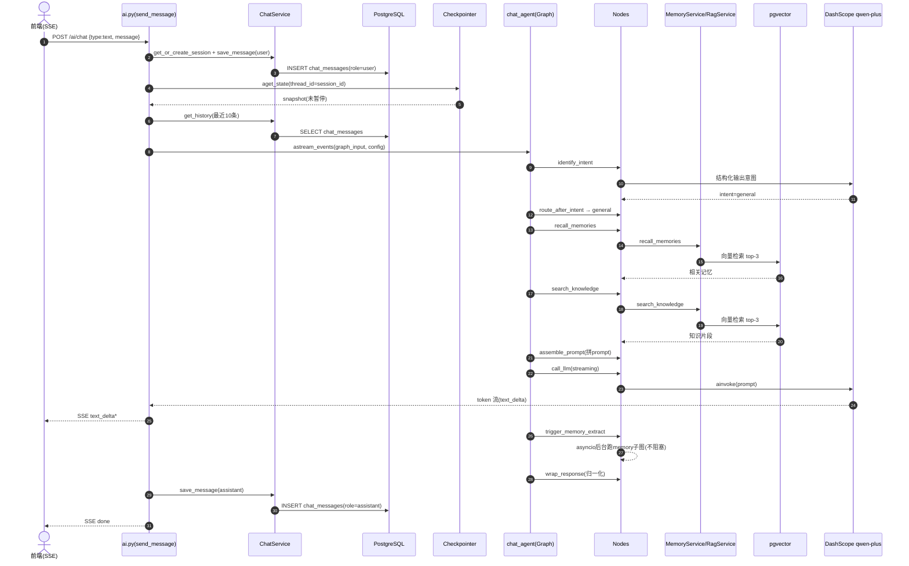
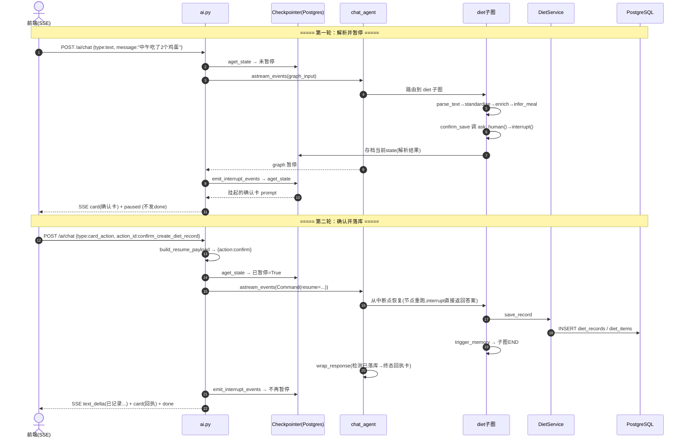

# Chat（对话）模块深度分析

> 基于 PROJECT_MAP 的单模块深度分析。所有结论基于 `health-agent/backend/` 真实代码，推断内容已标注【推断】。
> 分析模板见 `2.md`。

## 关键技术栈澄清（务必先记住）

| 模板假设 | 本项目实际 |
|---------|-----------|
| Redis（缓存中断态） | **Postgres checkpointer**（无 Redis） |
| MySQL | **PostgreSQL + pgvector**（无 MySQL） |
| MQ（消息队列） | **asyncio.create_task**（进程内后台，无 MQ） |
| 一次性 JSON 响应 | **SSE 流式**（text/event-stream） |
| LLM | **通义千问 qwen-plus**（DashScope OpenAI 兼容） |

---

# 一、模块职责

> 基于：`app/api/v1/ai.py`、`app/agents/chat/graph.py`、`app/agents/chat/nodes.py`、`app/services/chat_service.py`

## 1.1 该模块解决什么问题

Chat 模块是整个健康管家产品的**唯一对话入口**。它解决三件事：

1. **统一入口**：用户所有自然语言输入（"我中午吃了两个鸡蛋"、"我体重 70kg"、"帮我定个减脂计划"、"高蛋白饮食有什么好处"）都从同一个 SSE 端点 `POST /ai/chat` 进来。
2. **意图分发**：通过 `identify_intent` 节点判断这句话属于哪个领域（diet/body/plan/general），再路由到对应的子图或通用对话链路。它本身**不实现**饮食/身体/计划的业务逻辑，而是把请求"派单"出去。
3. **通用对话 + 记忆驱动**：对于无法归类到具体领域的消息（闲聊、健康知识问答），Chat 模块自己用"召回记忆 + 检索知识 + 组装 prompt + 调用 LLM"的链路生成个性化回复，并在回复后**后台异步**触发记忆提取。

## 1.2 处于整个系统什么位置

```
前端 ──SSE──▶ 【Chat 模块 = AI 总闸】──┬─▶ diet subgraph（饮食）
                                      ├─▶ body subgraph（身体数据）
                                      ├─▶ plan subgraph（计划）
                                      └─▶ general 链路（通用对话）──▶ 后台 memory subgraph
```

Chat 模块在系统中是**编排层（orchestration）**，位于 API 层与各领域子图之间。它是 PROJECT_MAP 中标注的 ★★★★★ 最核心、最复杂模块，因为：
- 它是 LangGraph 父图（parent graph），其它领域子图都作为它的一个 node 挂载；
- 它承载了 SSE 流式协议、interrupt 暂停/恢复、checkpointer 存档等全部"AI 交互基础设施"。

## 1.3 上下游是谁

| 方向 | 对象 | 关系 |
|------|------|------|
| 上游（调用方） | 前端 Web（SSE 客户端） | 通过 `POST /ai/chat` 发起流式请求 |
| 上游（依赖注入） | `app/dependencies.py` | 注入 chat_agent 单例、各 Service |
| 下游（领域子图） | diet / body / plan subgraph | 作为 graph node 被路由调用 |
| 下游（基础能力） | MemoryService、RagService | 召回记忆、检索知识 |
| 下游（持久化） | ChatService → ChatRepository → `chat_messages` 表 | 存对话消息 |
| 下游（存档） | checkpointer（Postgres / 内存） | 存 graph 中断态，支持暂停/恢复 |
| 下游（LLM） | `get_chat_model` → DashScope qwen-plus | 意图识别 + 通用回复生成 |
| 旁路（异步） | memory subgraph | 回复后 fire-and-forget 提取记忆 |

## 1.4 一句话总结

**Chat 模块 = LangGraph 父图 + SSE 流式协议 + 意图路由器 + 通用对话链路**，它是产品所有 AI 能力的总入口和编排中枢，自己只做"识别意图 → 派单 → 通用兜底对话"，把领域逻辑交给子图。

---

# 二、功能清单

> 基于：`app/api/v1/ai.py`、`app/agents/chat/nodes.py`、`app/agents/chat/graph.py`

## 2.1 对外功能（HTTP 端点级）

| # | 功能 | 入口 | 功能目的 | 业务价值 |
|---|------|------|---------|---------|
| 1 | **流式对话** | `POST /ai/chat` | 接收用户文本/卡片操作/选项回应，流式（SSE）返回 AI 回复 | 产品核心交互，所有 NLP 能力的总入口 |
| 2 | **查询会话中断态** | `GET /ai/chat/sessions/{id}/state` | 返回会话是否处于"等待用户作答"的暂停态及挂起的 prompt | 前端刷新/重连后恢复"待确认卡片"UI |
| 3 | **查询历史消息** | `GET /ai/chat/history` | 分页返回某会话的消息时间线（含卡片） | 用户回看历史对话与历史卡片 |
| 4 | **删除会话** | `DELETE /ai/chat/sessions/{id}` | 软删除会话内所有消息（幂等） | 用户清理对话记录 |

## 2.2 内部功能（graph 节点级）

| 节点 | 功能 | 目的 |
|------|------|------|
| `identify_intent` | 意图识别 | LLM 结构化输出判定 intent，失败回退关键词规则 |
| `route_after_intent` | 条件路由 | 按 intent 决定走 diet/body/plan 子图还是 general 链路 |
| `recall_memories` | 召回记忆 | 通用对话前从 MemoryService 取 top-k 相关记忆 |
| `search_knowledge` | 检索知识 | 从 RagService 取 top-k 健康知识片段 |
| `assemble_prompt` | 组装 prompt | 把记忆+知识+历史+交互模式拼成最终 prompt messages |
| `call_llm` | 生成回复 | 流式调用 qwen-plus 生成通用对话文本 |
| `trigger_memory_extract` | 触发记忆提取 | fire-and-forget 后台跑 memory 子图，不阻塞主流 |
| `wrap_response` | 归一化输出 | 把各分支结果统一成 `ai_response` + `response_cards` |

## 2.3 三种入口类型（`type` 字段）

| type | 含义 | 处理方式 |
|------|------|---------|
| `text` | 普通文本消息 | 走"新一轮"完整 graph |
| `choice_response` | 用户回应了 AI 的选项澄清（如选餐次 chip） | 走"恢复"通道，`Command(resume=...)` 从中断点继续 |
| `card_action` | 用户点击卡片按钮（如"确认保存"） | 走"恢复"通道，把按钮动作映射成 confirm/edit/cancel/accept/revise |

## 2.4 三种交互模式（影响回复风格）

由 `user_service.get_interaction_mode()` 取得，注入 state 影响 system prompt：

| 模式 | 行为 | 业务价值 |
|------|------|---------|
| `efficiency`（效率） | 回复精简、直接给结论、记录类操作直接落库不追问 | 老用户快速记录 |
| `confirmation`（确认） | 回复简洁、记录类操作出确认卡 | 默认模式，安全可控 |
| `learning`（学习） | 结论 + 简短健康知识讲解（流式 narrate） | 新用户边记录边学习 |

## 2.5 功能边界（Chat 模块不做什么）

- **不做领域业务**：饮食解析、营养计算、计划展开等在各自子图里，Chat 只路由。
- **不直接调 LLM 做领域任务**：领域 LLM 调用在子图节点内。
- **不存中断态**：中断态由 checkpointer 存，Chat 只读快照判断是否暂停。
- **不做认证**：JWT 校验在依赖 `CurrentUserWithProfileDep` 中完成（Supabase Auth）。

---

# 三、代码结构分析

> 本项目是 Python/FastAPI + LangGraph，没有传统 Java 的 Manager/Consumer/Producer/Scheduler 概念。下面用 Java 分层做类比，并标注本模块**实际有/没有**对应角色。

## 3.1 分层映射总览

| Java 概念 | 本模块对应 | 文件 | 职责 |
|-----------|-----------|------|------|
| Controller | API 路由 | `app/api/v1/ai.py` | 接收 SSE 请求、判断暂停/恢复、组装 graph 输入、包装 SSE 输出 |
| DTO/VO | Pydantic Schema | `app/schemas/chat.py`、`app/streaming/events.py` | 请求/响应/SSE 事件的数据契约 |
| Service | 业务服务 | `app/services/chat_service.py` | 会话与消息 CRUD（**无 LLM**） |
| —（特有）| Agent 编排 | `app/agents/chat/{graph,nodes,state,tools}.py` | LangGraph 父图：意图路由 + 通用对话链路 |
| DAO/Repository | 仓储 | `app/db/repositories/chat_repo.py` | 强制 user_id 隔离的消息读写 |
| Entity | ORM 模型 | `app/db/models/chat.py` | `chat_messages` 表映射 |
| Consumer/Producer | **无 MQ** | — | 异步用 `asyncio.create_task`，非消息队列 |
| Scheduler | **无定时任务** | — | 无 cron/定时调度 |

## 3.2 Controller 层 — `app/api/v1/ai.py`

注册前缀 `/ai`，4 个端点。核心是 `POST /ai/chat`（`send_message`），它做了 6 件事：

1. `_resolve_input_message` 把三种 type 归一化成可持久化的用户文本；
2. `chat_service.get_or_create_session` + `save_message` 先落库用户消息；
3. `user_service.get_interaction_mode` 取交互模式；
4. **关键判断**：`chat_agent.aget_state` 取快照 → `snapshot_has_pending_interrupt` 判断是否暂停态 → 决定走 `Command(resume=...)`（恢复）还是 `_build_graph_input`（新一轮）；
5. `gen()` 异步生成器：先发 META，再 `translate_langgraph_events` 流式转发，最后 `emit_interrupt_events` 检查是否再次暂停；
6. 落库助手消息，未暂停则发 DONE。

辅助函数：
- `build_resume_payload`：把 card_action / choice_response 转成 `ask_human` 约定的答案 dict（含 action_id → confirm/edit/cancel/accept/revise 映射）；
- `_build_graph_input`：构造完整 graph 输入（user_id/message/history/profile 等）；
- `_build_configurable`：把各 Service 放进 `config.configurable`（**不进 checkpoint**，因不可序列化）。

## 3.3 Schema 层（DTO）

| 文件 | 关键类型 | 作用 |
|------|---------|------|
| `app/schemas/chat.py` | `ChatStreamRequest` | 入参，`type` 区分 text/card_action/choice_response |
| | `ChatCard` / `ChatCardAction` | 富卡片及按钮契约 |
| | `ChatMessageResponse` | 历史消息响应 |
| `app/streaming/events.py` | `StreamEvent` + `StreamEventType` | SSE 事件统一包装（meta/status/text_delta/card/choice/paused/done/error…）|

## 3.4 Service 层 — `app/services/chat_service.py`

`ChatService` 只做会话/消息 CRUD，**严格无 LLM 调用**（注释明确声明）。方法：`get_or_create_session`、`save_message`（写一条并 commit）、`get_history`（分页，page_size ≤ 50）、`delete_session`（软删）。用 `@log_all_service_methods` 统一日志。

## 3.5 Agent 编排层（本模块的"心脏"，Java 无对应）

| 文件 | 角色 | 内容 |
|------|------|------|
| `graph.py` | 图装配 | `build_chat_agent(checkpointer)`：声明 10 个 node + 条件边，compile 成图 |
| `state.py` | 共享状态 | `ChatState`（TypedDict），所有 node 读写的字段集合 |
| `nodes.py` | 节点实现 | 8 个节点函数 + IntentResult schema + 规则兜底 + 卡片构造 |
| `tools.py` | 工具封装 | `recall_memories_tool` / `search_knowledge_tool` 等对 Service 的薄封装 |
| `prompts/chat_system.py` | prompt 构造 | system prompt + 意图分类 prompt + 交互模式指令 |

## 3.6 Repository / Entity 层

- `chat_repo.py`：`ChatRepository(session, user_id)`，**构造时绑定 user_id**，所有查询都带 `user_id == self.user_id`（多租户隔离）+ `deleted_at IS NULL`（软删除过滤）。
- `chat.py`（model）：`ChatMessage` 表，混入 `UUIDPrimaryKeyMixin`/`TimestampMixin`/`SoftDeleteMixin`，`cards` 用 JSONB 存。

## 3.7 异步机制（替代 MQ/Scheduler）

本模块没有 MQ、没有 Scheduler。"异步解耦"靠 `trigger_memory_extract` 节点用 `asyncio.create_task` 把 memory 子图丢到后台跑（fire-and-forget），用模块级 `_BACKGROUND_TASKS` set 持有引用防 GC。这是**进程内后台任务**，不是跨进程消息队列。

---

# 四、接口清单

> 基于：`app/api/v1/ai.py`（`router = APIRouter(prefix="/ai", tags=["ai"])`）。实际对外路径还有全局前缀（通常 `/api/v1`），下表以模块内 prefix `/ai` 为准。

## 4.1 接口总表

| # | 接口名称 | 路径 | 请求方式 | 功能说明 |
|---|---------|------|---------|---------|
| 1 | 流式对话 | `/ai/chat` | POST | 核心 SSE 端点，接收文本/卡片操作/选项回应，流式返回 AI 回复；支持 interrupt 暂停/恢复 |
| 2 | 查询会话状态 | `/ai/chat/sessions/{session_id}/state` | GET | 返回会话是否处于中断态（paused/idle）及挂起的 prompt 列表 |
| 3 | 查询历史 | `/ai/chat/history` | GET | 分页返回消息时间线，支持 `session_id`/`page`/`page_size` query |
| 4 | 删除会话 | `/ai/chat/sessions/{session_id}` | DELETE | 软删除会话内全部消息，幂等 |

## 4.2 接口 1：`POST /ai/chat`（核心）

### 请求体 `ChatStreamRequest`

| 字段 | 类型 | 适用 type | 说明 |
|------|------|----------|------|
| `session_id` | str? | 全部 | 会话 ID，不传则新建 |
| `type` | text/card_action/choice_response | — | 入口类型，默认 text |
| `message` | str? | text | 用户文本 |
| `context` | ChatContext/dict? | text | 可带 `image_url`、`referenced_date` |
| `card_id` `action_id` `action_payload` | — | card_action | 卡片按钮信息 |
| `prompt_id` `selected_value` `free_text` | — | choice_response | 选项回应信息 |

### 响应：SSE 事件流（`text/event-stream`，事件类型见 `StreamEventType`）

| 事件 | 含义 |
|------|------|
| `meta` | 流开始，带 message_id/session_id/started_at |
| `status` | 节点切换状态文案（"正在识别意图..."） |
| `tool_call` / `tool_result` | 工具调用开始/结束 |
| `text_delta` | LLM 流式 token 增量 |
| `card` | 富卡片（如饮食解析结果） |
| `choice` | 请用户选择（chip + 可选自由文本） |
| `paused` | graph 被 interrupt 暂停，等待用户作答 |
| `done` | 流正常结束 |
| `error` | 流异常终止 |
| `heartbeat` | 保活心跳 |

> 暂停/恢复约定：收到 `paused` 后前端下一条输入要走"恢复"通道（type=choice_response/card_action 并带 prompt_id）；暂停态**不发 done**，前端据此进入 WAITING_INPUT。

## 4.3 接口 2/3/4

- **`GET /ai/chat/sessions/{id}/state`**：返回 `{session_id, status: paused|idle, prompts:[HumanPrompt]}`，用于前端刷新/重连后恢复待交互 UI。
- **`GET /ai/chat/history`**：Query `session_id`（空则取最近会话）、`page`（≥1）、`page_size`（1~50），返回分页消息列表。
- **`DELETE /ai/chat/sessions/{id}`**：软删除会话全部消息，幂等。

## 4.4 鉴权

接口 1 用 `CurrentUserWithProfileDep`（带健康档案的当前用户）；接口 2/3/4 用 `CurrentUserDep`。JWT 对接 Supabase Auth，后端只验签不发 token。

---

# 五、Agent 分析（LangGraph）

> 基于：`app/agents/chat/graph.py`、`state.py`、`nodes.py`、`tools.py`、`app/agents/interrupts.py`、`app/agents/checkpointer.py`

## 5.1 Graph（父图）

`build_chat_agent(checkpointer)` 构建唯一对外暴露的 `StateGraph(ChatState)`。

```
                    set_entry_point
                          │
                          ▼
                  ┌─────────────────┐
                  │ identify_intent │
                  └────────┬────────┘
                  route_after_intent (条件边)
        ┌────────┬─────────┼──────────────────────┐
   intent=diet  body      plan              general(其余)
        ▼        ▼         ▼                       ▼
   [diet 子图][body 子图][plan 子图]        recall_memories
        │        │         │                       ▼
        │        │         │                 search_knowledge
        │        │         │                       ▼
        │        │         │                 assemble_prompt
        │        │         │                       ▼
        │        │         │                   call_llm
        │        │         │                       ▼
        │        │         │              trigger_memory_extract
        └────────┴─────────┴───────────┬───────────┘
                                       ▼
                                  wrap_response
                                       ▼
                                      END
```

**父子图关系**：diet/body/plan 三个领域子图作为普通 node 挂到父图（`add_node("diet", build_diet_subgraph())`）。子图 `compile()` 时**不传 checkpointer**，运行时继承父图的——所以子图内 `interrupt()` 能冒泡到父图层面暂停。

## 5.2 Node（节点）

| 节点 | 同步/异步 | 读 state | 写 state | 职责 |
|------|----------|----------|----------|------|
| `identify_intent` | async | user_message | intent | LLM 结构化输出意图，失败回退规则 |
| `route_after_intent` | sync | intent | （返回路由字符串） | 条件边判定函数，不写 state |
| `recall_memories` | async | user_message, intent, memory_service | recalled_memories | 召回 top-3 记忆，失败返空 |
| `search_knowledge` | async | user_message, rag_service | knowledge | 检索 top-3 知识，失败返空 |
| `assemble_prompt` | async | history/memories/knowledge/mode | prompt_messages | 拼最终 prompt |
| `call_llm` | async | prompt_messages | ai_response | 流式 qwen-plus 生成回复 |
| `trigger_memory_extract` | async | session/message/intent | （空，副作用） | fire-and-forget 跑 memory 子图 |
| `wrap_response` | async | 各分支结果 | ai_response/response_cards/choice_prompts | 归一化终态输出 |

> 每个 node 只返回"要更新的字段 dict"，LangGraph 负责 merge 进 state。`messages` 字段用 `add_messages` reducer 累加。

## 5.3 State（共享状态）

`ChatState`（`state.py`，`TypedDict, total=False`）是父图+所有子图**共享**的状态字典：

| 分组 | 字段 | 用途 |
|------|------|------|
| 通用对话 | messages, user_id, session_id, user_message, chat_history, context, interaction_mode, prompt_messages, ai_response, response_cards, intent | Chat 主链路 |
| 记忆/知识 | long_term_profile, recalled_memories, knowledge | RAG + 记忆召回结果 |
| diet 子图 | diet_input_text, diet_image_url, diet_meal_type, diet_date, diet_parse_result, diet_saved_record, diet_cancelled, foods, mode, diet_service | 饮食字段（全带 `diet_` 前缀） |
| body 子图 | body_input_text, body_date, body_parse_result, body_saved, body_cancelled, body_service | 身体数据字段 |
| plan 子图 | profile, plan_service, request_type, card_action_id, card_action_payload | 计划字段 |
| 依赖通道 | memory_service, rag_service, embedding_client | 运行时注入的 Service（走 configurable） |
| 控制 | request_id, error, pending_action, choice_prompts | 错误/中断/选项 |

> `Intent`（diet/body/plan/memory/suggestion/general）与 `InteractionMode`（efficiency/confirmation/learning）是两个独立 Literal。

## 5.4 Tool（工具）

Chat 的 tool 是对 Service 的**薄封装**（`tools.py`），不是 LangChain `@tool` 自动调用，而是节点内主动调用：

| 工具 | 封装的 Service | 返回 |
|------|---------------|------|
| `recall_memories_tool` | `MemoryService.recall_memories` | JSON-safe 记忆 dict 列表 |
| `get_long_term_profile_tool` | `MemoryService.get_long_term_profile` | 长期画像片段 |
| `search_knowledge_tool` | `RagService.search_knowledge` | 知识片段列表 |

> 区别于 ReAct Agent：这里没有"让 LLM 自主决定调哪个工具"，而是**确定性链路**，节点固定调用对应工具，工程上更可控。

## 5.5 Memory（记忆）— 两类勿混淆

1. **LangGraph checkpointer（会话级 graph 状态）**：`checkpointer.py`，用 `AsyncPostgresSaver`（失败降级 `MemorySaver`）持久化 graph 中断态，`thread_id = session_id` 绑定会话存档，支持暂停/恢复。
2. **业务记忆系统（长/中/短期用户记忆）**：通过 `recall_memories`（召回，对话前注入 prompt）和 `trigger_memory_extract`（提取，回复后后台入库）两个节点接入 Memory 子图。

## 5.6 Conditional Edge（条件边）

本模块只有**一处**条件边：
```python
graph.add_conditional_edges(
    "identify_intent", route_after_intent,
    {"diet": "diet", "body": "body", "plan": "plan", "general": "recall_memories"},
)
```
判定函数 `route_after_intent` 读 `state["intent"]`：diet/body/plan 各进对应子图；**其余全部（含 memory/suggestion/general）→ general 链路**。即 memory/suggestion 意图当前**未实现独立子图**，统一走 general 兜底。

## 5.7 interrupt 机制（human-in-the-loop）

`app/agents/interrupts.py` 定义统一暂停协议：
- `ask_human(HumanPrompt)` 在子图节点内调 `langgraph.types.interrupt()` 暂停 graph，把 prompt（choice/card）抛给前端。
- **幂等要求**：`interrupt()` 恢复时整个节点**从头重跑**，所以 `ask_human` 之前的代码必须无副作用（不能提前落库）。
- 答案 dict 由 API 层 `build_resume_payload` 构造，用 `Command(resume=...)` 注入恢复。

> Chat 父图本身不直接 `interrupt`，暂停发生在子图内（问餐次、出确认卡），冒泡到父图暂停。父图 `wrap_response` 只在子图**自然结束后**运行。

---

# 六、完整执行流程

> 模板链路是 User→Controller→Service→Graph→Node→Tool→Redis→MySQL→MQ→返回。**本项目实际栈不同**：无 Redis（中断态用 Postgres checkpointer），无 MySQL（用 PostgreSQL），无 MQ（用进程内 asyncio）。下面按真实链路描述。

`POST /ai/chat` 内部根据会话是否处于中断态分两条路：A 新一轮对话、B 恢复对话。

## 6.1 链路 A：新一轮通用对话（intent=general）

**Step 1 User→Controller**：前端 `POST /ai/chat` body `{type:"text", message:"高蛋白饮食有什么好处"}`，进入 `send_message`，FastAPI 依赖完成 JWT 鉴权并注入各 Service。

**Step 2 落库用户消息**：`_resolve_input_message` 取文本 → `get_or_create_session` → `save_message(role=user)` → `ChatRepository.create_message` + commit → 写 `chat_messages`（**PostgreSQL，非 MySQL**）→ `get_interaction_mode()`。

**Step 3 判断暂停态（读 checkpointer，非 Redis）**：构造 `run_config`（configurable.thread_id=session_id + 各 Service）→ `aget_state` 读快照 → `snapshot_has_pending_interrupt` → False → 走"新一轮"：`get_history` 取最近 10 条 + `_build_graph_input`（含 `ProfileSnapshot.from_orm`）。

**Step 4 Controller→Graph**：`gen()` 先 yield META，再 `translate_langgraph_events` 用 `astream_events(v2)` 驱动 graph 并翻译成 SSE。

**Step 5 Graph→Node 节点链**：
1. `identify_intent`：调 qwen-plus 结构化输出 intent="general"（失败回退 `_rule_based_intent`）。
2. `route_after_intent`：非 diet/body/plan → "general" → `recall_memories`。
3. `recall_memories` → Tool → `MemoryService.recall_memories` → Embedding + **pgvector** → top-3 记忆。
4. `search_knowledge` → Tool → `RagService.search_knowledge` → pgvector → top-3 知识。
5. `assemble_prompt`：`build_chat_messages` 拼 system(含交互模式) + 记忆 + 知识 + 历史 + 当前消息。
6. `call_llm`：`get_chat_model(streaming=True)` 流式调 qwen-plus → token 经 `on_chat_model_stream` 翻译成 `text_delta` **实时下发**。
7. `trigger_memory_extract`：`asyncio.create_task` 把 memory 子图丢后台（**fire-and-forget，替代 MQ**），不阻塞。
8. `wrap_response`：general 分支无 diet/body 结果 → 输出 `ai_response`。

**Step 6 收尾**：`emit_interrupt_events` 检查未暂停 → `save_message(role=assistant)` 写 `chat_messages` → yield DONE → `sse_response` 包装为 `text/event-stream`。

```
前端 → ai.py → chat_service(写user消息) → PostgreSQL
              → aget_state → checkpointer(读快照)
              → astream_events → [identify_intent→recall→knowledge→assemble→call_llm→trigger→wrap]
                                    └ recall/knowledge → MemoryService/RagService → pgvector
                                    └ call_llm → DashScope qwen-plus (流式)
                                    └ trigger → asyncio后台 → memory子图(异步写memories)
              → chat_service(写assistant消息) → PostgreSQL
              → SSE: meta → status* → text_delta* → done
```

## 6.2 链路 B：领域子图 + interrupt 暂停/恢复（intent=diet）

**B-1 第一轮（解析→暂停问确认）**：
1. Step 1~3 同上，`_build_graph_input` 额外塞 `diet_input_text`/`diet_image_url`/`diet_date`。
2. `identify_intent`→"diet"→ diet 子图：parse_text → standardize_units → enrich_nutrition → infer_meal_type → `confirm_or_clarify`。
3. confirmation 模式下 `confirm_save` 调 `ask_human()`→`interrupt()` **暂停 graph**：当前 state 由 checkpointer **存档到 PostgreSQL**，抛出 HumanPrompt（确认卡）。
4. `gen()` 流末 `emit_interrupt_events` 读快照 → 发 `card`（确认卡）+ `paused`，**不发 done**；落库 assistant 消息（含卡片）。前端进入 WAITING_INPUT。

**B-2 第二轮（点"确认保存"→恢复→落库）**：
1. 前端 `POST /ai/chat` body `{type:"card_action", prompt_id, action_id:"confirm_create_diet_record"}`。
2. Step 2 落库用户消息（文本 "[卡片操作] confirm_create_diet_record"）。
3. Step 3：`aget_state` → `snapshot_has_pending_interrupt` → **True**；`is_resume_request` → True。
4. `build_resume_payload` 映射 action_id→`{action:"confirm"}`，包成 `Command(resume=...)`。
5. `astream_events(Command(resume))` → graph **从中断点恢复**：`confirm_save` 的 `interrupt()` 这次直接返回答案 → confirm → `save_record`（DietService → diet_records 表）→ trigger_memory → 子图 END。
6. 父图 `wrap_response`：检测 `diet_saved_record` 非空 → 输出 "已记录午餐，N 项，X kcal" + 结果回执卡（requires_confirmation=False，无确认按钮，**防死循环**）。
7. `emit_interrupt_events` → 不再暂停 → 发 DONE。

## 6.3 与模板链路的对应

| 模板 | 本项目实际 | 说明 |
|------|-----------|------|
| Controller / Service / Graph / Node / Tool | ai.py / 各 Service / chat_agent / 8 节点 / recall&search tool | ✅ |
| **Redis** | **Postgres checkpointer** | ⚠️ 无 Redis |
| **MySQL** | **PostgreSQL + pgvector** | ⚠️ 无 MySQL |
| **MQ** | **asyncio.create_task** | ⚠️ 无 MQ |
| 返回结果 | SSE 事件流 | ✅ 流式，非一次性 JSON |

---

# 七、Mermaid 时序图

## 7.1 链路 A：新一轮通用对话（intent=general）



## 7.2 链路 B：领域子图 + interrupt 暂停/恢复（intent=diet）



## 7.3 时序图阅读要点

- **两次 `aget_state`**：开头判断"新一轮 vs 恢复"，结尾判断"是否再次暂停"——interrupt 模型的核心控制点。
- **text_delta 直接从 LLM 流到前端**：不经节点返回值，由 `astream_events` 的 `on_chat_model_stream` 实时捕获。
- **暂停时父图 `wrap_response` 不运行**：卡片由 `emit_interrupt_events` 从 interrupt 载荷发出。
- **恢复时节点从头重跑**：所以 `ask_human` 之前不能有副作用。

---

# 八、数据库分析

> 基于：`app/db/models/chat.py`、`app/db/repositories/chat_repo.py`、`app/agents/checkpointer.py`

## 8.1 涉及的数据表

| 表 | 归属 | 作用 |
|----|------|------|
| `chat_messages` | Chat 模块 | 持久化对话消息（用户/助手），含富卡片 |
| `checkpoints` 等 | LangGraph 自动建 | 存 graph 中断态快照（暂停/恢复用） |

> Chat 路由到子图后会间接写 `diet_records`/`body_*`/`plans` 等领域表，但那些归属各领域模块，不在本模块范围。

## 8.2 `chat_messages` 表结构

`ChatMessage` 混入 `UUIDPrimaryKeyMixin` + `TimestampMixin` + `SoftDeleteMixin`：

| 字段 | 类型 | 约束 | 说明 |
|------|------|------|------|
| `id` | UUID | PK | 主键 |
| `user_id` | UUID | NOT NULL, index | 多租户隔离键 |
| `session_id` | String(64) | NOT NULL, index | 会话 ID（= LangGraph thread_id） |
| `role` | String(20) | NOT NULL, index | user / assistant / system |
| `content` | Text | NOT NULL | 消息文本 |
| `cards` | JSONB | NOT NULL, default `[]` | 富卡片数组 |
| `created_at`/`updated_at` | timestamp | — | TimestampMixin |
| `deleted_at` | timestamp? | nullable | 软删除标记，NULL=未删 |

**核心索引**：
- `idx_chat_messages_user_session_time` (user_id, session_id, created_at) — 支撑"按会话查时间线"。
- `idx_chat_messages_user_time` (user_id, created_at) — 支撑"查用户最近会话"。

## 8.3 表之间关系

`chat_messages` 是扁平表，无外键：会话用 `session_id` 字符串聚合（**无 sessions 主表**），卡片内联在 `cards` JSONB（**无独立卡片表**），`user_id` 逻辑关联用户但无库级外键（Supabase Auth 跨库管理）。

## 8.4 数据流转

- **写用户消息**：`send_message` 一进来就 commit（保证不丢）。
- **写助手消息**：流结束后 `save_message`（暂停态也存，便于回看卡片）。
- **读**：`latest_session_id`（最近会话）、`list_messages`（时间线分页，`deleted_at IS NULL`，`created_at ASC`）、`count_messages`。
- **删**：`soft_delete_session` 批量置 `deleted_at`（软删）。

## 8.5 多租户隔离（关键安全点）

`ChatRepository.__init__(session, user_id)` **构造时绑定 user_id**，所有查询无一例外带 `ChatMessage.user_id == self.user_id`。隔离在 Repository 层**强制**，业务代码无法绕过查到别人的消息；即使传别人的 session_id 也查不到（user_id 不匹配）。

## 8.6 Checkpointer 表（间接）

`AsyncPostgresSaver.setup()` 幂等创建 `checkpoints`/`checkpoint_writes` 等表，用 **psycopg(3) 独立连接池**（与业务 ORM 的 asyncpg 分开），`thread_id = session_id` 为存档键。失败降级进程内 `MemorySaver`。【推断】这些表 DDL 由 LangGraph 库内部定义，项目代码不直接维护其结构。

## 8.7 与模板"MySQL"的差异

本项目用 **PostgreSQL**：`cards` 用 PG 特有 `JSONB`，主键用 PG `UUID`，checkpointer + 记忆/知识检索依赖 `pgvector`——整个 AI 栈与 Postgres 强绑定。

---

# 十一、异常处理分析

> 基于：`app/agents/chat/nodes.py`、`app/api/v1/ai.py`、`app/agents/checkpointer.py`、`app/agents/interrupts.py`

## 11.1 异常捕获：分级降级

核心理念 **"AI 体验降级，不是业务失败"** —— 辅助能力失败不应让对话挂掉。

| 位置 | 捕获什么 | 处理 | 影响 |
|------|---------|------|------|
| `identify_intent` | LLM 不可用/解析失败 | 回退 `_rule_based_intent` 关键词规则 | 意图识别降级，对话继续 |
| `recall_memories` | embedding/db 异常 | 返回空列表 + `error` 标记 | 无个性化记忆，对话继续 |
| `search_knowledge` | 检索异常 | 返回空列表 + `error` 标记 | 无知识增强，对话继续 |
| `call_llm` | LLM 调用失败 | **抛 `LLMProviderException`** | 主回复失败，向用户报错 |
| `trigger_memory_extract` | 调度后台任务失败 | log warning，返回空 | 不影响本轮回复 |
| `get_checkpointer` | Postgres 连池/建表失败 | 降级 `MemorySaver` | 中断态不跨进程持久化，对话可用 |
| `gen()` 落库 assistant | 持久化失败 | `logger.exception` 不中断流 | 消息可能不入历史，但用户已收到回复 |

> 关键区别：`call_llm` 是**主链路**，失败必须报错；`recall_memories`/`search_knowledge` 是**增强链路**，失败静默降级。

## 11.2 重试机制

- LLM 调用：`max_retries`（`get_chat_model`，来自 `settings.llm_max_retries`），LangChain 底层重试，对节点透明。
- checkpointer 连接：`connect_timeout=10` + 失败降级，不重试连接。
- 业务节点：**无显式重试**，失败即降级或抛出。

## 11.3 补偿机制

无传统事务补偿（无 Saga/TCC），靠两点：
1. **先落用户消息再处理**：即使后续 graph 失败，用户输入不丢。
2. **checkpointer 存档即补偿点**：interrupt 暂停时 state 已存档，进程崩溃后重连仍能从中断点恢复（前提：用 Postgres saver）。

## 11.4 幂等方案

| 场景 | 幂等保证 |
|------|---------|
| 删除会话 | `soft_delete_session` 只更新未删消息，重复删返回 0 条 |
| interrupt 恢复 | `ask_human` 之前节点代码**要求无副作用**（恢复时从头重跑），落库放在 confirm 之后 |
| 会话获取 | `get_or_create_session` 传了 id 就复用 |
| 重发确认卡防死循环 | `wrap_response` 只在子图自然结束后运行，落库后发 `requires_confirmation=False` 回执卡（无确认按钮），杜绝"保存成功又弹确认卡" |

## 11.5 暂停态误判防护（重要工程细节）

`snapshot_has_pending_interrupt` 解决跨版本坑：LangGraph 不同版本下 `snapshot.next` 表达暂停不可靠（可能空 tuple），仅靠它会把"已暂停"误判为"未暂停"→ 从头重跑 → 用户答案丢失。修复：同时检查 `snapshot.next` **和** `snapshot.tasks[].interrupts`，任一非空即视为暂停。

## 11.6 反模式规避

- 不让 checkpointer 故障打爆 `/chat`（降级而非 500，"对话可用性优先于持久化"）。
- 不在 `ask_human` 前落库（避免恢复重跑导致重复写）。
- 后台任务持引用（`_BACKGROUND_TASKS` set 防 `asyncio.create_task` 被 GC 回收）。

---

# 十二、项目亮点

## 12.1 技术亮点

1. **interrupt 驱动的 human-in-the-loop**：用 LangGraph 原生 `interrupt()` + `Command(resume=...)` 实现"问餐次/出确认卡 → 等用户 → 从中断点继续"。子图内 `interrupt()` 冒泡到父图暂停，恢复时节点从中断点续跑，**state 不丢**。统一协议 `ask_human(HumanPrompt)`：choice/card 两种 prompt 一套逻辑。
2. **SSE 流式 + LangGraph 事件翻译层**：`translate_langgraph_events` 把 `astream_events(v2)` 原始事件翻译成业务 SSE 事件。token 级流式（`call_llm` 开 `streaming=True`，经 `on_chat_model_stream` 实时下发），且只对白名单节点（`call_llm`/`narrate_learning`）下发 text_delta，避免结构化节点噪音 token。
3. **checkpointer 多层降级保可用**：Postgres saver 优先，连池/建表失败自动降级 MemorySaver，绝不让持久化故障打爆 `/chat`。Supabase 兼容：`autocommit=True`+`prepare_threshold=None`（避连接池下 prepared statement 冲突）+`statement_timeout=0`（避建表 DDL 被掐断）。
4. **暂停态判定跨版本健壮性**：`snapshot_has_pending_interrupt` 同时查 `next` 和 `tasks[].interrupts`，规避 LangGraph 跨版本误判。
5. **msgpack 序列化白名单自动扫描**：`_build_serde` 自动扫描 schema 模块里的 BaseModel/Enum 注册，避免手工漏注册导致反序列化失败。

## 12.2 架构亮点

1. **父图-子图分层编排**：Chat 父图只做"意图识别+路由+通用兜底"，领域逻辑全在 diet/body/plan 子图，子图作为 node 挂载、不带 checkpointer 继承父图的——职责清晰、可独立测试。
2. **Service 与 Agent 严格分离**：`ChatService` 零 LLM 调用只做 CRUD；LLM 模型工厂唯一入口 `get_chat_model`。
3. **依赖注入双通道**：可序列化数据（user_id/message/profile）进 graph_input→进 checkpoint；不可序列化依赖（各 Service）走 `config.configurable`→不进 checkpoint。这是 interrupt 持久化能成立的前提。
4. **三种交互模式的 prompt 注入**：efficiency/confirmation/learning 通过 system prompt 追加指令实现，同一套 graph 适配不同偏好，无需分支代码。

## 12.3 性能优化点

- **chat_agent 单例**：进程内单例，连接池+编译产物复用，避免每请求重建。
- **历史只取最近 10 条** + prompt 里 `history[-10:]`，控制 token 成本。
- **记忆/知识 top-3**：平衡个性化与延迟。
- **fire-and-forget 记忆提取**：不阻塞主回复，降低用户感知延迟。
- **复合索引** `(user_id, session_id, created_at)` 直接支撑时间线查询。

## 12.4 可扩展性设计

- **新增意图领域**：只需写新子图 + `route_after_intent` 加分支 + `add_node`，父图骨架不变。
- **SSE 事件可扩展**：`StreamEventType` 枚举 + payload 模型，加新类型不破坏现有协议。
- **prompt 模块化**：`agents/prompts/` 按场景拆分，改 prompt 不碰节点逻辑。
- **checkpointer 可替换**：`get_checkpointer` 抽象，未来可换后端。
- 【推断】memory/suggestion 意图当前走 general 兜底，已预留独立子图扩展位（`Intent` 类型已含这两值）。

---

# 十三、面试讲解版

## 13.1 三分钟讲解版

> Chat 模块是这个健康管家产品的 **AI 总入口**，所有用户的自然语言输入都从一个 SSE 流式端点 `POST /ai/chat` 进来。

它的核心是一张 **LangGraph 父图**。请求进来后，先经过 `identify_intent` 节点用大模型做意图识别——判断这句话是记饮食、记身体数据、定计划，还是普通健康问答。然后一个条件边把请求**路由**到对应的领域子图（diet/body/plan），或者走通用对话链路。

通用对话链路是"**召回记忆 → 检索知识 → 组装 prompt → 流式调 LLM → 后台提取记忆**"，让 AI 记得用户、回答个性化，而且回复是 token 级流式吐给前端的。

最有特色的是 **interrupt 暂停/恢复机制**：比如记饮食时需要用户确认，子图会在节点里调 `interrupt()` 把图暂停，当前状态由 **Postgres checkpointer** 存档，前端收到一张确认卡。用户点"确认"后再次请求走恢复通道，用 `Command(resume)` 从中断点继续、落库。这套机制让多轮人机交互在无状态的 HTTP/SSE 上得以实现。

整个模块严格分层：Service 只做消息 CRUD 不碰 LLM，所有 AI 编排在 agents 层；为了高可用，checkpointer 连不上 Postgres 会自动降级到内存，绝不让持久化故障打爆对话接口。

## 13.2 十分钟讲解版

**一、定位**：Chat 是产品的 AI 编排中枢，是 LangGraph **父图**，其它领域 Agent 都作为它的子节点挂载。它自己只做意图识别、路由派单、通用对话兜底。

**二、请求链路**（以 `POST /ai/chat` 为例）：
1. 入口归一化：`type` 字段区分普通文本、卡片操作、选项回应，先落库用户消息（保证不丢）。
2. 暂停态判断：`aget_state` 读 checkpointer 快照，判断会话是否正等用户作答。是+恢复类请求 → `Command(resume)`；否则走新一轮完整 graph。
3. graph 执行：意图识别（结构化输出，失败回退规则）→ 条件边路由 → 通用链路依次跑召回记忆、检索知识、组装 prompt、流式调 LLM、后台提取记忆、归一化。
4. 流式输出：`translate_langgraph_events` 把 LangGraph 事件翻译成 SSE，token 实时下发。
5. 收尾：检查是否再次暂停，落库助手消息，未暂停发 done。

**三、interrupt 机制**（最核心）：传统 HTTP 无状态做不了"问一句等用户答"。用 LangGraph 的 `interrupt()`——子图节点调 `ask_human` 暂停 graph 抛出问题；暂停瞬间整个 state 存档到 Postgres（thread_id=session_id）；前端收 paused 进入等待态；用户作答后 `Command(resume=答案)` 让 graph 从中断点续跑。**关键约束**：恢复时节点从头重跑，所以 `interrupt()` 之前的代码必须幂等无副作用，落库一定放在确认之后。

**四、工程健壮性**：① 分级降级——记忆/知识检索失败静默返空，只有主 LLM 失败才报错；② checkpointer 降级——Postgres 连不上自动降级内存 saver；③ 暂停态跨版本判定——不只看 `next` 还查 `tasks[].interrupts`，避免误判重跑丢答案；④ 依赖注入双通道——可序列化数据进 checkpoint，Service 走 configurable 不进 checkpoint。

**五、数据与隔离**：消息存 `chat_messages` 单表，卡片用 JSONB 内联，会话用 session_id 聚合（无独立表）。Repository 构造时绑定 user_id，所有查询强制带 user_id 过滤。

**六、可扩展性**：新增意图领域只需写新子图+路由加分支+add_node，父图骨架不动。

**七、技术栈澄清**：不是 MySQL/Redis/MQ 那套——数据库是 PostgreSQL+pgvector，中断态用 Postgres checkpointer（非 Redis），异步用进程内 asyncio task（非 MQ），LLM 用通义千问 qwen-plus。

---

# 十四、新人阅读路线（只看 20% 代码）

> 目标：用最少的文件建立完整心智模型。下列 6 个文件约占模块代码量 20%，覆盖 80% 核心逻辑。

| 优先级 | 文件 | 为什么优先读 |
|--------|------|-------------|
| ① | `app/agents/chat/graph.py` | **全局地图**。一眼看清有哪些节点、怎么连、条件边怎么分叉，~65 行 |
| ② | `app/api/v1/ai.py` | **入口与控制流**。`send_message` 是整个模块的指挥中心 |
| ③ | `app/agents/chat/nodes.py` | **节点实现**。尤其 `identify_intent`（意图+兜底）、`wrap_response`（终态归一化） |
| ④ | `app/agents/chat/state.py` | **数据契约**。所有节点读写的字段定义，~80 行 |
| ⑤ | `app/streaming/translator.py` | **流式翻译 + 暂停判定**。理解流式输出和 interrupt 的桥梁 |
| ⑥ | `app/agents/interrupts.py` | **暂停协议**。`ask_human`/`HumanPrompt` 是 human-in-the-loop 核心，~85 行 |

**阅读理由**：先 graph 后 nodes（先拓扑再实现，不迷失）；ai.py 把 Service/checkpointer/graph/SSE 串起来；state.py 是"字典字典"，看节点时常回头查；translator + interrupts 是流式和暂停两个机制文件。

**可延后**：`checkpointer.py`（想懂持久化/降级时）、`chat_service.py`+`chat_repo.py`（标准 CRUD，想懂落库时）、`prompts/chat_system.py`（调 prompt 时）、`tools.py`（很短）、`models/chat.py`+`streaming/events.py`（当契约手册用到再查）、diet/body/plan 子图（分析完 Chat 再深入，属其它模块）。

**阅读心法**：① 始终带着"用户发一句话→怎么走到回复"的主线串联；② 先吃透 general 链路，再看 interrupt 的子图路径；③ 记住三个"不是"——不是 Redis、不是 MySQL、不是 MQ。

---

# 十五、带我读代码的流程（循序渐进读码指南）

> 跟着阶段顺序读，每个文件知道重点看什么，最后用一个真实请求把整个模块串起来。所有路径均真实存在于 `health-agent/backend/`。

## 15.1 有序阅读清单（从外到内）

| 顺序 | 文件 | 角色 | 排这个位置的原因 |
|------|------|------|-----------------|
| 1 | `app/api/v1/ai.py` | Controller | 模块入口，先看请求从哪进、怎么出 |
| 2 | `app/schemas/chat.py` | Schema(请求) | 看清入参三种 type、卡片结构 |
| 3 | `app/streaming/events.py` | Schema(SSE事件) | 看清输出协议：10 种 SSE 事件 |
| 4 | `app/services/chat_service.py` | Service | 消息 CRUD（无 LLM，最易懂） |
| 5 | `app/agents/chat/graph.py` | Graph 装配 | 看节点拓扑和条件边，建全局地图 |
| 6 | `app/agents/chat/state.py` | State 定义 | 看所有节点共享的字段 |
| 7 | `app/agents/chat/nodes.py` | Node 实现 | 看 8 个节点的实际逻辑 |
| 8 | `app/agents/prompts/chat_system.py` | Prompt | 看意图分类/对话/交互模式 prompt |
| 9 | `app/agents/chat/tools.py` | Tool | 看节点怎么调记忆/知识 Service |
| 10 | `app/agents/base.py` | LLM 工厂 | 看 `get_chat_model` 怎么连 DashScope |
| 11 | `app/streaming/translator.py` | 流式翻译 | 看 LangGraph 事件→SSE、暂停判定 |
| 12 | `app/agents/interrupts.py` | 暂停协议 | 看 `ask_human`/`HumanPrompt` |
| 13 | `app/agents/checkpointer.py` | 存档基础设施 | 看中断态持久化+降级 |
| 14 | `app/dependencies.py`(片段) | 依赖注入 | 看 `get_chat_agent` 单例装配 |
| 15 | `app/db/repositories/chat_repo.py` | Repository | 看用户隔离怎么做 |
| 16 | `app/db/models/chat.py` | Model | 看 `chat_messages` 表结构 |

## 15.2 分阶段阅读

**阶段 1：跑通主链路骨架（文件 1~7）** — 目标：搞清"一句话进来怎么走到 AI 回复"。
读完应能回答：① 三种 `type` 各代表什么？② graph 有哪些节点、条件边按什么分叉？③ general 链路依次经过哪几个节点？④ 用户/助手消息分别何时落库？⑤ `wrap_response` 为何区分 diet/body/general？

**阶段 2：看 Agent 内部机制（文件 8~13）** — 目标：搞懂 prompt 怎么拼、LLM 怎么调、流式怎么吐、interrupt 怎么暂停。
读完应能回答：① 交互模式怎么影响 prompt？② token 级流式怎么从 LLM 传到前端（`on_chat_model_stream`+白名单节点）？③ `interrupt()` 暂停时 state 存哪、恢复怎么续跑？④ 为何 `ask_human` 之前必须无副作用？⑤ checkpointer 连不上 Postgres 会怎样？

**阶段 3：看数据落库与装配（文件 14~16）** — 目标：搞懂依赖注入、用户隔离、表结构。
读完应能回答：① chat_agent 为何是单例、谁注入？② Repository 怎么保证查不到别人消息？③ `cards` 为何用 JSONB、会话为何没独立表？

## 15.3 每个文件"重点看什么"

| 文件 | 重点看 | 可略过 |
|------|--------|--------|
| `ai.py` | `send_message` "判断暂停态→选 resume/新一轮"那段；`build_resume_payload` 的 action 映射 | 日志 debug 语句 |
| `schemas/chat.py` | `ChatStreamRequest` 各字段对应哪种 type | `__all__` |
| `streaming/events.py` | `StreamEventType` 枚举值 | 各 Payload 字段细节 |
| `chat_service.py` | `save_message`/`get_history` 调用时机 | `_to_response` 细节 |
| `graph.py` | `add_node` 列表 + `add_conditional_edges` 路由 map | `cast(Any,...)` |
| `state.py` | 字段按 diet_/body_ 前缀分组的含义 | TypedDict import 兜底 |
| `nodes.py` | `identify_intent`、`route_after_intent`、`wrap_response` | `_body_response_text` 等文案构造 |
| `chat_system.py` | `_mode_instruction` + `build_chat_messages` 怎么拼 system | SYSTEM_PROMPT 全文 |
| `tools.py` | 三个 tool 各封装哪个 Service 方法 | model_dump 细节 |
| `base.py` | `get_chat_model` 的 base_url/model/streaming 参数 | 异常兜底类 |
| `translator.py` | `translate_langgraph_events` 事件分支；`snapshot_has_pending_interrupt` 为何查两处 | `_short_repr` 等工具函数 |
| `interrupts.py` | `ask_human` 的 interrupt 调用 + 幂等注释 | choice_answer/card_action 提取 |
| `checkpointer.py` | `get_checkpointer` 降级逻辑；configurable vs checkpoint 区分 | Supabase 连接参数细节 |
| `chat_repo.py` | 每个查询都带 `user_id == self.user_id` | SQL 拼装细节 |
| `models/chat.py` | 字段 + 两个复合索引 | Mixin 内部 |

## 15.4 最短验证路径（用一个真实请求串起来）

**追踪一句话**：用户发 `{type:"text", message:"高蛋白饮食有什么好处"}`（intent=general，最完整链路）。按调用顺序跳读：

```
1. ai.py:send_message                      ← 请求进入
2.   ai.py:_resolve_input_message          ← 取出文本
3.   chat_service.py:save_message          ← 落库用户消息
4.     chat_repo.py:create_message         ← INSERT chat_messages
5.   ai.py: chat_agent.aget_state          ← 读 checkpointer 判暂停(未暂停)
6.   ai.py:_build_graph_input              ← 构造 graph 输入
7.   ai.py:gen() → translate_langgraph_events  ← 启动流式
8.     translator.py:translate_langgraph_events ← 驱动 graph
9.       graph 节点链: identify_intent → route_after_intent(general)
         → recall_memories → search_knowledge → assemble_prompt
         → call_llm → trigger_memory_extract → wrap_response
10.      nodes.py:call_llm → base.py:get_chat_model ← 流式调 LLM
11.    translator.py: on_chat_model_stream → text_delta ← token 下发
12.  ai.py:gen() → emit_interrupt_events    ← 检查是否暂停(否)
13.  chat_service.py:save_message(assistant) ← 落库助手消息
14.  ai.py: yield DONE                       ← 流结束
```

跟完这 14 步，就把 Controller→Service→Repository→Graph→Node→Tool→LLM→SSE 全链路串通了。

**进阶验证**（理解 interrupt）：再追 `{type:"text", message:"我中午吃了2个鸡蛋"}`（intent=diet），关注它怎么在 diet 子图 `interrupt()` 暂停、发 `paused`，第二轮 `card_action` 怎么 `Command(resume)` 恢复落库。对照第七节链路 B。

## 15.5 可以暂时跳过的文件/分支

| 跳过项 | 原因 |
|--------|------|
| diet/body/plan 子图内部（`agents/diet/*` 等） | 属其它模块，分析 Chat 时只需知道"被路由调用" |
| `nodes.py` 里 `_body_result_to_card`/`_body_response_text`/`_parse_result_to_card` | 卡片文案构造，主链路不依赖 |
| `checkpointer.py` 的 Supabase 连接参数 | 运维兼容细节，懂"降级"思路即可 |
| `translator.py` 的 `SUGGESTION_NODE_LABELS`/`PLAN_NODE_LABELS` | 别的模块的标签映射 |
| 各文件的异常 log/debug 语句 | 不影响主流程理解 |
| `app/agents/test.py` | 临时测试脚本，非正式代码 |

先抓主干（阶段 1 的 7 个文件），其余按需深入。
