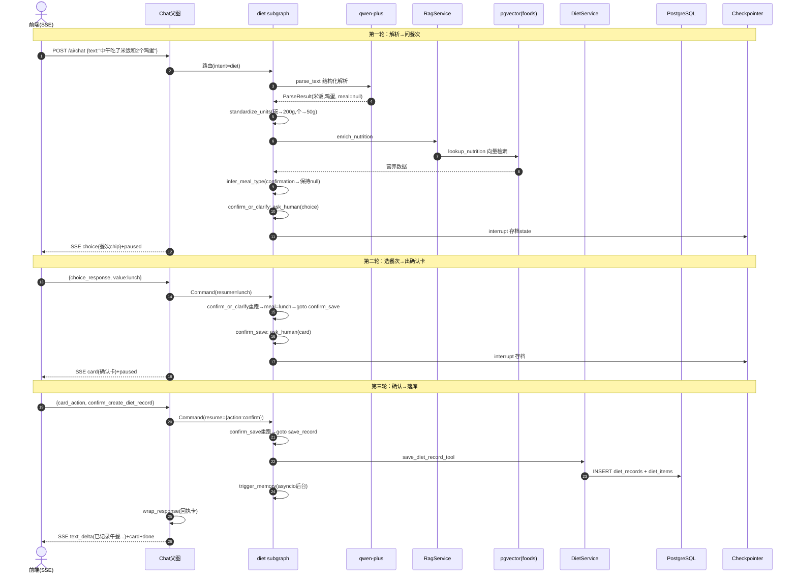
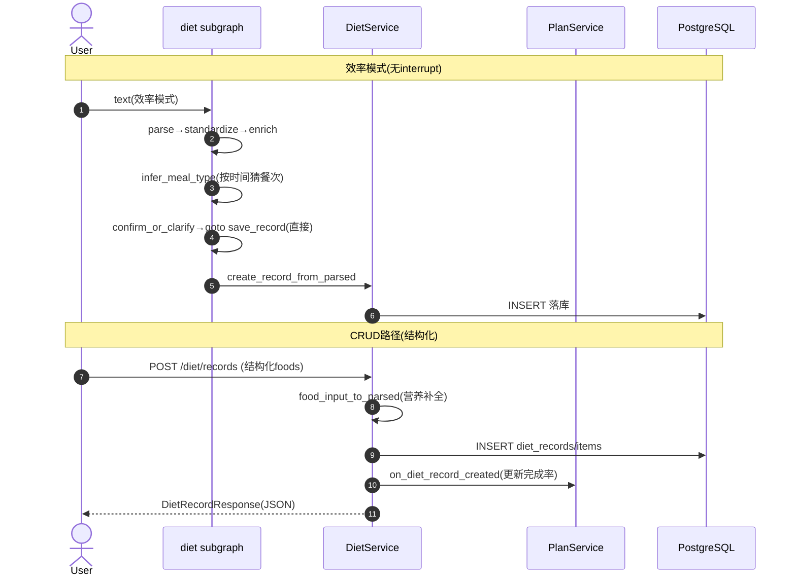

# Diet（饮食）模块深度分析

> 基于 PROJECT_MAP 的单模块深度分析。所有结论基于 `health-agent/backend/` 真实代码，推断内容已标注【推断】。
> 分析模板见 `2.md`。Diet 模块依赖 Chat 父图作为入口，建议先读 `chat-module.md`。

## 关键技术栈澄清（务必先记住）

| 模板假设 | 本项目实际 |
|---------|-----------|
| Redis | **Postgres checkpointer**（无 Redis），饮食解析中间态由 checkpointer 存 |
| MySQL | **PostgreSQL + pgvector** |
| MQ | **asyncio.create_task**（trigger_memory 后台跑，无 MQ） |
| 一次性 JSON | **SSE 流式**（经 Chat 父图 `/ai/chat`）+ 纯 CRUD JSON（`/diet/*`） |
| LLM | **通义千问 qwen-plus**（DashScope OpenAI 兼容） |

## ⚠️ 重要：两套入口、一个废弃文件

Diet 模块有**两个独立入口**：
1. **AI 自然语言入口**：`/ai/chat` → Chat 父图路由到 **diet subgraph**（`agents/diet/subgraph.py`）→ 最终调 `DietService.create_record_from_parsed`。
2. **结构化 CRUD 入口**：`/diet/*`（`api/v1/diet.py`）→ `DietService` → Repository，**不经过 Agent**。

【已确认】`agents/diet/graph.py`（`build_diet_agent` / `DietState` / `save_or_end`）是**遗留废弃文件**：它 import 的 `save_or_end` 在 `nodes.py` 中已不存在，`state.py` 也已清空。实际生效的是 `subgraph.py` 的 `build_diet_subgraph`，基于共享 `ChatState` 而非独立 `DietState`。分析与阅读都应忽略 `graph.py`。

---

# 一、模块职责

> 基于：`app/agents/diet/subgraph.py`、`nodes.py`、`app/services/diet_service.py`、`app/api/v1/diet.py`

## 1.1 该模块解决什么问题

Diet 模块负责**饮食记录的全流程**，核心解决两件事：

1. **自然语言饮食录入**：用户说"我中午吃了一碗米饭和两个鸡蛋"，模块要把这句话解析成结构化食物列表（名称/份量/克数/营养），自动换算单位、补全营养、推断餐次，并在确认后落库。这是产品"像聊天一样记录健康"的核心体验。
2. **结构化饮食 CRUD + 营养汇总**：提供标准增删改查接口、按日/周营养汇总，供前端表单录入、历史回看、数据看板使用。

## 1.2 处于整个系统什么位置

```
            ┌─ AI 入口: /ai/chat → Chat 父图 → [diet subgraph] ─┐
用户 ──────┤                                                    ├─→ DietService → diet_records/items
            └─ CRUD 入口: /diet/records (api/v1/diet.py) ────────┘
                                                          │
                          DietService ──→ RagService(营养补全) ──→ foods 知识库(pgvector)
                          diet 落库后 ──→ PlanService.on_diet_record_created(更新计划完成率)
                          diet 落库后 ──→ Memory 子图(后台异步提取记忆)
```

Diet 在系统中既是**领域子图**（被 Chat 父图当 node 调用），又是**独立业务模块**（有自己的 Service/Repository/CRUD API）。它是 PROJECT_MAP 中的 ★★★★☆ 模块。

## 1.3 上下游是谁

| 方向 | 对象 | 关系 |
|------|------|------|
| 上游（AI 入口） | Chat 父图 `route_after_intent` | intent=diet 时路由到 diet subgraph |
| 上游（CRUD 入口） | 前端表单 / 卡片保存 | `POST/PUT/GET /diet/*` |
| 下游（营养补全） | RagService → `foods` 知识库 | `lookup_nutrition` 查营养，pgvector 检索 |
| 下游（持久化） | DietRepository → `diet_records`/`diet_items` | 按 user_id 隔离落库 |
| 下游（计划联动） | PlanService | 落库后 `on_diet_record_created` 更新完成率 |
| 下游（记忆） | Memory 子图 | `trigger_memory` 后台异步提取 |
| 下游（LLM） | qwen-plus | `parse_text`/`narrate_learning` 解析与讲解 |

## 1.4 一句话总结

**Diet 模块 = 饮食 NLP 解析子图（5 段流水线 + interrupt 确认）+ 纯 CRUD 服务 + 营养汇总**，自然语言入口经 Chat 父图驱动 subgraph，结构化入口直连 Service，两条路最终都汇到 `DietService` 落库。

---

# 二、功能清单

## 2.1 AI 子图功能（自然语言路径）

| 节点功能 | 目的 | 业务价值 |
|---------|------|---------|
| 文本解析 `parse_text` | LLM 把自然语言解析成结构化食物 | 免手填表单的核心 |
| 图片解析 `parse_photo_mock` | 【mock】图片识别食物（Phase 2 未接多模态） | 拍照记录（占位） |
| 单位标准化 `standardize_units` | 把"碗/个/份"换算成克 | 营养计算前置 |
| 营养补全 `enrich_nutrition` | 用 RAG 补全缺失营养、汇总整餐 | 准确的卡路里/蛋白等 |
| 餐次推断 `infer_meal_type` | 效率模式按时间猜餐次 | 减少用户输入 |
| 确认/澄清 `confirm_or_clarify` | 缺餐次时 interrupt 询问；按模式路由 | 人机协作准确性 |
| 学习讲解 `narrate_learning` | 学习模式流式营养讲解 | 边记录边学习 |
| 保存确认 `confirm_save` | interrupt 出确认卡，等 confirm/edit/cancel | 落库前用户把关 |
| 落库 `save_record` | 写 diet_records/items | 持久化 |
| 触发记忆 `trigger_memory` | 后台异步提取饮食记忆 | AI 记住饮食习惯 |

## 2.2 CRUD/汇总功能（结构化路径，`DietService`）

| 功能 | 方法 | 目的 |
|------|------|------|
| 创建记录 | `create_record` | 结构化 foods 落库（营养不全则 RAG 补全） |
| upsert | `upsert_record` | 按 date+meal_type 替换/追加（卡片保存统一入口） |
| 查询/详情/列表 | `get_record` / `list_records` | 历史回看，分页 |
| 更新/删除 | `update_record` / `delete_record` | 修改、软删 |
| 每日汇总 | `get_daily_summary` | 按餐次聚合 + 营养合计 |
| 每周汇总 | `get_weekly_summary` | 7 天合计 + 日均 |

## 2.3 两个关键写入语义（`DietOperation`）

| 语义 | 触发 | 行为 |
|------|------|------|
| `replace`（默认） | 首次记录 / 更正（"说错了/改成…"） | 软删该餐已有记录，建新记录 |
| `append` | 追加（"还/又/再吃了…"） | 读出该餐已有食物，与本次合并，软删旧+建新（保持单餐单记录） |

> operation 由 `parse_text` 阶段 LLM 判断（见 `diet_parse.py` prompt），贯穿到 `upsert_record`。

## 2.4 三种交互模式在 Diet 的分支

| 模式 | 餐次缺失处理 | 是否出确认卡 | 是否讲解 |
|------|-------------|-------------|---------|
| efficiency | 按时间自动推断 | 否，直接落库 | 否 |
| confirmation | interrupt 询问餐次 | 是（confirm_save） | 否 |
| learning | interrupt 询问餐次 | 是 | 是（narrate_learning 流式） |

## 2.5 功能边界（Diet 不做什么）

- **DietService 不做 LLM 调用**：解析在 subgraph 节点；Service 只做 CRUD+营养计算。
- **CRUD API 不接自然语言**：`/diet/records` 只收结构化 foods，NLP 走 `/ai/chat`。
- **营养数据不自己造**：缺失营养通过 RagService 查 `foods` 知识库。
- **图片识别未实现**：`parse_photo_mock` 是写死的 mock。

---

# 三、代码结构分析

> Python/FastAPI + LangGraph，用 Java 分层类比。

## 3.1 分层映射总览

| Java 概念 | 本模块对应 | 文件 | 职责 |
|-----------|-----------|------|------|
| Controller | CRUD API 路由 | `app/api/v1/diet.py` | 8 个纯 CRUD 端点，直连 Service |
| —（特有） | Agent 子图 | `app/agents/diet/{subgraph,nodes,tools}.py` | 饮食 NLP 解析流水线 |
| DTO/VO | Pydantic Schema | `app/schemas/diet.py` | ParseResult/FoodItemInput/DietRecordResponse 等 |
| Service | 业务服务 | `app/services/diet_service.py` | CRUD + 营养计算 + RAG 补全（**无 LLM**） |
| DAO/Repository | 仓储 | `app/db/repositories/diet_repo.py` | user_id 隔离的记录读写 |
| Entity | ORM 模型 | `app/db/models/diet.py` | `diet_records` + `diet_items` 两表 |
| Consumer/Producer | **无 MQ** | — | `trigger_memory` 用 asyncio 后台任务 |
| Scheduler | **无定时任务** | — | — |
| —（废弃） | 遗留文件 | `app/agents/diet/graph.py` | ⚠️ `build_diet_agent`，已不被引用 |

## 3.2 Agent 子图层（核心，`agents/diet/`）

| 文件 | 角色 | 内容 |
|------|------|------|
| `subgraph.py` | 图装配 | `build_diet_subgraph()`：10 节点流水线，conditional entry + Command 路由，挂到 Chat 父图 |
| `nodes.py` | 节点实现 | 11 个节点函数（含 route_input）+ 卡片/汇总辅助 |
| `tools.py` | 工具封装 | `enrich_food_tool` / `save_diet_record_tool`，对 DietService 的薄胶水 |
| `state.py` | **空文件** | 子图复用 Chat 的 `ChatState`，不定义独立 state |
| `graph.py` | **废弃** | 遗留 `build_diet_agent`，忽略 |

子图节点的依赖（`diet_service`/`memory_service`）通过 `get_dep`（`agents/deps.py`）解析：**优先 `config.configurable`，回退 state**。原因：service 持有 DB session 不可序列化，不能进 checkpoint。

## 3.3 Schema 层 — `app/schemas/diet.py`

| 类型 | 作用 |
|------|------|
| `MealType` | 餐次枚举 breakfast/lunch/dinner/snack |
| `DataSource` | 营养来源 database/api/llm_estimate |
| `DietOperation` | 写入语义 replace/append |
| `ParsedFood` | 解析后单个食物（含完整营养，amount_grams 必填） |
| `FoodItemInput` | 入参食物（营养可空，待补全） |
| `ParseResult` | 整餐解析结果（foods + meal_type + operation + 营养汇总 + confidence） |
| `NutritionSummary` | 营养汇总（卡路里/蛋白/脂肪/碳水/纤维/钠） |
| `DietRecordCreate/Update/Response` | CRUD 请求/响应 |
| `DailySummary` / `WeeklySummary` | 日/周汇总 |

## 3.4 Service 层 — `app/services/diet_service.py`

`DietService(repo, rag_service)`，**严格无 LLM**。关键方法：
- `create_record`：API 结构化入口，营养不全则 `food_input_to_parsed` 经 RAG 补全。
- `create_record_from_parsed`：**subgraph 落库入口**（save_record 节点经 tool 调它）。
- `upsert_record`：按 date+meal_type 的 replace/append 语义（卡片保存统一入口）。
- `food_input_to_parsed`：营养齐全直接用，否则 `rag_service.lookup_nutrition` 补全。
- `estimate_amount_grams`：单位→克换算表（米饭碗、鸡蛋个等）。
- `get_daily_summary`/`get_weekly_summary`：聚合计算。

## 3.5 Repository / Entity 层

- `diet_repo.py`：`DietRepository(session, user_id)`，**构造时绑定 user_id**，`_base_stmt` 统一带 `user_id` + `deleted_at IS NULL` + `selectinload(items)`。含 `soft_delete_by_date_meal`（upsert 用）。
- `diet.py`（model）：`DietRecord`（主表，1 对多 items，`cascade=all,delete-orphan`，`lazy=selectin`）+ `DietItem`（食物条目，外键 `ondelete=CASCADE`）。

## 3.6 异步机制（替代 MQ）

`trigger_memory` 节点用 `asyncio.create_task` 把 memory 子图丢后台跑（fire-and-forget），`_BACKGROUND_TASKS` set 持引用防 GC，`_discard_task` 回调消费异常。非跨进程 MQ。

---

# 四、接口清单

Diet 有两类"接口"：① CRUD HTTP 端点（`/diet/*`）；② AI 子图入口（不是独立 HTTP，复用 `/ai/chat`）。

## 4.1 CRUD HTTP 端点（`api/v1/diet.py`，prefix `/diet`）

| # | 接口名称 | 路径 | 方法 | 功能说明 |
|---|---------|------|------|---------|
| 1 | 创建记录 | `/diet/records` | POST | 结构化 foods 落库，并触发 `plan_service.on_diet_record_created` 更新完成率 |
| 2 | 列表查询 | `/diet/records` | GET | 按 start_date/end_date/meal_type 分页查询 |
| 3 | 记录详情 | `/diet/records/{record_id}` | GET | 单条记录 |
| 4 | upsert | `/diet/records/upsert` | PUT | 按 date+meal_type 替换/追加（卡片保存入口），同样触发计划联动 |
| 5 | 更新记录 | `/diet/records/{record_id}` | PUT | 改餐次/日期/食物 |
| 6 | 删除记录 | `/diet/records/{record_id}` | DELETE | 软删，幂等 |
| 7 | 每日汇总 | `/diet/daily-summary` | GET | query `date`，按餐次聚合+营养合计 |
| 8 | 每周汇总 | `/diet/weekly-summary` | GET | query `start_date`，7 天合计+日均 |

> 鉴权：全部用 `CurrentUserDep`。接口 1/4 额外注入 `PlanServiceDep` 做计划联动。

## 4.2 AI 子图入口（复用 Chat 的 `POST /ai/chat`）

diet subgraph **没有独立 HTTP 路由**，通过 Chat 父图触发：
- 入口：`POST /ai/chat` body `{type:"text", message:"中午吃了一碗米饭"}`。
- Chat 父图 `identify_intent`→intent=diet→`route_after_intent`→diet subgraph。
- 确认/取消：`{type:"card_action", action_id:"confirm_create_diet_record"|"edit_diet_items"}`。
- 选餐次：`{type:"choice_response", prompt_id:"diet_meal_type", selected_value:"lunch"}`。
- 详细协议见 `chat-module.md` 第四节。

## 4.3 子图内部"工具接口"（`tools.py`）

| 工具 | 封装 | 用途 |
|------|------|------|
| `enrich_food_tool(service, food)` | `DietService.food_input_to_parsed` | 补全单食物营养 |
| `save_diet_record_tool(service, ...)` | `DietService.create_record_from_parsed` | subgraph 落库 |

---

# 五、Agent 分析（diet subgraph）

> 基于：`app/agents/diet/subgraph.py`、`nodes.py`、`tools.py`、`app/agents/deps.py`、`app/agents/interrupts.py`

## 5.1 Graph（子图，作为 Chat 父图的一个 node）

`build_diet_subgraph()` 构建一个 `StateGraph(ChatState)` 并 `compile()`（**不传 checkpointer**，继承父图的）。

```
   set_conditional_entry_point(route_input)
        ┌──────────┬──────────────┐
   parse_text  parse_photo_mock  (已有foods)→standardize_units
        │          │                       │
        └────┬─────┘                       │
             ▼                              │
      standardize_units ◀──────────────────┘
             ▼
      enrich_nutrition
             ▼
      infer_meal_type
             ▼
      confirm_or_clarify ──Command(goto=...)──┐
        ├ efficiency        → save_record      │
        ├ 缺餐次             → interrupt(choice) 问餐次后继续
        ├ learning          → narrate_learning → confirm_save
        └ confirmation      → confirm_save
                                  │
              confirm_save ──Command(goto=...)──┐
                ├ confirm/edit → save_record
                └ cancel       → __end__
                                  ▼
                            save_record
                                  ▼
                            trigger_memory
                                  ▼
                                 END
```

**关键**：`confirm_or_clarify` 和 `confirm_save` 返回 `Command(goto=..., update=...)` 做动态路由，不是静态边。子图 END 后回到 Chat 父图的 `wrap_response` 出终态反馈。

## 5.2 Node（11 个节点）

| 节点 | 类型 | 读 state | 写 state / 返回 | 职责 |
|------|------|----------|----------------|------|
| `route_input` | sync 路由 | foods/diet_image_url | 返回入口节点名 | 决定走 text/photo/已结构化 |
| `parse_text` | async LLM | diet_input_text | diet_parse_result/diet_parsed_foods/diet_confidence | LLM 结构化解析 |
| `parse_photo_mock` | async | diet_image_url | diet_parsed_foods | 【mock】写死两个食物 |
| `standardize_units` | async | diet_parsed_foods/foods | diet_parsed_foods | 换算 amount→grams |
| `enrich_nutrition` | async | diet_parsed_foods | diet_parsed_foods/diet_parse_result | RAG 补营养+汇总，保留 operation |
| `infer_meal_type` | async | diet_meal_type/interaction_mode | diet_meal_type/diet_parse_result | 效率模式按时间猜餐次 |
| `confirm_or_clarify` | async→Command | parse_result/mode | goto+update | 餐次澄清 interrupt + 路由 |
| `narrate_learning` | async LLM 流式 | diet_parse_result | （空） | 学习模式流式讲解 |
| `confirm_save` | async→Command | diet_parse_result | goto+update | 确认卡 interrupt（confirm/edit/cancel） |
| `save_record` | async | diet_parsed_foods/meal_type/date | diet_saved_record | 经 tool 落库 |
| `trigger_memory` | async | diet_saved_record | （空，副作用） | 后台异步提取记忆 |

## 5.3 State（复用 ChatState 的 diet_ 前缀字段）

diet subgraph **不定义独立 state**（`state.py` 为空），读写 `ChatState` 中的 `diet_` 前缀字段：

| 字段 | 含义 |
|------|------|
| `diet_input_text` | 用户原始文本 |
| `diet_image_url` | 图片 URL（mock 用） |
| `diet_meal_type` | 餐次（str，可空待澄清） |
| `diet_date` | 记录日期 |
| `diet_parsed_foods` | `list[ParsedFood]` 解析中间态 |
| `diet_confidence` | 解析置信度 |
| `diet_parse_result` | `ParseResult` 整餐结果 |
| `diet_saved_record` | 落库后的 `DietRecordResponse` |
| `diet_cancelled` | 用户取消标记 |
| `foods` | 外部预注入的结构化 foods（绕过 LLM 解析） |
| `interaction_mode` | 三种模式，影响分支 |

## 5.4 Tool（确定性调用，非 LLM 自主）

只有 2 个工具（`tools.py`），都是对 `DietService` 的薄封装，节点内**确定性调用**（不让 LLM 决定调哪个）：`enrich_food_tool`（补营养）、`save_diet_record_tool`（落库）。

## 5.5 Memory（两类）

- **graph 中断态**：由 Chat 父图的 checkpointer 统一管，diet subgraph 的 interrupt 暂停态也存其中。
- **业务记忆**：`trigger_memory` 节点落库后异步触发 memory 子图，`trigger_type="record_diet"`，把 `DietRecordResponse` 作为 context_data 提取记忆。

## 5.6 Conditional Edge / Command 路由（共 3 处动态分流）

1. **conditional entry** `route_input`：foods/image/text 三选一入口。
2. **`confirm_or_clarify` 返回 Command**：efficiency→save_record；缺餐次→interrupt 问；learning→narrate_learning；confirmation→confirm_save。
3. **`confirm_save` 返回 Command**：confirm/edit→save_record；cancel→`__end__`。

> 注意：`subgraph.py` 用 `add_edge` 声明了 narrate_learning→confirm_save、save_record→trigger_memory→END 等**静态边**，动态跳转点只在上述 3 处。

## 5.7 interrupt 机制（两个暂停点）

diet subgraph 有**两处** `ask_human()` interrupt：
1. **餐次澄清**（`confirm_or_clarify`）：`kind="choice"`，prompt_id=`diet_meal_type`，4 个 chip + 允许自由文本。
2. **保存确认**（`confirm_save`）：`kind="card"`，prompt_id=`diet_confirm`，确认卡带"确认保存/修改食物"按钮。

**幂等关键**：两个 interrupt 之前的节点（parse/standardize/enrich/infer）都无副作用，落库只在 `save_record`（最后）。恢复时整段重跑也不会重复落库。`edit` 动作可携带 `patch`（改 meal_type/foods）合并进 parse_result。

---

# 六、完整执行流程

> 模板链路含 Redis/MySQL/MQ，本项目实际为 checkpointer/PostgreSQL/asyncio。以下分 AI 路径与 CRUD 路径。

## 6.1 AI 路径：自然语言记饮食（confirmation 模式，最典型）

### 第一轮：解析 → 暂停出确认卡
1. **User→Chat**：`POST /ai/chat {type:"text", message:"我中午吃了一碗米饭和两个鸡蛋"}`。
2. **Chat 父图**：`identify_intent`→diet→`route_after_intent`→diet subgraph，`_build_graph_input` 已塞 `diet_input_text`/`diet_date`。
3. **route_input**：无 foods、无 image → `parse_text`。
4. **parse_text**：`get_chat_model(temperature=0.1).with_structured_output(ParseResult)` 调 qwen-plus → 得到 [米饭/1/碗, 鸡蛋/2/个]，operation=replace，meal_type 可能为 None。失败抛 `BusinessRuleException(DIET_PARSE_FAILED)`。
5. **standardize_units**：米饭碗→200g、鸡蛋个→50g×2（`estimate_amount_grams`）。
6. **enrich_nutrition**：对 llm_estimate 的食物经 `enrich_food_tool`→`RagService.lookup_nutrition` 查 `foods` 知识库（**pgvector**）补营养，`_summary` 汇总整餐。
7. **infer_meal_type**：confirmation 模式 + 餐次缺失 → 保持 None（留给下一节点问）。
8. **confirm_or_clarify**：非效率模式、meal_type=None → `ask_human(choice, diet_meal_type)` **interrupt 暂停**，state 存档到 **PostgreSQL checkpointer**。
9. **Chat 端**：`emit_interrupt_events` 发 `choice`（餐次 chip）+ `paused`，**不发 done**。

### 第二轮：选餐次（恢复，可能再次暂停）
10. **User**：`{type:"choice_response", prompt_id:"diet_meal_type", selected_value:"lunch"}`。
11. **Chat**：检测暂停态→`Command(resume={value:"lunch"})`。
12. **confirm_or_clarify 重跑**：interrupt 直接返回 lunch → meal_type=lunch → `Command(goto="confirm_save")`。
13. **confirm_save**：`ask_human(card, diet_confirm)` **再次 interrupt**，发确认卡 + paused。

### 第三轮：确认保存（恢复 → 落库）
14. **User**：`{type:"card_action", action_id:"confirm_create_diet_record"}`。
15. **Chat**：`build_resume_payload`→`{action:"confirm"}`，`Command(resume)`。
16. **confirm_save 重跑**：action=confirm → `Command(goto="save_record")`。
17. **save_record**：`save_diet_record_tool`→`DietService.create_record_from_parsed`→`DietRepository.create_record`+commit → 写 `diet_records`+`diet_items`（**PostgreSQL**）。
18. **trigger_memory**：`asyncio.create_task` 后台跑 memory 子图（**fire-and-forget**）。子图 END。
19. **Chat 父图 wrap_response**：检测 `diet_saved_record` 非空 → "已记录午餐，2 项食物，共 X kcal" + 回执卡（requires_confirmation=False）→ DONE。

```
文本 → Chat父图(identify_intent→diet) → diet subgraph:
  route_input → parse_text(qwen-plus) → standardize_units(换算)
  → enrich_nutrition(RAG→pgvector) → infer_meal_type
  → confirm_or_clarify ─interrupt→ [选餐次] ─resume→ confirm_save ─interrupt→ [确认] ─resume→
  → save_record(DietService→diet_records/items) → trigger_memory(asyncio→memory子图)
→ Chat父图 wrap_response → SSE done
```

## 6.2 效率模式（无 interrupt，一气呵成）
parse_text → standardize → enrich → infer_meal_type（**按时间自动猜餐次**）→ confirm_or_clarify（efficiency → 直接 `goto save_record`）→ save_record → trigger_memory → END。全程不暂停，wrap_response 出 `requires_confirmation=False` 回执卡。

## 6.3 CRUD 路径：结构化创建（`POST /diet/records`）
1. 前端提交 `DietRecordCreate`（已结构化 foods）。
2. `create_record`：`food_input_to_parsed` 逐个补全（营养齐全直接用，否则 RAG）。
3. `create_record_from_parsed`→Repository→commit→写表。
4. `get_daily_summary` 算当日营养 → `plan_service.on_diet_record_created(date, 营养)` **联动更新计划完成率**。
5. 返回 `DietRecordResponse`。

## 6.4 与模板链路对应

| 模板 | 本项目实际 |
|------|-----------|
| Controller/Service/Graph/Node/Tool | diet.py / DietService / diet subgraph / 11 节点 / 2 tool |
| **Redis** | **Postgres checkpointer**（暂停态） |
| **MySQL** | **PostgreSQL + pgvector**（foods 知识库） |
| **MQ** | **asyncio.create_task**（trigger_memory） |
| 返回 | SSE（AI 路径）/ JSON（CRUD 路径） |

---

# 七、Mermaid 时序图

## 7.1 AI 路径：confirmation 模式三轮交互



## 7.2 效率模式 + CRUD 路径



## 7.3 时序图阅读要点
- **confirmation 模式可能两次 interrupt**（先问餐次、再确认保存），效率模式零 interrupt。
- **落库永远在 save_record（最后）**，前面 interrupt 重跑不会重复写。
- **CRUD 路径触发计划联动**（`on_diet_record_created`），AI 路径不直接调（落库后由前端或后续逻辑触发）。

---

# 八、数据库分析

> 基于：`app/db/models/diet.py`、`app/db/repositories/diet_repo.py`

## 8.1 涉及的数据表

| 表 | 归属 | 作用 |
|----|------|------|
| `diet_records` | Diet 模块 | 单餐饮食主记录（user/date/meal_type 维度） |
| `diet_items` | Diet 模块 | 单餐内的食物条目（多个） |
| `foods` | Knowledge/RAG 模块 | 食物营养知识库（diet 通过 RagService 查询） |
| `chat_messages` | Chat 模块 | AI 路径下的对话/卡片记录（间接） |
| `memories` | Memory 模块 | trigger_memory 后台异步写（间接） |

> 本节聚焦 Diet 自身的两表 + 关联的 foods 知识库。

## 8.2 `diet_records` 表（主记录）

`DietRecord` 混入 `UUIDPrimaryKeyMixin`+`TimestampMixin`+`SoftDeleteMixin`：

| 字段 | 类型 | 说明 |
|------|------|------|
| `id` | UUID | PK |
| `user_id` | UUID | NOT NULL, index — 多租户隔离 |
| `meal_type` | String(10) | NOT NULL, index — breakfast/lunch/dinner/snack |
| `date` | Date | NOT NULL, index |
| `input_text` | Text? | 原始自然语言（可空） |
| `image_url` | Text? | 图片 URL（可空） |
| `created_at`/`updated_at`/`deleted_at` | timestamp | Mixin |
| `items` | relationship | 1 对多 → DietItem，`cascade=all,delete-orphan`，`lazy=selectin` |

> 索引：user_id / meal_type / date 各自索引（无显式复合索引），列表查询走 user_id+date 范围扫描。

## 8.3 `diet_items` 表（食物条目）

`DietItem` 只混入 `UUIDPrimaryKeyMixin`（**无软删/时间戳**，跟随主表 cascade 删除）：

| 字段 | 类型 | 说明 |
|------|------|------|
| `id` | UUID | PK |
| `record_id` | UUID | FK→diet_records，`ondelete=CASCADE`，index |
| `food_name` | String(100) | 食物名 |
| `amount` / `unit` / `amount_grams` | Float/String | 数量+单位+换算克数 |
| `cooking_method` | String(50)? | 烹饪方式 |
| `calories`/`protein`/`fat`/`carbs` | Float | 营养（必填） |
| `fiber`/`sodium` | Float? | 营养（可空） |
| `data_source` | String(20) | database/api/llm_estimate |
| `food_id` | UUID? | 关联 foods 知识库 ID（可空） |

## 8.4 表关系

```
                 (user_id 逻辑关联) Supabase Auth
                            │
diet_records ──1对多(cascade)──▶ diet_items ──(food_id)──▶ foods(知识库)
   │                              (data_source 标记来源)
   └─ user_id 隔离 + 软删 + (date,meal_type)聚合
```

- `record_id` 是物理外键（CASCADE 删除子项）。
- `food_id` 是**逻辑关联**到 foods 知识库，无库级外键，data_source 标记是否来自知识库。
- `user_id` 跨库（Supabase Auth），无库级外键。

## 8.5 数据流转

**AI 路径写入**：parse_text → standardize → enrich_nutrition（经 RagService 查 foods 知识库补营养）→ confirm → save_record → `DietRepository.create_record` → `session.add(DietRecord(items=[...]))` → flush+commit。

**CRUD 路径写入**：`DietRecordCreate` → `food_input_to_parsed`（同样可能查 foods）→ `create_record_from_parsed` → 同上。

**upsert（关键）**：先 `soft_delete_by_date_meal(date, meal_type)` 软删旧记录，append 模式还会先 `_item_to_parsed` 读出旧食物合并，再建新记录。**始终保持单餐单记录**，避免幽灵记录。

**读取**：`_base_stmt` 统一带 `user_id+deleted_at IS NULL`，`selectinload(items)` 一起加载子项；按 (date desc, meal_type asc) 排序。

## 8.6 多租户隔离

`DietRepository(session, user_id)` **构造时绑定 user_id**，所有查询带 `user_id == self.user_id` + `deleted_at IS NULL`。Service 层接收业务方法参数，无法越权访问别的用户。

## 8.7 与模板"MySQL"的差异

PostgreSQL 特有：UUID 主键、ON DELETE CASCADE、selectinload 1+1 查询。营养库 `foods` 用 pgvector 做向量检索（diet 通过 RagService 间接调）。

---

# 十一、异常处理分析

## 11.1 分级降级策略

| 位置 | 异常 | 处理 | 影响 |
|------|------|------|------|
| `parse_text` | LLM 解析失败 | **抛 `BusinessRuleException(DIET_PARSE_FAILED)`** | 主功能失败，向用户报错 |
| `enrich_nutrition` | 单食物补营养失败 | 用 llm_estimate 兜底（`food.model_copy(update={data_source:llm_estimate})`） | 该食物营养可能不准，但流程继续 |
| `narrate_learning` | 讲解 LLM 失败 | log warning **跳过**，继续走 confirm_save | 学习模式无讲解，但能保存 |
| `confirm_or_clarify` 解析答案 | meal_type 字符串非法 | `try MealType(...) except ValueError → snack` 兜底 | 默认加餐，避免阻塞 |
| `confirm_save` patch 解析 | meal_type 字符串非法 | `with suppress(ValueError)` 跳过该字段 | 仅丢失该字段更新 |
| `trigger_memory` | memory 子图调度失败 | log warning，返回 `{}` | 不影响主流程 |
| `DietService.create_record` | foods 数 > 20 | `ValidationException(DIET_RECORD_LIMIT_EXCEEDED)` | 拒绝请求 |
| `DietService.list_records` | end_date < start_date | `ValidationException(DIET_INVALID_DATE)` | 拒绝请求 |
| `DietService.get/update/delete_record` | 记录不存在 | `NotFoundException(DIET_RECORD_NOT_FOUND)` | 404 |
| API 层 | 日期是未来 | `model_validator` 抛 ValueError | 422 |

## 11.2 重试机制

- LLM 调用：底层 `get_chat_model` 走 `settings.llm_max_retries` 重试，对节点透明。
- RAG 营养查询：单食物失败回退 llm_estimate，不重试。
- 业务节点：无显式重试。

## 11.3 补偿机制

无 Saga/TCC。两条保证：
1. **interrupt 之前不落库**：parse/standardize/enrich 都是计算/查询，无副作用，恢复时重跑安全。
2. **upsert 用"软删旧+建新"模式**：append 也会读旧、合并、删旧、建新，避免出现重复记录或孤立 items。

## 11.4 幂等方案

| 场景 | 幂等保证 |
|------|---------|
| interrupt 恢复 | 两次 interrupt 之前的节点纯计算，重跑结果一致 |
| upsert | 软删 + 建新 = 单餐单记录，重复调用得到相同最终态 |
| 删除记录 | 软删，重复调用对已删记录无影响 |
| 后台任务防重 | `_BACKGROUND_TASKS` set + `_discard_task` 回调消费异常 |

## 11.5 反模式规避

- **不在 interrupt 前落库**：`save_record` 是子图最后一步（trigger_memory 之前）。
- **enrich_nutrition 单食物失败不打断整餐**：用 llm_estimate 兜底，避免一个生僻食物毁掉整次解析。
- **operation 跨节点保留**：`enrich_nutrition` 节点显式 `prev_result.operation if prev_result else replace`，防止重新构造 ParseResult 时丢失 LLM 判定的 append/replace 语义。
- **mock 节点显式标识**：`parse_photo_mock` 名字带 mock 后缀，placeholder 直白，避免被误以为真。

---

# 十二、项目亮点

## 12.1 技术亮点

1. **多模式分支用 Command 路由 + interrupt**：`confirm_or_clarify` 单点决策三模式分流（efficiency/learning/confirmation），用 LangGraph 原生 `Command(goto, update)` 而非静态条件边，状态推进与跳转一次完成。
2. **operation 语义识别**：LLM prompt 显式区分 append/replace（"还/又/再"vs"说错了/改成"），`upsert_record` 在 Service 层用同一接口实现追加与替换，避免分裂为两个方法。
3. **单位换算混合策略**：`estimate_amount_grams` 内置常用换算表（米饭碗、鸡蛋个、苹果个等）+ 通用 fallback（份/盘/杯…），代码直白可调。
4. **营养兜底链**：parse_text(LLM 粗估)→standardize(换算)→enrich(RAG 补全，失败回退 llm_estimate)，每步降级路径清晰。
5. **学习模式流式讲解**：`narrate_learning` 节点 token 经 translator 白名单（`text_visible_nodes`）透传成 text_delta，与 chat 通用回复同样的视觉体验。

## 12.2 架构亮点

1. **两套入口、一个 Service**：AI 路径（subgraph→tool→Service）与 CRUD 路径（API→Service）汇到 `DietService`，避免业务逻辑分裂。
2. **subgraph 复用父图 ChatState**：不定义独立 DietState，所有字段加 `diet_` 前缀，子图作为 node 挂载更轻量。
3. **依赖通道双层**：service 走 `config.configurable`（不进 checkpoint），数据走 state（进 checkpoint），`get_dep` 兼容旧测试的 state 注入。
4. **upsert 单餐单记录**：用"软删旧+建新"保证 (user, date, meal_type) 永远只有一条有效记录，简化前端、避免幽灵数据。
5. **业务联动单点触发**：`on_diet_record_created` 在 API 层调（`POST/PUT records`），让 Plan 模块按完成率更新；AI 路径下由前端在确认卡保存后调 CRUD 入口（双轨设计）。

## 12.3 性能优化点

- `lazy="selectin"`：`DietRecord.items` 用 selectin 加载，避免 N+1。
- `_base_stmt` 复用：list/count/soft_delete 共用基础查询，减少重复 SQL 拼装。
- `food_input_to_parsed` 营养已齐全直接返回，**跳过 RAG**，减少向量检索开销。
- `narrate_learning` 失败不阻塞：讲解失败也能走到 confirm_save。
- 后台 memory 提取 fire-and-forget，不阻塞主流。

## 12.4 可扩展性设计

- **图片识别**：`parse_photo_mock` 是预留位，接入多模态模型只需替换该节点实现。
- **新增营养字段**：`ParsedFood`/`NutritionSummary`/`DietItem` 三处加字段+migration 即可。
- **新交互模式**：`confirm_or_clarify` 加一条 if 分支即可路由到新节点。
- **operation 扩展**：`DietOperation` 加新值（如 `merge`），upsert_record 加分支。

---

# 十三、面试讲解版

## 13.1 三分钟讲解版

> Diet 模块负责健康管家产品的**饮食记录全流程**，包括"自然语言解析录入"和"结构化 CRUD"两条入口，最终汇到同一个 Service 落库。

最有特色的是 **AI 自然语言录入**：用户说"我中午吃了一碗米饭和两个鸡蛋"，会触发一条 LangGraph 子图——先 LLM 结构化解析、再单位换算、再用 RAG 查 `foods` 知识库补营养、再按时间或追问推断餐次、最后落库。整条流水线可在中间用 `interrupt()` 暂停，问"是哪一餐？"或弹"确认保存"卡片，等用户回答后从中断点继续。

模块支持**三种交互模式**：效率模式按时间猜餐次直接落库，确认模式弹确认卡，学习模式额外用流式 LLM 讲解营养。三种模式由 system prompt 注入 + 一个 `Command(goto)` 节点路由实现，同一套 graph 适配。

写入还有一个细节：`operation` 字段区分 append/replace。LLM 解析时识别用户语气（"还/又/再"是 append、"说错了/改成"是 replace），后端 `upsert_record` 用"软删旧+建新"模式保证单餐单记录，避免幽灵数据。

CRUD 路径则给 `/diet/records` 等纯 JSON 端点，落库后还会**联动 Plan 模块**更新完成率。

## 13.2 十分钟讲解版

**一、定位**：Diet 是产品的饮食记录模块，既是 LangGraph 子图（被 Chat 父图调用），又是独立 CRUD 模块。两个入口最终汇到一个 `DietService`。

**二、AI 子图流水线**（5 段）：
1. **解析**：parse_text 用 qwen-plus + `with_structured_output(ParseResult)` 把自然语言转成结构化食物，prompt 显式教 LLM 拆复合输入、判断 operation 语义。
2. **标准化**：standardize_units 用 `estimate_amount_grams` 把"碗/个/份"换算到克。
3. **营养补全**：enrich_nutrition 经 `RagService.lookup_nutrition` 查 `foods` 知识库（pgvector）；失败用 llm_estimate 兜底，不打断整餐。
4. **餐次推断**：infer_meal_type 在效率模式按时间猜，其它模式留空待 confirm_or_clarify 询问。
5. **确认+落库**：confirm_or_clarify 单点路由三模式，confirm_save 出确认卡，save_record 调 tool 落库，trigger_memory 后台异步提取记忆。

**三、interrupt 暂停点**（最多两处）：
- 餐次澄清：`ask_human(choice, diet_meal_type)`，4 个 chip+自由文本。
- 保存确认：`ask_human(card, diet_confirm)`，确认/修改/取消三种 action。
- 关键约束：interrupt 之前节点必须无副作用（落库放最后），恢复时整段重跑安全。

**四、三种交互模式**：efficiency 不弹卡直接落库（适合老用户）；confirmation 弹确认卡（默认）；learning 额外有 narrate_learning 节点流式讲解营养。`confirm_or_clarify` 用 `Command(goto)` 在三模式间分流，节点内 if 分支即可。

**五、operation append vs replace**：LLM 在 prompt 里被教会从用户语气判断（"还吃了"=append，"改成"=replace），`upsert_record` 在 Service 层统一处理：append 模式先把该餐已有食物读出合并、软删旧、建新；replace 直接软删旧、建新。永远保证单餐单记录。

**六、CRUD 路径**：`/diet/*` 接口走 `DietService` 直连。`POST /diet/records` 和 `PUT /diet/records/upsert` 落库后调 `plan_service.on_diet_record_created` 更新计划完成率，这是模块间的业务联动。

**七、技术栈**：PostgreSQL 主表（`diet_records` 1对多 `diet_items`，cascade 删除，selectinload 防 N+1），pgvector 检索 foods 知识库，asyncio 后台触发 memory 子图，DashScope qwen-plus 做 LLM。无 Redis/MySQL/MQ。

**八、亮点**：① 两套入口一个 Service；② subgraph 复用父图 ChatState（diet_ 前缀字段）；③ 营养补全的多级降级链；④ `Command` 路由替代静态条件边的灵活分流；⑤ upsert 单餐单记录避免幽灵数据。

---

# 十四、新人阅读路线（只看 20% 代码）

> 如果只看 6 个文件建立 Diet 模块的完整心智模型，按下表顺序读：

| 优先级 | 文件 | 为什么优先读 |
|--------|------|-------------|
| ① | `app/agents/diet/subgraph.py` | **AI 路径地图**。65 行，节点拓扑+conditional entry一目了然 |
| ② | `app/agents/diet/nodes.py` | **节点实现**。5 段流水线 + 2 处 interrupt + Command 路由全在这 |
| ③ | `app/services/diet_service.py` | **业务核心**。create/upsert/营养计算/单位换算 |
| ④ | `app/schemas/diet.py` | **数据契约**。ParseResult、ParsedFood、DietOperation |
| ⑤ | `app/api/v1/diet.py` | **CRUD 入口**。8 个端点，看清结构化路径与计划联动 |
| ⑥ | `app/agents/prompts/diet_parse.py` | **LLM 提示词**。看 LLM 怎么被教会 operation 语义和单位换算 |

**阅读理由**：先 subgraph 看地图（避免迷失）→ nodes 看具体逻辑 → service 看业务规则 → schema 看数据形状 → api 看对外暴露面 → prompt 看 LLM 行为契约。

**可延后**：`diet_repo.py`+`models/diet.py`（标准 ORM，看 SQL 时再查）、`tools.py`（很短，包装两个 service 方法）、`diet_narrate.py`（learning 模式 prompt，分析时不在主路径上）、`graph.py`（**废弃文件，永远不要读**）、`state.py`（空文件）。

**阅读心法**：① 时刻分清两条路径（AI vs CRUD）；② 记住"interrupt 之前无副作用"的设计契约；③ operation append/replace 是 LLM+Service 联合实现的语义；④ 注意 `subgraph.py` 才是真入口，不是同名的 `graph.py`。

---

# 十五、带我读代码的流程（循序渐进读码指南）

## 15.1 有序阅读清单（从外到内）

| 顺序 | 文件 | 角色 | 排此位置原因 |
|------|------|------|-------------|
| 1 | `app/api/v1/diet.py` | Controller(CRUD) | 先看结构化入口，最易懂 |
| 2 | `app/schemas/diet.py` | Schema | 看清入参/出参/枚举 |
| 3 | `app/services/diet_service.py` | Service | 看 CRUD+营养计算（无 LLM 干扰） |
| 4 | `app/db/repositories/diet_repo.py` | Repository | 看用户隔离 + base_stmt 复用 |
| 5 | `app/db/models/diet.py` | Model | 看两表 1对多关系 |
| 6 | `app/agents/diet/subgraph.py` | Graph 装配 | 进入 AI 路径，看节点拓扑 |
| 7 | `app/agents/prompts/diet_parse.py` | Prompt | 看 LLM 被教什么、operation 语义 |
| 8 | `app/agents/diet/nodes.py` | Node 实现 | 看 11 个节点（重点 confirm_or_clarify、confirm_save） |
| 9 | `app/agents/diet/tools.py` | Tool | 看 service 调用胶水（很短） |
| 10 | `app/agents/deps.py` | 依赖解析 | 看 `get_dep` 的 config→state 回退 |
| 11 | `app/agents/prompts/diet_narrate.py` | learning 讲解 prompt | 看流式讲解的输入/角色 |

## 15.2 分阶段阅读

**阶段 1：吃透 CRUD 路径（文件 1~5）** — 目标：搞清结构化记一餐怎么落库。
读完应能回答：① POST /records 和 PUT /records/upsert 有什么区别？② 营养不全时怎么补？③ 单位怎么换算？④ append vs replace 怎么实现？⑤ Repository 怎么保证用户隔离？

**阶段 2：进入 AI 子图（文件 6~9）** — 目标：搞清自然语言到落库的完整流水线。
读完应能回答：① 有哪 5 段流水线？② interrupt 在哪两处暂停、问什么？③ 三种交互模式怎么分流？④ Command(goto) 在哪些节点用？⑤ LLM prompt 怎么教 operation 语义？⑥ enrich_nutrition 失败怎么降级？

**阶段 3：理解依赖与扩展点（文件 10~11）** — 目标：明白依赖怎么注入、学习模式怎么讲解。
读完应能回答：① diet_service 怎么从 config 注入到节点？② state 兼容回退是什么？③ narrate_learning 的 token 怎么变成 text_delta？

## 15.3 每个文件"重点看什么"

| 文件 | 重点看 | 可略过 |
|------|--------|--------|
| `diet.py`(API) | 8 个端点的入参出参；POST 和 upsert 后调 `on_diet_record_created` | `Annotated` 类型别名 |
| `schemas/diet.py` | `MealType`/`DataSource`/`DietOperation` 三个枚举；`ParseResult`/`ParsedFood`/`FoodItemInput` 三套食物模型 | DailySummary/WeeklySummary 字段 |
| `diet_service.py` | `upsert_record` 的 append 合并逻辑、`food_input_to_parsed`、`estimate_amount_grams` 换算表 | 静态转换 _to_response/_to_item |
| `diet_repo.py` | `_base_stmt` 复用、`soft_delete_by_date_meal` | 计数查询细节 |
| `models/diet.py` | DietRecord.items relationship 配置（cascade/lazy） | Mixin 内部 |
| `subgraph.py` | 节点列表 + conditional_entry_point + 静态边连接 | cast(Any,...) 类型转换 |
| `diet_parse.py` | system_prompt 中的"单位换算"和"operation 字段"两段 | 示例 user 消息 |
| `nodes.py` | parse_text 的结构化输出；confirm_or_clarify 的三模式分流；confirm_save 的 confirm/edit/cancel 处理；trigger_memory 的后台任务 | _summary 汇总函数 |
| `tools.py` | 两个 tool 各自封装的 Service 方法 | docstring |
| `deps.py` | get_dep 的优先级 | — |
| `diet_narrate.py` | 营养讲解的 prompt 角色 | 边角细节 |

## 15.4 最短验证路径（用一个真实请求串起来）

**追踪一句话**：用户在 confirmation 模式发 `{type:"text", message:"中午吃了一碗米饭和两个鸡蛋"}`。按调用顺序跳读：

```
1. ai.py:send_message                          ← Chat 入口
2.   ai.py:_build_graph_input(填 diet_input_text/diet_date)
3.   chat_agent.aget_state → 未暂停
4.   astream_events(graph_input)
5.     chat/nodes.py:identify_intent → "diet"
6.     chat/nodes.py:route_after_intent → diet 子图
7.       diet/subgraph.py 入口
8.       diet/nodes.py:route_input → "parse_text"
9.       diet/nodes.py:parse_text → qwen-plus 结构化
10.      diet/nodes.py:standardize_units(碗→200g, 个×2→100g)
11.      diet/nodes.py:enrich_nutrition → enrich_food_tool → DietService.food_input_to_parsed → RagService.lookup_nutrition → pgvector
12.      diet/nodes.py:infer_meal_type(confirmation→保留 None)
13.      diet/nodes.py:confirm_or_clarify → ask_human(choice) → interrupt()
14.    Chat: emit_interrupt_events → SSE choice + paused
```
（用户选餐次后进入第二轮）
```
15. ai.py:Command(resume={value:"lunch"})
16.   confirm_or_clarify 重跑 → goto confirm_save
17.   diet/nodes.py:confirm_save → ask_human(card) → interrupt()
18. Chat: SSE card + paused
```
（用户点确认后进入第三轮）
```
19. ai.py:Command(resume={action:"confirm"})
20.   confirm_save 重跑 → goto save_record
21.   diet/nodes.py:save_record → save_diet_record_tool → DietService.create_record_from_parsed
22.     diet_service.py:_parsed_food_to_item × N
23.     diet_repo.py:create_record → INSERT diet_records + diet_items
24.   diet/nodes.py:trigger_memory → asyncio.create_task(memory 子图)
25. Chat 父图:wrap_response(回执卡, requires_confirmation=False)
26. Chat: SSE text_delta + card + done
```

跟完这 26 步，就把 AI 路径的 Schema→Subgraph→Node→Tool→Service→Repository→DB 全链路串通了。

**进阶验证**（CRUD 路径）：再追一个 `PUT /diet/records/upsert {meal_type:"lunch", date:"2026-06-15", foods:[...], operation:"append"}`，关注 `upsert_record` 怎么先读旧 items、合并、软删、建新，以及 `on_diet_record_created` 怎么联动 Plan。

## 15.5 可以暂时跳过的文件/分支

| 跳过项 | 原因 |
|--------|------|
| `app/agents/diet/graph.py` | **遗留废弃文件**，引用的 `save_or_end` 不存在、`DietState` 已空。永远不要读 |
| `app/agents/diet/state.py` | 空文件（子图复用 ChatState） |
| `parse_photo_mock` 节点 | 写死的 mock，多模态未实现 |
| `_summary`/`_calculate_food_summary` 等汇总辅助 | 简单累加，看一次就懂 |
| `MEAL_SORT_ORDER` 常量 | 只在 repo 排序时用，无业务逻辑 |
| 日志/异常 log | 不影响主流程 |
| `_to_response`/`_to_item` 转换 | 字段一一映射，看一处就行 |

先抓主干（阶段 1 的 5 个文件 + subgraph + nodes），其余按需深入。

