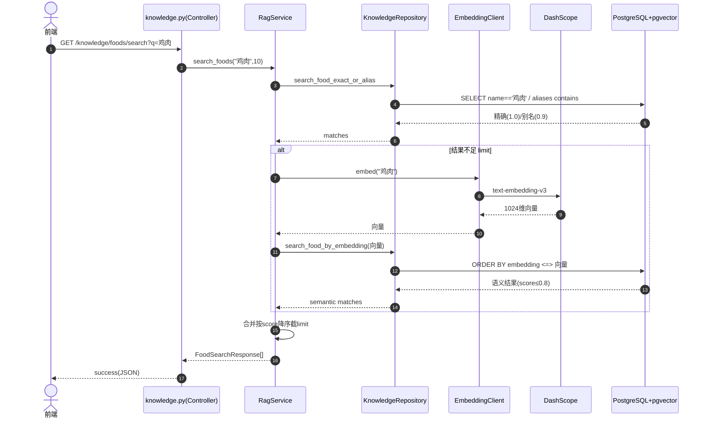
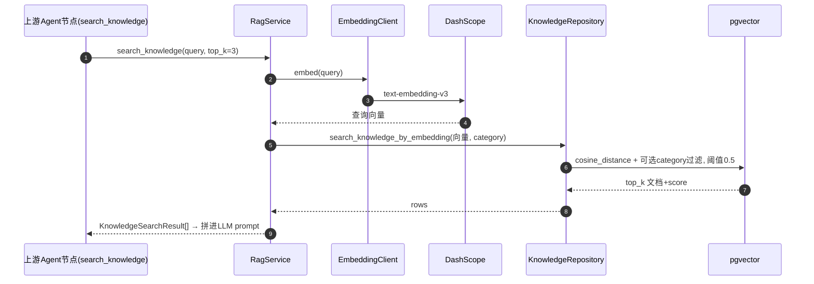

# Knowledge/RAG 知识库模块 · 深度分析

> 基于 PROJECT_MAP，对 **Knowledge/RAG（知识库）模块** 的单模块深度分析。
> 所有结论基于 `health-agent/backend/` 真实代码，推断内容已标注【推断】。分析模板见 `2.md`。

**一句话定位**：Knowledge/RAG 是产品的**只读语义检索底座**——把食物营养库和健康文档库向量化，对外提供"食物精确/语义搜索、营养换算、健康知识检索"三种能力，供 Chat、Suggestion、Diet 等上游模块做 RAG 增强。它**不做 LLM 推理**，只做 Embedding + pgvector 检索。

---

## 一、模块职责

### 1.1 解决什么问题
1. **食物营养数据查询**：把"鸡胸肉""米饭"这类自然语言食物名，映射到结构化营养数据（热量/蛋白/脂肪/碳水等），并支持按份量换算。
2. **语义检索**：用户说"鸡肉"也能匹配到"鸡胸肉"——靠向量相似度而非精确字符串匹配。
3. **健康知识 RAG**：把健康/营养文档向量化，按语义召回 top-k 片段，喂给上游 LLM 做个性化、有依据的回复（减少幻觉）。

### 1.2 系统位置
```
Chat.search_knowledge ──┐
Suggestion.search_knowledge ─┼─▶ 【RagService】─▶ KnowledgeRepository ─▶ pgvector ─▶ foods / knowledge_docs
Diet.lookup_nutrition ──┘            │
                                     └─▶ EmbeddingClient ─▶ DashScope text-embedding-v3
```
属于**基础设施/能力层**，被多个上游模块复用。是 PROJECT_MAP 标注的 ★★★★☆ 模块。

### 1.3 上下游

| 方向 | 对象 | 关系 |
|------|------|------|
| 上游（HTTP） | 前端 | `GET /knowledge/foods/search`、`/foods/{id}` |
| 上游（模块内调用） | Chat 的 `search_knowledge` 节点 | 通用对话检索健康知识 |
| 上游（模块内调用） | Suggestion 的 `search_knowledge` 节点 | 生成建议时检索知识 |
| 上游（模块内调用） | Diet 的 `enrich_nutrition`（`diet_service.py:250` 调 `lookup_nutrition`） | 饮食营养计算 |
| 下游 | `EmbeddingClient` → DashScope | 生成查询/入库向量 |
| 下游 | `KnowledgeRepository` → `PgVectorClient` → PostgreSQL+pgvector | 向量检索 |
| 数据来源 | `scripts/seed_knowledge.py` + `data/foods.json`、`data/health_tips.json` | 离线灌库 |

---

## 二、功能清单

### 2.1 对外 HTTP 功能

| # | 功能 | 入口 | 目的 | 业务价值 |
|---|------|------|------|---------|
| 1 | 食物搜索 | `GET /knowledge/foods/search` | 关键词搜食物（精确+别名+语义） | 用户/前端查食物营养，记饮食时选食物 |
| 2 | 食物详情 | `GET /knowledge/foods/{food_id}` | 取单个食物完整营养+份量 | 展示营养明细 |

### 2.2 对内 Service 功能（`RagService`）

| 方法 | 功能 | 被谁调用 |
|------|------|---------|
| `search_foods(query, limit)` | 食物三级检索：精确→别名→语义 | 接口1、`lookup_nutrition` 兜底 |
| `get_food_detail(food_id)` | 按 ID 取食物详情 | 接口2 |
| `search_knowledge(query, category, top_k)` | 健康文档语义检索 | Chat / Suggestion 的 `search_knowledge` 节点 |
| `lookup_nutrition(food_name, amount, unit)` | 营养换算（按份量算实际营养） | Diet 的营养计算（`diet_service.py:250`） |

### 2.3 功能边界（不做什么）
- **不做 LLM 推理**：注释明确 "本服务不做 LLM 推理"。
- **不做写入 API**：知识库是只读的，灌库走离线脚本 `seed_knowledge.py`（`upsert_*` 仅脚本调用）。
- **不按用户隔离**：知识库是**全局共享数据**，`KnowledgeRepository` 注释明确"不按 user_id 隔离，不继承 BaseRepository"。

---

## 三、代码结构分析

> 用 Java 分层类比，标注本模块实际有/无对应角色。

| Java 概念 | 本模块对应 | 文件 | 职责 |
|-----------|-----------|------|------|
| Controller | API 路由 | `app/api/v1/knowledge.py` | 2 个 GET 接口，委托 RagService |
| DTO/VO | Pydantic Schema | `app/schemas/knowledge.py` | 食物/营养/检索结果契约 |
| Service | 业务服务 | `app/services/rag_service.py` | 检索编排（**无 LLM**），三级检索+营养换算 |
| DAO/Repository | 仓储 | `app/db/repositories/knowledge_repo.py` | SQL 拼装、精确/别名/向量查询、upsert |
| —（特有）| 向量检索客户端 | `app/integrations/vector/pgvector_client.py` | 通用 pgvector 相似度搜索 |
| —（特有）| Embedding 客户端 | `app/integrations/embedding/client.py` | 调 DashScope 生成向量 |
| Entity | ORM 模型 | `app/db/models/knowledge.py` | `Food` / `KnowledgeDoc` 表 |
| Producer/灌库 | 离线脚本 | `scripts/seed_knowledge.py` | 读 JSON → embed → upsert |
| Consumer/MQ | **无** | — | 无消息队列 |
| Scheduler | **无** | — | 灌库手动跑脚本，非定时 |
| Agent/Graph | **无** | — | 本模块不含 LangGraph，纯 Service |

### 各层要点
- **Controller**（`knowledge.py`）：极薄，仅 2 个 GET，鉴权用 `CurrentUserDep`，service 用 `RagServiceDep`。
- **Service**（`rag_service.py`）：核心编排在 `search_foods` 的"三级降级检索"和 `lookup_nutrition` 的"换算逻辑"。用 `@log_all_service_methods` 统一日志。
- **Repository**（`knowledge_repo.py`）：持有 `PgVectorClient`；`search_knowledge_by_embedding` 直接手写 pgvector SQL（带 category 过滤），`search_food_by_embedding` 复用通用 `PgVectorClient`。
- **PgVectorClient**：通用泛型检索器，`score = 1 - cosine_distance`，支持 filters（等值/IN/IS NULL）和 score_threshold。
- **EmbeddingClient**：OpenAI SDK 接 DashScope，`text-embedding-v3`，1024 维，支持单条 `embed` 和批量 `embed_batch`（≤25 条）。

---

## 四、接口清单

| # | 接口名称 | 路径 | 方式 | 功能说明 |
|---|---------|------|------|---------|
| 1 | 搜索食物营养数据 | `/knowledge/foods/search` | GET | Query: `q`(必填,≥1)、`limit`(1~50,默认10)；返回 `FoodSearchResponse[]`（含 match_score） |
| 2 | 获取食物详情 | `/knowledge/foods/{food_id}` | GET | Path: `food_id`(UUID)；返回 `FoodDetailResponse`（营养+份量+数据源） |

> 注意：实际对外路径含全局前缀（通常 `/api/v1`）。`search_knowledge` 和 `lookup_nutrition` **无独立 HTTP 接口**，仅作为 Service 方法被其它模块的 Agent/Service 内部调用。
> 全部接口需 JWT 鉴权（`CurrentUserDep`，对接 Supabase Auth）。

### 响应结构要点
- `FoodSearchResponse`：id/name/aliases/category/calories_per_100g/**match_score**(0~1)。
- `FoodDetailResponse`：含 `nutrition_per_100g`(NutritionInfo) + `common_portions`(份量换算表) + `data_source`。
- `KnowledgeSearchResult`：id/title/content/**score**(0~1)/metadata。

---

## 五、Agent 分析

**本模块不涉及 LangGraph**。它是纯 Service 层的检索能力，被其它模块的 Agent 节点调用：
- Chat 父图的 `search_knowledge` 节点 → `RagService.search_knowledge`
- Suggestion 子图的 `search_knowledge` 节点 → `RagService.search_knowledge`
- Diet 子图的 `enrich_nutrition` → `DietService` → `RagService.lookup_nutrition`

所以本模块在 RAG 链路里扮演的是 **"R"（Retrieval）**，Generation 在上游各 Agent 完成。这种"检索与生成解耦"的设计，让同一套检索能力被多个 Agent 复用。

---

## 六、完整执行流程

> 模板链路含 Redis/MySQL/MQ，本项目实际：无 Redis、用 PostgreSQL+pgvector、无 MQ。

### 6.1 链路 A：食物搜索（`GET /knowledge/foods/search?q=鸡肉`）

```
Step1 User→Controller: GET /knowledge/foods/search?q=鸡肉&limit=10
Step2 Controller(knowledge.py): JWT鉴权 → 注入 RagService → service.search_foods("鸡肉", 10)
Step3 Service: 校验非空、limit 夹到[1,50]
Step4 Service→Repo: search_food_exact_or_alias("鸡肉",10)
        → 精确匹配 Food.name=="鸡肉" (score=1.0)
        → 不足则 别名匹配 aliases contains "鸡肉" (score=0.9)
Step5 若结果<limit → Service→EmbeddingClient.embed("鸡肉") → DashScope → 1024维向量
Step6 Service→Repo: search_food_by_embedding(向量, 排除已命中id, 阈值0.5)
        → PgVectorClient.similarity_search(Food, 向量) → pgvector <=> 余弦距离
        → 语义结果 score 上限压到 0.8（低于精确/别名）
Step7 Service: 合并结果按 score 降序，截 limit，转 FoodSearchResponse[]
Step8 Controller: success([...]) 返回 JSON
```

### 6.2 链路 B：健康知识检索（Chat/Suggestion 内部调用）

```
Step1 上游Agent节点(search_knowledge) → RagService.search_knowledge(query, top_k=3)
Step2 Service: 校验非空、top_k 夹到[1,20]
Step3 Service→EmbeddingClient.embed(query) → DashScope 向量（失败抛 ExternalServiceException）
Step4 Service→Repo.search_knowledge_by_embedding(向量, category, top_k)
        → 手写 pgvector SQL: cosine_distance + 可选 metadata->>'category' 过滤
        → 阈值 0.5，按距离升序取 top_k
Step5 Service: 转 KnowledgeSearchResult[] 返回给上游节点 → 拼进 LLM prompt
```

### 6.3 链路 C：营养换算（Diet 内部调用）

```
Step1 Diet → RagService.lookup_nutrition("鸡胸肉", amount=150, unit="g")
Step2 Repo.get_food_by_name 精确取；取不到 → 走 search_foods 语义兜底取 top1
Step3 _amount_to_grams: g/克 直接用；否则查 common_portions 份量换算表
Step4 按 grams/100 比例缩放每100g营养 → 返回 NutritionInfo
```

### 6.4 数据流向（含离线灌库）
```
[离线] data/foods.json + health_tips.json
  → seed_knowledge.py → EmbeddingClient.embed → KnowledgeRepository.upsert_* → foods/knowledge_docs(带embedding)
[在线] 查询文本 → embed → pgvector 余弦检索 → 结构化结果 → 上游
```

---

## 七、Mermaid 时序图

### 7.1 食物搜索（三级检索）


### 7.2 健康知识 RAG 检索


### 7.3 阅读要点
- **三级检索是"成本递增"设计**：先零成本的精确/别名查（DB），不够才花钱调 Embedding 做语义查。
- **score 分层**：精确 1.0 > 别名 0.9 > 语义 ≤0.8，保证精确匹配永远排在语义匹配前面。
- **knowledge 检索强依赖 Embedding**：embed 失败直接抛 `ExternalServiceException`（无 DB 兜底，因为没有关键词匹配路径）。

---

## 八、数据库分析

### 8.1 涉及的表

| 表 | 作用 | 重要程度 |
|----|------|---------|
| `foods` | 食物营养知识库 | ★★★★☆ |
| `knowledge_docs` | 健康建议文档库 | ★★★★☆ |

### 8.2 `foods` 表结构（`Food` 模型）

| 字段 | 类型 | 约束 | 说明 |
|------|------|------|------|
| `id` | UUID | PK | UUIDPrimaryKeyMixin |
| `name` | String(100) | **unique, index** | 食物名（精确匹配键） |
| `aliases` | ARRAY(String) | default `{}` | 别名数组（别名匹配用 `contains`） |
| `category` | String(20) | index | 分类（grains/meat/...） |
| `calories/protein/fat/carbs_per_100g` | Float | NOT NULL | 每100g 核心营养 |
| `fiber/sodium/sugar_per_100g` | Float | nullable | 可选营养 |
| `common_portions` | JSONB | default `[]` | 份量换算表 `[{name,weight_grams}]` |
| `data_source` | String(50) | default `manual` | 数据来源 |
| `embedding` | **Vector(1024)** | nullable | 食物向量（语义检索用） |

### 8.3 `knowledge_docs` 表结构（`KnowledgeDoc` 模型）

| 字段 | 类型 | 约束 | 说明 |
|------|------|------|------|
| `id` | UUID | PK | — |
| `title` | String(200) | **unique, index** | 标题（upsert 冲突键） |
| `content` | Text | NOT NULL | 文档正文 |
| `metadata_` | JSONB（列名 `metadata`） | default `{}` | 含 category/tags 等，category 过滤用 `metadata->>'category'` |
| `embedding` | **Vector(1024)** | nullable | 文档向量 |

### 8.4 表关系与数据流转
- 两张表**互相独立、无外键**，是两套并行的"向量化知识库"。
- `embedding` 维度 1024，必须与 `EmbeddingClient.dimensions` 一致，否则 pgvector 无法比较。
- **写入**：仅离线 `seed_knowledge.py` 走 `upsert_*`（按 name/title 冲突更新，`ON CONFLICT DO UPDATE`），幂等可重复灌。
- **读取**：精确（`name`/`aliases`）走普通索引；语义走 pgvector `<=>` 余弦距离。
- **向量索引（已查 alembic 确认，非推断）**：`foods`/`knowledge_docs` 的 `embedding` 列**均建了 IVFFlat 索引**——`20260508_0003_phase3_knowledge_tables.py` 执行 `CREATE INDEX ... USING ivfflat (embedding vector_cosine_ops) WITH (lists = 50)`（索引名 `idx_foods_embedding` / `idx_knowledge_docs_embedding`）。pgvector 扩展由 `20260508_0002` 迁移启用。模型层不声明索引，统一在迁移脚本里建。

### 8.5 与模板 MySQL 的差异
- 用 **PostgreSQL + pgvector** 扩展，`Vector(1024)` 是 pgvector 特有类型，MySQL 无对应。
- `aliases` 用 PG 的 `ARRAY`，`common_portions/metadata` 用 `JSONB`——都依赖 PostgreSQL。

---

## 十一、异常处理分析

### 11.1 异常捕获

| 位置 | 异常 | 处理 |
|------|------|------|
| `search_foods` query 空 | `ValidationException(INVALID_QUERY)` | 入参校验 |
| `search_foods` embed 失败 | 若已有精确/别名结果 → **降级返回**；否则抛 `ExternalServiceException` | 部分降级 |
| `search_knowledge` embed 失败 | 直接抛 `ExternalServiceException(EMBEDDING_SERVICE_ERROR)` | 无降级路径 |
| `get_food_detail`/`lookup_nutrition` 找不到 | `NotFoundException(FOOD_NOT_FOUND)` | — |
| `lookup_nutrition` amount≤0 / 单位不支持 | `ValidationException` | 入参/换算校验 |
| `PgVectorClient` 入参非法 | `ValueError`（top_k≤0、空向量、阈值越界、无 embedding 列） | 防御式校验 |

> 上游调用方（Chat/Suggestion 的 `search_knowledge` 节点）会**再包一层 try/except 静默降级**（返回空列表，不影响对话）——即本模块抛异常，但对话体验不挂。

### 11.2 重试 / 补偿 / 幂等
- **重试**：本模块无显式重试；Embedding 的重试依赖 OpenAI SDK 客户端层（若配置）。
- **补偿**：无事务补偿（纯只读检索 + 离线灌库）。
- **幂等**：
  - 检索接口天然幂等（只读）。
  - 灌库 `upsert_food`/`upsert_knowledge_doc` 用 `ON CONFLICT(name/title) DO UPDATE`，**重复灌库幂等**，可反复跑 `seed_knowledge.py`。
  - `--skip-embeddings` 选项支持先灌结构化数据、后补向量，避免重复花 Embedding 费用。

---

## 十二、项目亮点

### 技术亮点
1. **三级降级检索**（`search_foods`）：精确(1.0)→别名(0.9)→语义(≤0.8)，成本递增、精度优先，零成本路径优先于花钱的 Embedding 调用。
2. **通用泛型向量检索器**（`PgVectorClient`）：一套 `similarity_search` 服务 Food/KnowledgeDoc/Memory 多张表，泛型 + 动态 filters（等值/IN/IS NULL），高度复用。
3. **score 归一化**：`1 - cosine_distance` 把"距离"翻译成业务易懂的"相似度分数"，并对语义结果设上限避免越过精确匹配。
4. **Embedding 与 LLM 解耦**：`EmbeddingClient` 注释明确"Embedding 是确定性工具能力，不属于 LLM 推理编排，不放进 LangGraph"——边界清晰。

### 架构亮点
1. **检索与生成解耦**：本模块只管 Retrieval，Generation 在各上游 Agent，同一套检索被 Chat/Suggestion/Diet 三处复用。
2. **全局数据不做 user 隔离**：`KnowledgeRepository` 显式不继承 BaseRepository，与业务表（按 user_id 隔离）区分清楚。
3. **离线灌库与在线检索分离**：写路径（脚本 upsert）与读路径（API/Service）完全分开，知识库对运行时只读。

### 性能 / 可扩展性
- **精确查优先**：常见食物走索引精确匹配，避免每次都调 Embedding。
- **limit/top_k 夹紧**：50/20 上限防止过大检索。
- **批量 Embedding**：`embed_batch`（≤25）供灌库批处理。
- **可扩展**：新增知识表只要带 `embedding` 列即可复用 `PgVectorClient`；新增 food category 改枚举即可。
- **现状**：已用 IVFFlat 索引（lists=50）。数据量增大后如需更高召回/速度，可评估迁移到 HNSW（当前为 IVFFlat）。

---

## 十三、面试讲解版

### 3 分钟版
> Knowledge/RAG 模块是产品的**语义检索底座**，负责 RAG 里的"检索"环节。它管两套向量化知识库：食物营养库和健康文档库，对外提供食物搜索、营养换算、健康知识检索三种能力，被 Chat、Suggestion、Diet 三个模块复用。

它**不做 LLM 推理**，只做两件事：调通义千问 Embedding 把文本转成 1024 维向量，再用 PostgreSQL 的 pgvector 扩展做余弦相似度检索。

最有特色的是**食物的三级降级检索**：先做零成本的精确名匹配（分数1.0），不够再做别名匹配（0.9），还不够才花钱调 Embedding 做语义匹配（上限0.8）。这样既保证了精确匹配永远排前面，又能用"鸡肉"匹配到"鸡胸肉"。

工程上检索与生成解耦——本模块只返回结构化检索结果，由上游各 Agent 拼进 prompt 调 LLM，所以一套检索能力被多处复用。

### 10 分钟版（要点提纲）
1. **定位**：RAG 的 R，只读检索底座，无 LLM、无 LangGraph、无用户隔离（全局数据）。
2. **两张表**：`foods`（营养+别名+份量+Vector1024）、`knowledge_docs`（标题+正文+metadata+Vector1024）。
3. **三种能力**：`search_foods`（三级检索）、`lookup_nutrition`（份量换算）、`search_knowledge`（文档语义检索）。
4. **三级检索详解**：精确(DB,1.0)→别名(DB,0.9)→语义(Embedding+pgvector,≤0.8)，成本递增、精度优先、score 分层。
5. **向量栈**：EmbeddingClient(DashScope text-embedding-v3,1024维) + PgVectorClient(通用泛型 cosine_distance 检索)。
6. **解耦设计**：检索与生成分离，被 Chat/Suggestion/Diet 复用；Embedding 不进 LangGraph。
7. **数据生命周期**：离线 `seed_knowledge.py` 读 JSON→embed→upsert(幂等 ON CONFLICT)；在线只读检索。
8. **异常策略**：search_foods 的 embed 失败可降级（有精确结果就返），search_knowledge 无降级路径；上游再包一层静默降级保对话不挂。
9. **技术栈澄清**：PostgreSQL+pgvector（非 MySQL）、无 Redis、无 MQ。

---

## 十四、新人阅读路线（只看 20% 代码）

### 必读 5 文件（按优先级）

| 优先级 | 文件 | 为什么优先 |
|--------|------|-----------|
| ① | `app/services/rag_service.py` | **核心编排**。三级检索、营养换算、知识检索全在这，读懂它就懂了模块 |
| ② | `app/db/models/knowledge.py` | **数据契约**。两张表结构 + Vector(1024)，~50行，秒懂 |
| ③ | `app/db/repositories/knowledge_repo.py` | **检索实现**。精确/别名/向量三种查询 + upsert，看 SQL 怎么拼 |
| ④ | `app/integrations/vector/pgvector_client.py` | **向量检索机制**。cosine_distance→score 的核心，理解 pgvector 怎么用 |
| ⑤ | `app/integrations/embedding/client.py` | **Embedding 调用**。文本怎么变向量，~90行 |

### 可延后
- `app/api/v1/knowledge.py`（接口很薄，2个GET，一看就懂）
- `app/schemas/knowledge.py`（当字段参考手册）
- `scripts/seed_knowledge.py`（想搞懂数据怎么灌进去时）

### 阅读心法
1. **带着三条链路读**：食物搜索（三级）、知识检索（纯语义）、营养换算，三者走法不同。
2. **盯住 score**：精确1.0/别名0.9/语义≤0.8 的分层是理解检索质量的关键。
3. **记住三个"不是"**：不是 LLM（只检索）、不是 MySQL（是 pgvector）、不按用户隔离（全局数据）。

---

## 十五、带我读代码的流程

> 所有路径真实存在于 `health-agent/backend/`。

### 15.1 有序阅读清单（从外到内）

| 顺序 | 文件 | 角色 | 排序理由 |
|------|------|------|---------|
| 1 | `app/api/v1/knowledge.py` | Controller | 入口，看请求怎么进（很薄，2个GET） |
| 2 | `app/schemas/knowledge.py` | Schema | 看请求/响应契约：FoodSearchResponse/KnowledgeSearchResult |
| 3 | `app/services/rag_service.py` | Service | **核心**，三种能力的编排逻辑 |
| 4 | `app/db/models/knowledge.py` | Model | 看 foods/knowledge_docs 表结构 |
| 5 | `app/db/repositories/knowledge_repo.py` | Repository | 看精确/别名/向量查询 + upsert |
| 6 | `app/integrations/vector/pgvector_client.py` | 向量检索器 | 看 cosine_distance→score |
| 7 | `app/integrations/embedding/client.py` | Embedding 客户端 | 看文本→向量 |
| 8 | `scripts/seed_knowledge.py` | 灌库脚本 | 看数据怎么进库（理解数据来源） |

### 15.2 分阶段阅读

**阶段 1：跑通检索主链路（文件 1~5）**
目标：搞清"一个食物搜索请求怎么走到 DB 又回来"。
读完应能回答：
- [ ] `search_foods` 的三级检索分别用什么匹配？score 分别是多少？
- [ ] 为什么精确/别名查不调 Embedding，语义查才调？
- [ ] `search_knowledge` 和 `search_foods` 在"是否依赖 Embedding"上有何区别？
- [ ] `lookup_nutrition` 怎么把 150g 鸡胸肉换算成营养？
- [ ] 知识库为什么不按 user_id 隔离？

**阶段 2：看向量检索机制（文件 6~7）**
目标：搞懂 pgvector 和 Embedding 怎么协作。
读完应能回答：
- [ ] `score = 1 - cosine_distance` 是什么意思？为什么这么算？
- [ ] `PgVectorClient.similarity_search` 怎么生成 SQL？filters 支持哪几种？
- [ ] Embedding 维度为什么必须是 1024？和数据库哪里对应？

**阶段 3：看数据来源（文件 8）**
目标：搞懂知识库怎么灌进去。
读完应能回答：
- [ ] `--skip-embeddings` 有什么用？
- [ ] `upsert` 怎么保证重复灌库幂等？冲突键是什么？

### 15.3 每个文件"重点看什么"

| 文件 | 重点看 | 可略过 |
|------|--------|--------|
| `knowledge.py` | 2个GET的参数和 service 调用 | response_model 细节 |
| `schemas/knowledge.py` | FoodSearchResponse 的 match_score、KnowledgeSearchResult 的 score | FoodCategory 全部枚举值 |
| `rag_service.py` | `search_foods` 三级逻辑、`lookup_nutrition` 换算、`search_knowledge` 流程 | `_food_*_response` 转换细节 |
| `knowledge.py`(model) | 两个 `embedding: Vector(1024)`、unique 键 | Mixin 内部 |
| `knowledge_repo.py` | `search_food_exact_or_alias` 的 score 赋值、`search_knowledge_by_embedding` 的 category 过滤、`upsert_*` 的 ON CONFLICT | metadata_ 列名映射细节 |
| `pgvector_client.py` | `similarity_search` 的 distance/score 计算、`_apply_filters` | 泛型 TypeVar 声明 |
| `embedding/client.py` | `embed` 的 model/dimensions 参数 | embed_batch 的批量上限校验 |
| `seed_knowledge.py` | `seed_knowledge` 主流程、`_*_embedding_text` 拼接 | argparse 细节 |

### 15.4 最短验证路径（用一个真实请求串起来）

**追踪**：`GET /knowledge/foods/search?q=鸡肉&limit=10`

```
1. knowledge.py:search_foods                       ← 请求进入
2.   rag_service.py:search_foods("鸡肉",10)          ← 校验+limit夹紧
3.     knowledge_repo.py:search_food_exact_or_alias  ← 精确(1.0)+别名(0.9)
4.       → SELECT foods WHERE name=='鸡肉' / aliases contains
5.   (若不足) embedding/client.py:embed("鸡肉")       ← DashScope 1024维向量
6.     knowledge_repo.py:search_food_by_embedding    ← 语义检索(≤0.8)
7.       pgvector_client.py:similarity_search(Food)   ← cosine_distance→score
8.       → ORDER BY embedding <=> 向量 LIMIT
9.   rag_service.py: 合并按score降序截limit→FoodSearchResponse[]
10. knowledge.py: success(JSON)                      ← 返回
```

跟完这 10 步，Controller→Service→Repository→PgVectorClient→Embedding→DB 全链路就通了。

**进阶**：再追一个 `search_knowledge`（从 Chat 的 `search_knowledge` 节点进），对比它**没有**精确/别名路径、强依赖 Embedding 的差异。

### 15.5 可以暂时跳过

| 跳过项 | 原因 |
|--------|------|
| `rag_service.py` 的 `_food_search_responses`/`_nutrition_info` 等静态转换方法 | 纯数据搬运，主链路不依赖 |
| `pgvector_client.py` 的泛型类型注解 | 不影响逻辑理解 |
| `embedding/client.py` 的 `embed_batch` | 仅灌库用，在线检索走单条 `embed` |
| `schemas/knowledge.py` 的 `KnowledgeSearchRequest` | 已核对：定义并导出，但**无任何 HTTP 接口/调用方使用**（knowledge 检索走 Service 内部调用）。属预留/历史遗留，按需再看 |
| 上游 Chat/Suggestion/Diet 节点 | 属于其它模块，知道"调本模块"即可 |
