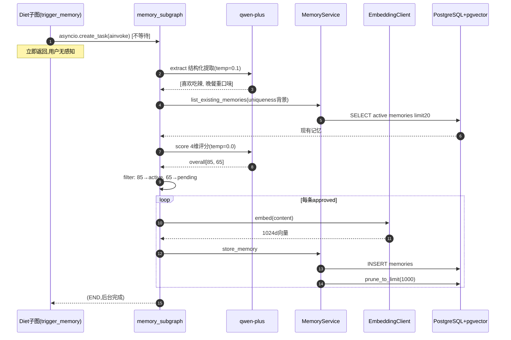
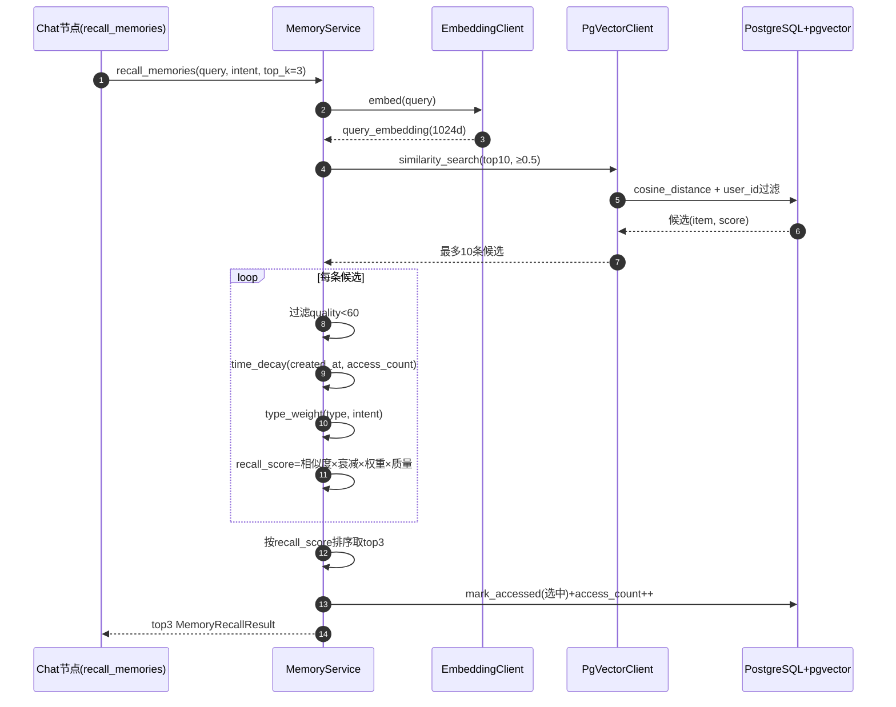

# Memory（记忆）模块深度分析

> 基于 PROJECT_MAP 的单模块深度分析。所有结论基于 `health-agent/backend/` 真实代码，推断内容已标注【推断】。
> 分析模板见 `2.md`。Memory 是 PROJECT_MAP 中 ★★★★★ **技术壁垒最高**的模块。

## 关键技术栈澄清（务必先记住）

| 模板假设 | 本项目实际 |
|---------|-----------|
| Redis | **无 Redis**；中断态由 Chat 父图 checkpointer 管 |
| MySQL | **PostgreSQL + pgvector**（`Vector(1024)` 列） |
| MQ | **不需要**——Memory 子图本身被 `asyncio.create_task` fire-and-forget 调用 |
| HTTP API | **无独立 REST 端点**！Memory 是"基础能力模块"，被 Chat/Diet/Plan/Suggestion 调用 |
| LLM | **通义千问 qwen-plus**（DashScope OpenAI 兼容，`with_structured_output` 三处） |
| Embedding | **通义千问 text-embedding-v3**（1024 维） |

## ⚠️ 重要：Memory 是"基础能力模块"，没有 HTTP 入口

Memory 与 Chat/Diet/Plan 不同，**完全没有 `/memories/*` 端点**。它的对外形态是：
1. **MemoryService**（被 chat_agent / suggestion_agent / plan conversation 注入调用）。
2. **memory_subgraph**（被 chat/diet 节点 `asyncio.create_task` 后台异步调起）。
3. **consolidate_subgraph**（手动调用，**当前未见调度器代码**【推断】合并任务可能尚未自动化）。

数据流是"**异步写、同步读**"：
- 写入：业务模块（chat/diet 等）回复完用户后 fire-and-forget 触发 memory_subgraph 提取入库。
- 读取：业务模块在生成回复**之前**同步调 `MemoryService.recall_memories` 召回 top-k 注入 prompt。

---

# 一、模块职责

> 基于：`agents/memory/{subgraph,nodes,state,tools,graph}.py`、`services/memory_service.py`、`db/models/memory.py`、`integrations/embedding/`、`integrations/vector/`

## 1.1 该模块解决什么问题

Memory 是产品**"AI 记得用户"**的底层能力，让 AI 在多次对话中保持人格连贯性、个性化建议有依据。它解决：

1. **从对话/事件中提取持久化事实**：用户说"我对花生过敏"、"我喜欢吃辣"、"目标 12 周减 4kg" → 自动结构化存成 `Memory` 行，带类型标签和质量分。
2. **质量评分 + 阈值过滤**：避免把垃圾事实存进库（用 LLM 给 relevance/accuracy/actionability/uniqueness 四维打分，<60 丢弃）。
3. **去重**：用现有记忆作为 uniqueness 评分背景，相同事实不重复存。
4. **向量化召回**：1024 维 embedding + pgvector 余弦相似度检索，取 top-k 候选。
5. **多因子重排**：相似度不是唯一标准，要乘 **时间衰减 × 类型权重 × 质量分**，按上下文 intent 调整偏好。
6. **冷数据归档**：active 总数超 1000 时按"低质量+老旧"归档；定期把相似记忆合并成 summary 后归档源记录。

## 1.2 处于整个系统什么位置

```
                                  Memory 模块
                                     │
        ┌─ 写入路径(异步) ──┐                    ┌─ 读取路径(同步) ─┐
        │                  │                    │                │
   chat/diet 节点           │                    │   chat/diet/plan/suggestion
   asyncio.create_task ────→│ build_memory_subgraph │←── recall_memories
   (record_diet, chat_msg)  │ extract→score→filter→ │   (intent + top_k)
                           │ embed_and_store        │
                           │                       │
                           ▼                       ▼
                     ┌──────────────────────────────────┐
                     │ MemoryService(算法+CRUD,无LLM)   │
                     │   ├─ recall_memories(向量+衰减+权重) │
                     │   ├─ store_memory + prune_to_limit │
                     │   └─ on_profile_updated(档案同步)   │
                     └──────────────┬───────────────────┘
                                    │
                ┌───────────────────┼───────────────────┐
                ▼                   ▼                   ▼
          MemoryRepository    EmbeddingClient      PgVectorClient
          (memories/summaries) (text-embedding-v3,1024d) (cosine_distance)
                │                                       │
                └─────────────  PostgreSQL + pgvector ───┘
```

## 1.3 上下游是谁

| 方向 | 对象 | 关系 |
|------|------|------|
| 上游（写） | Chat 节点 `trigger_memory_extract` | 通用对话回复后异步触发 extract |
| 上游（写） | Diet 节点 `trigger_memory` | 饮食落库后异步触发 extract（trigger_type=record_diet） |
| 上游（写） | UserService `on_profile_updated` | 档案变化直接调 `MemoryService.on_profile_updated` 同步存 profile 类记忆 |
| 上游（读） | Chat 节点 `recall_memories` | 通用对话前召回 top-3 注入 prompt |
| 上游（读） | Plan `run_plan_conversation` | 起草前召回 top-4（intent=create_plan） |
| 上游（读） | Suggestion `recall_memories` 节点 | 建议生成前召回个性化偏好 |
| 下游（向量） | DashScope text-embedding-v3 | 1024 维向量 |
| 下游（LLM） | qwen-plus | extract/score/consolidate 三处结构化输出 |
| 下游（持久化） | PostgreSQL + pgvector | `memories`（含 Vector(1024)）+ `memory_summaries` |

## 1.4 一句话总结

**Memory 模块 = LLM 提取 + LLM 评分 + 向量化存储 + 多因子召回 + 自动归档** 的"AI 长期记忆"系统。它没有 HTTP API，是各业务模块的**横切基础能力**，写入异步、读取同步、底层用 pgvector + DashScope embedding。

---

# 二、功能清单

## 2.1 三套核心子能力

| 子能力 | 实现 | 说明 |
|--------|------|------|
| 提取 | `build_memory_subgraph` 4 节点流水线 | extract → score → filter → embed_and_store |
| 召回 | `MemoryService.recall_memories` | embedding → pgvector → 多因子重排 → top-k |
| 合并 | `build_consolidate_subgraph` 1 节点 | LLM 总结相似记忆为 summary，原记忆归档 |

## 2.2 写入流水线节点功能

| 节点 | 功能 | LLM？ | 失败处理 |
|------|------|------|---------|
| `extract` | 从 trigger_type+context_data 提取最多 10 条 ExtractedMemory | ✅ qwen-plus 结构化 | 返空+error 标记，不阻塞 |
| `score` | 给每条记忆评 4 维分数（relevance/accuracy/actionability/uniqueness）+ overall_score | ✅ qwen-plus 结构化 | fallback 给所有维度 70 分 |
| `filter` | overall<60 丢弃；≥80 active；其它 pending | 否（确定性） | — |
| `embed_and_store` | 用 EmbeddingClient.embed 生成 1024d 向量，调 store_memory 落库 | 否 | 缺依赖返 error |

## 2.3 召回算法功能

`MemoryService.recall_memories(query, intent, top_k=3, candidate_k=10)`：

1. `EmbeddingClient.embed(query)` → query_embedding。
2. `repo.search_by_embedding(top_k=10, score_threshold=0.5)` → 候选（最多 10 条）。
3. 过滤 `quality_score < 60`。
4. 计算每条 `recall_score = vector_similarity × time_decay × type_weight × (quality_score/100)`。
5. 按 recall_score 降序取 top_k。
6. 标记被选中的 `last_accessed_at + access_count++`（影响下次的 time_decay）。

## 2.4 时间衰减分段（`calculate_time_decay`）

| 创建距今 | 基础衰减 |
|---------|---------|
| ≤ 7 天 | 1.0 |
| ≤ 14 天 | 0.9 |
| ≤ 21 天 | 0.8 |
| ≤ 30 天 | 0.7 |
| > 30 天 | 0.5 |
| 加成：access_count ≥ 10 | +0.2 |
| 加成：access_count ≥ 5 | +0.1 |
| 上限 | 1.2 |

## 2.5 类型权重矩阵（`TYPE_WEIGHTS`）

3 种 intent × 7 种 MemoryType：

| memory_type | record_diet | create_plan | general_advice |
|-------------|-------------|-------------|---------------|
| food_preference | 1.0 | 0.8 | 1.0 |
| portion_habit | 0.9 | 0.6 | 0.7 |
| behavior_pattern | 0.7 | 1.0 | 0.9 |
| suggestion_feedback | 0.6 | 0.9 | 0.8 |
| health_goal | 0.7 | 1.0 | 0.9 |
| allergy | 1.0 | 0.7 | 1.0 |
| exercise_habit | 0.4 | 0.9 | 0.8 |

未匹配 intent 或类型 → `DEFAULT_TYPE_WEIGHT = 0.7`。

## 2.6 9 种 MemoryType 与 3 种 Status

- **MemoryType**（schemas/memory.py）：food_preference / portion_habit / behavior_pattern / suggestion_feedback / health_goal / allergy / exercise_habit / profile / other
- **MemoryStatus**：active（默认）/ pending（评分 60-79，待人工或自动晋升）/ archived（被合并或老旧低质量自动归档）

## 2.7 归档与限额

`prune_to_limit(max_active=1000)`：active+pending 总数 > 1000 时，按 `quality_score asc, created_at asc` 取超额条数置为 archived。**每次 store_memory 后都会跑**，是写入路径的硬约束。

`archive_memories(ids)`：consolidate 节点把被合并的源记忆批量置为 archived。

## 2.8 功能边界（Memory 不做什么）

- **不做 HTTP CRUD**：无 `/memories/*` API。前端不直接管理记忆。
- **不在 Service 层调 LLM**：MemoryService 严格只做 CRUD + 算法；提取/评分/合并都在 agents 层。
- **不实时改写记忆**：用户重复说"我喜欢辣" → uniqueness 评分会发现重复 → filter 直接丢弃，**不是更新已有记忆**。
- **不做权重学习**：TYPE_WEIGHTS 是写死的常量，无强化学习。
- **不做跨用户检索**：所有查询强制带 user_id。
- **当前未见自动 consolidate 调度器**【推断】：合并子图存在但需要外部触发。

---

# 三、代码结构分析

## 3.1 分层映射总览

| Java 概念 | 本模块对应 | 文件 | 职责 |
|-----------|-----------|------|------|
| Controller | **无** | — | Memory 无 HTTP 端点 |
| —（特有）| Agent 子图 | `agents/memory/{subgraph,nodes,state,tools,graph}.py` | 提取流水线 + 合并子图 |
| DTO/VO | Pydantic Schema | `schemas/memory.py` | MemoryCreate/Entry/RecallResult/ExtractedMemory/QualityScore… |
| Service | 业务服务 | `services/memory_service.py` | 召回算法 + CRUD + 档案同步（**无 LLM**） |
| DAO/Repository | 仓储 | `db/repositories/memory_repo.py` | user_id 隔离 + 向量检索委托 |
| Entity | ORM 模型 | `db/models/memory.py` | `memories`（Vector(1024)）+ `memory_summaries` |
| —（基础设施）| 集成层 | `integrations/embedding/`、`integrations/vector/` | DashScope embedding + pgvector 检索 |
| Consumer/Producer | **无 MQ** | — | 子图本身被上游 asyncio 调起 |
| Scheduler | **无定时任务** | — | consolidate 需外部触发【推断】 |

## 3.2 Agent 层 — `agents/memory/`

| 文件 | 角色 | 内容 |
|------|------|------|
| `subgraph.py` | 图装配 | `build_memory_subgraph`（4 节点）+ `build_consolidate_subgraph`（1 节点） |
| `nodes.py` | 节点实现 | extract/score/filter_memories/embed_and_store/consolidate |
| `state.py` | 共享状态 | `MemoryExtractionState`（TypedDict） |
| `tools.py` | Service 胶水 | `save_memory_tool`、`list_existing_memories_tool` |
| `graph.py` | **兼容导出** | `build_memory_agent` → `build_memory_subgraph`（Phase 6 命名兼容） |

**注意**：`graph.py` 不是废弃文件，而是**兼容别名**——`build_memory_agent()` 直接转调 `build_memory_subgraph()`。

## 3.3 Schema 层 — `schemas/memory.py`

| 类型 | 作用 |
|------|------|
| `MemoryType` | 9 种枚举 |
| `MemoryStatus` | active/pending/archived |
| `MemoryCreate` | 落库入参（含 embedding，content ≤ 500 字） |
| `MemoryEntry` | 记忆完整实体（含 time_decay_factor） |
| `MemoryRecallResult` | 继承 Entry + vector_similarity + recall_score |
| `ExtractedMemory` | extract 节点 LLM 输出单条（无评分） |
| `MemoryExtractionResult` | extract 输出（memories 列表，≤10） |
| `MemoryQualityScore` | score 节点 LLM 输出（4 维 + overall + reason） |
| `MemoryScoreResult` | score 输出（scored_memories，≤10） |
| `ConsolidatedMemorySummary` | consolidate LLM 输出（summary_content + key_facts + quality） |
| `MemorySummaryCreate/Entry` | 中期记忆摘要 CRUD（含 period 校验） |

## 3.4 Service 层 — `services/memory_service.py`

`MemoryService(repo, embedding_client)`，**严格无 LLM**。方法分两类：

**CRUD/编排**：
- `store_memory`：落库 + `prune_to_limit(1000)` + commit。
- `recall_memories`：召回主算法（见 2.3）。
- `get_long_term_profile`：取 active 记忆（供 score 节点做 uniqueness 背景 + suggestion 用）。
- `create_summary` / `archive_memories`：合并子图用。
- `on_profile_updated`：档案变化 → 直接构造 profile 类记忆（quality=90, status=active），**这是唯一不经子图的写入路径**。

**纯算法（staticmethod）**：
- `calculate_time_decay`：时间衰减分段。
- `calculate_recall_score`：四因子乘积。
- `type_weight`：查 TYPE_WEIGHTS 矩阵。

## 3.5 Repository / Entity 层

- `memory_repo.py`：`MemoryRepository(session, user_id)`，构造时即 new `PgVectorClient(session)`。关键方法：`search_by_embedding`（委托 vector_client）、`mark_accessed`（更新 last_accessed + count）、`archive_memories`、`prune_to_limit`、`create_summary`/`list_summaries`。
- `memory.py`（model）：
  - `Memory`：**只混入 UUIDPrimaryKey + Timestamp**（**无 SoftDelete**——靠 status=archived 软归档）。`embedding` 列是 `Vector(1024)` 可空；`metadata_` 映射到 `metadata` 列（避开 SQLAlchemy 保留字）。
  - `MemorySummary`：`key_facts` 和 `source_memory_ids` 用 PostgreSQL `ARRAY` 类型。

## 3.6 集成层（技术壁垒核心）

| 文件 | 类 | 职责 |
|------|----|----|
| `integrations/embedding/client.py` | `EmbeddingClient` | DashScope text-embedding-v3，`embed`（单条）/`embed_batch`（≤25 条），1024 维 |
| `integrations/vector/pgvector_client.py` | `PgVectorClient` | 通用余弦检索：`cosine_distance` → `score=1-distance`，支持等值/IN/IS NULL 过滤 + score_threshold |

`PgVectorClient.similarity_search` 是**泛型**的——同一份代码服务 Memory、Food、KnowledgeDoc 三张带 embedding 的表。

## 3.7 异步机制

Memory 模块**自己不开后台任务**，而是**被上游异步调起**：
- chat `trigger_memory_extract` / diet `trigger_memory` 用 `asyncio.create_task(memory_graph.ainvoke(...))`。
- Memory 子图内部全是 `await` 顺序执行，无并发。
- 这种设计让"记忆提取慢"不拖累用户对话响应。

---

# 四、接口清单

## 4.1 无 HTTP 接口

Memory **没有 REST 端点**。它的"接口"是 Python 调用契约，分三类。

## 4.2 Service 方法接口（被业务模块同步调用）

| 方法 | 调用方 | 用途 |
|------|--------|------|
| `recall_memories(query, intent, top_k)` | chat/plan/suggestion | 召回个性化记忆 |
| `get_long_term_profile(limit)` | suggestion / score 节点 | 取 active 记忆 |
| `store_memory(MemoryCreate)` | embed_and_store 节点 | 落库 |
| `create_summary(MemorySummaryCreate)` | consolidate 节点 | 写中期摘要 |
| `archive_memories(ids)` | consolidate 节点 | 归档源记忆 |
| `on_profile_updated(dict)` | UserService | 档案同步写入 |

## 4.3 子图入口（被业务节点异步调用）

| 入口 | 触发方 | trigger_type |
|------|--------|--------------|
| `build_memory_subgraph().ainvoke(state)` | chat `trigger_memory_extract` | chat_message |
| 同上 | diet `trigger_memory` | record_diet |
| `build_consolidate_subgraph().ainvoke(state)` | 【推断】需外部调度 | — |

子图入参（`MemoryExtractionState`）：`user_id` + `trigger_type` + `context_data` + `memory_service` + `embedding_client`。

## 4.4 Tool 接口（子图节点 → Service 胶水）

| 工具 | 封装 |
|------|------|
| `save_memory_tool(service, memory)` | `MemoryService.store_memory` |
| `list_existing_memories_tool(service, limit)` | `MemoryService.get_long_term_profile` → 取 content 列表（uniqueness 评分背景） |

---

# 五、Agent 分析（两个子图）

## 5.1 Graph 1：memory_subgraph（4 节点写入流水线）

`build_memory_subgraph()` 静态流水线，无条件边、无 interrupt：

```
START → extract → score → filter → embed_and_store → END
```

| 边 | 说明 |
|----|------|
| extract → score | 提取出的记忆送去评分 |
| score → filter | 评分结果按阈值过滤 |
| filter → embed_and_store | 通过的记忆向量化落库 |

**全静态**：与 Plan 的 5 节点流水线类似，但 Memory 这条**纯后台、无用户交互、无 interrupt**。

## 5.2 Graph 2：consolidate_subgraph（单节点）

```
START → consolidate → END
```

单节点 `consolidate`：把 `state["consolidate_memories"]` 里的相似记忆用 LLM 总结成一条 summary，写 `memory_summaries`，再把源记忆批量 archived。

## 5.3 Node（5 个节点）

| 节点 | 类型 | 读 state | 写 state | 职责 |
|------|------|----------|----------|------|
| `extract` | async LLM | trigger_type, context_data | extracted | LLM 结构化提取 ≤10 条记忆 |
| `score` | async LLM | extracted, memory_service | scored | LLM 4 维评分 + 取现有记忆做 uniqueness 背景 |
| `filter_memories` | async 确定性 | scored | approved | 阈值过滤 + 定状态（active/pending） |
| `embed_and_store` | async | approved, memory_service, embedding_client | stored | 逐条 embed + store_memory |
| `consolidate` | async LLM | consolidate_memories, memory_service | summary | 合并相似记忆为 summary |

## 5.4 State — `MemoryExtractionState`

| 字段 | 来源/去向 |
|------|----------|
| `user_id` / `trigger_type` / `context_data` | 入参（上游传） |
| `memory_service` / `embedding_client` | 入参（依赖，**直接放 state**而非 config） |
| `existing_memories` | score 节点取（uniqueness 背景） |
| `extracted` | extract 输出（list[ExtractedMemory]） |
| `scored` | score 输出（list[MemoryQualityScore]） |
| `approved` | filter 输出（list[MemoryCreate]） |
| `stored` | embed_and_store 输出（list[MemoryEntry]） |
| `consolidate_memories` / `summary` | 合并子图用 |
| `error` | 任一节点降级标记 |

> **与 Diet/Plan 不同**：Memory 子图依赖（memory_service/embedding_client）**直接放进 state**，不走 `config.configurable`。因为 Memory 子图是后台 fire-and-forget 调起，**不经 checkpointer 序列化**（它不暂停、不存档），所以不可序列化对象放 state 无害。

## 5.5 Tool

仅 2 个（`tools.py`），都封装 MemoryService：`save_memory_tool`（落库）、`list_existing_memories_tool`（取 uniqueness 背景）。**确定性调用**。

## 5.6 Memory（本模块即记忆系统本身）

这是元层面的：本模块**就是**项目的记忆引擎。它不"使用"记忆，而是"生产"记忆。三层记忆对应：
- **长期记忆**：`memories` 表（向量化，可召回）。
- **中期记忆**：`memory_summaries` 表（合并摘要，period 范围）。
- **短期会话状态**：不在本模块——由 Chat 父图 checkpointer 管。

## 5.7 Conditional Edge / Command

**全无**。两个子图都是纯静态边的线性流水线。这与 Diet（Command 路由）/Plan（节点内循环）形成鲜明对比——Memory 是确定性管道，无分支、无用户交互。

## 5.8 interrupt 机制

**完全没有 interrupt**。Memory 子图是后台任务，不与用户交互，无暂停/恢复需求。这也是它依赖能直接放 state 的原因（不进 checkpointer）。

## 5.9 三处 LLM 结构化输出对比

| 节点 | temperature | 输出 schema | 失败兜底 |
|------|-------------|-------------|---------|
| extract | 0.1 | MemoryExtractionResult | 返空列表 + error |
| score | 0.0（最确定） | MemoryScoreResult | 所有维度给 70 分 fallback |
| consolidate | 0.1 | ConsolidatedMemorySummary | 无显式 fallback（异常会抛出）【推断】 |

---

# 六、完整执行流程

## 6.1 写入流程：饮食记录触发记忆提取（典型）

**场景**：用户记录"晚饭吃了麻辣香锅"，Diet 子图落库后触发 Memory。

1. **Diet `trigger_memory` 节点**：`asyncio.create_task(build_memory_subgraph().ainvoke({user_id, trigger_type:"record_diet", context_data:{...DietRecordResponse}, memory_service, embedding_client}))`，**立即返回不等待**。
2. **extract 节点**：`get_chat_model(temp=0.1).with_structured_output(MemoryExtractionResult)` → LLM 从饮食记录提取，如 `[{food_preference:"喜欢吃辣"}, {portion_habit:"晚餐偏好香锅类重口味"}]`。失败 → 返空。
3. **score 节点**：先 `list_existing_memories_tool` 取现有 20 条记忆做 uniqueness 背景 → LLM(temp=0.0) 给每条 4 维打分 + overall。失败 → 全给 70。
4. **filter_memories 节点**（确定性）：
   - "喜欢吃辣" overall=85 → status=active。
   - "晚餐偏好香锅" overall=65 → status=pending。
   - 若有 overall<60 的 → 丢弃。
5. **embed_and_store 节点**：对每条 approved，`embedding_client.embed(content)` → 1024d 向量 → `save_memory_tool` → `store_memory`：
   - `repo.create_memory` INSERT memories。
   - `prune_to_limit(1000)`：若超额按低质量+老旧归档。
   - commit。
6. 子图 END。整个过程**用户无感知**（后台跑）。

```
Diet落库 → asyncio.create_task → [extract(LLM) → score(LLM) → filter → embed_and_store]
                                    └ embed_and_store → EmbeddingClient → 1024d
                                    └ store_memory → INSERT memories + prune_to_limit
```

## 6.2 读取流程：通用对话召回记忆（同步）

**场景**：用户问"我适合吃什么夜宵"，Chat 通用链路召回。

1. **Chat `recall_memories` 节点**：`MemoryService.recall_memories(query="我适合吃什么夜宵", intent=None, top_k=3)`。
2. `embedding_client.embed(query)` → query_embedding。
3. `repo.search_by_embedding(query_embedding, top_k=10, score_threshold=0.5)`：
   - `PgVectorClient.similarity_search(Memory, ...)` → `cosine_distance` → `score=1-distance`。
   - filters: user_id + status in [active, pending]。
   - 只取 score ≥ 0.5 的，最多 10 条候选。
4. 对每条候选：
   - 过滤 `quality_score < 60`。
   - `calculate_time_decay(created_at, access_count)` → 时间衰减。
   - `type_weight(memory_type, intent=None)` → 0.7（无 intent 用默认）。
   - `calculate_recall_score = similarity × decay × weight × (quality/100)`。
5. 按 recall_score 降序，取 top_3。
6. `mark_accessed`：选中的 last_accessed_at + access_count++（**下次召回它们衰减会 +0.1/+0.2**），commit。
7. 返回 top-3，Chat 注入 prompt。

```
用户问题 → recall_memories → embed → pgvector(top10,≥0.5)
   → 过滤quality<60 → 逐条算 recall_score(相似度×衰减×权重×质量)
   → 排序取top3 → mark_accessed(影响下次衰减) → 注入prompt
```

## 6.3 档案同步流程（不经子图的捷径）

UserService 改了健康档案 → `MemoryService.on_profile_updated({current_weight:70, ...})`：
1. 拼成 content "用户健康档案更新: current_weight: 70; ..."（截 450 字）。
2. `embedding_client.embed(content)`。
3. `store_memory(profile 类, quality=90, active)`。

**这是唯一绕过 extract→score→filter 流水线的写入**——因为档案是结构化可信数据，不需要 LLM 提取和评分。

## 6.4 合并流程（consolidate）

1. 外部把一批相似记忆塞进 `consolidate_memories`【推断：触发方式待确认】。
2. consolidate 节点 LLM(temp=0.1) 总结成 ConsolidatedMemorySummary。
3. `create_summary` 写 memory_summaries（period_start/end 取记忆创建日期范围）。
4. `archive_memories(源 ids)` 批量置 archived。

## 6.5 与模板链路对应

| 模板 | 本项目实际 |
|------|-----------|
| Controller | **无**（无 HTTP） |
| Service | MemoryService（算法+CRUD） |
| Graph/Node | memory_subgraph 4 节点 + consolidate 1 节点 |
| Tool | save_memory_tool / list_existing_memories_tool |
| **Redis** | **无**（不暂停，无 checkpointer） |
| **MySQL** | **PostgreSQL + pgvector**（Vector(1024)） |
| **MQ** | **被上游 asyncio 调起**（自身不开任务） |
| 返回 | 无 SSE/JSON（后台写 / 同步返 Python 对象） |

---

# 七、Mermaid 时序图

## 7.1 写入：饮食触发记忆提取（异步后台）



## 7.2 读取：召回记忆（同步多因子重排）



## 7.3 时序图阅读要点

- **写异步、读同步**：写入用 create_task 不阻塞用户对话；读取必须同步等结果注入 prompt。
- **mark_accessed 是反馈回路**：被召回的记忆 access_count++，下次 time_decay 会 +0.1/+0.2，形成"常用记忆更容易被召回"的正反馈。
- **两次过滤质量分**：写入 filter 时 <60 丢弃；读取 recall 时 <60 也跳过（双保险）。
- **score_threshold=0.5 在 SQL 层过滤**：`distance <= 1 - 0.5`，pgvector 先粗筛，再到 Service 层做多因子重排。

---

# 八、数据库分析

> 基于：`db/models/memory.py`、`db/repositories/memory_repo.py`、`integrations/vector/pgvector_client.py`

## 8.1 涉及的数据表

| 表 | 归属 | 作用 |
|----|------|------|
| `memories` | Memory 模块 | 长期记忆（含 1024 维向量） |
| `memory_summaries` | Memory 模块 | 中期记忆摘要（合并产物） |

## 8.2 `memories` 表（长期记忆，核心）

`Memory` **只混入 `UUIDPrimaryKeyMixin` + `TimestampMixin`**（**无 SoftDeleteMixin**——用 status=archived 软归档替代）：

| 字段 | 类型 | 说明 |
|------|------|------|
| `id` | UUID | PK |
| `user_id` | UUID | NOT NULL, index — 多租户隔离 |
| `memory_type` | String(40) | NOT NULL, index — 9 种类型 |
| `content` | Text | NOT NULL — 记忆内容（≤500 字） |
| `embedding` | **Vector(1024)** | 可空 — pgvector 列，DashScope 向量 |
| `metadata_` | JSONB | 映射到 `metadata` 列（避保留字），默认 `{}` |
| `quality_score` | Integer | 默认 80 — 召回/归档关键因子 |
| `status` | String(20) | active/pending/archived，index |
| `source` | String(50)? | 来源（profile/diet/...） |
| `trigger_type` | String(50)? | 触发类型（record_diet/chat_message/...） |
| `last_accessed_at` | timestamp? | 召回时更新（影响时间衰减） |
| `access_count` | Integer | 默认 0 — 召回次数，影响衰减加成 |

**索引**：`(user_id, status)`、`(user_id, memory_type)`，外加 user_id/memory_type/status 单列索引。

## 8.3 `memory_summaries` 表（中期记忆）

`MemorySummary` 同样只混入 UUIDPrimaryKey + Timestamp：

| 字段 | 类型 | 说明 |
|------|------|------|
| `id` | UUID | PK |
| `user_id` | UUID | NOT NULL, index |
| `period_start` / `period_end` | Date | 摘要覆盖的时间范围 |
| `summary_content` | Text | 合并后的摘要文本（≤1000 字） |
| `key_facts` | **ARRAY(String)** | PostgreSQL 数组类型，关键事实列表 |
| `source_memory_ids` | **ARRAY(UUID)** | PostgreSQL 数组，被合并的源记忆 id |
| `quality_score` | Float | 摘要质量 |
| `status` | String(20) | active/archived，index |

**索引**：`(user_id, period_start, period_end)`。

## 8.4 表关系

```
                (user_id 逻辑关联) Supabase Auth
                         │
   memories ──(source_memory_ids ARRAY)──▶ memory_summaries
      │ (合并后源记忆 status=archived)        (引用源记忆 id 数组)
      └─ embedding Vector(1024) ── pgvector 余弦检索
```

- **无物理外键**：`memory_summaries.source_memory_ids` 是 UUID 数组（逻辑引用），不是 FK。
- `user_id` 跨库（Supabase Auth），无库级外键。
- memories 与 summaries 是"多对一合并"关系，但靠数组字段记录，非关系表。

## 8.5 数据流转

**写入**：extract→score→filter→`store_memory`→`create_memory` INSERT + `prune_to_limit` 归档 + commit。

**召回**：`search_by_embedding`→`PgVectorClient.similarity_search`→`cosine_distance` SQL→候选→Service 多因子重排→`mark_accessed` UPDATE。

**归档（两条路径）**：
1. 限额归档：`prune_to_limit`，active+pending > 1000，按 `quality_score asc, created_at asc` 取超额置 archived。
2. 合并归档：`archive_memories(ids)`，consolidate 后把源记忆置 archived。

**档案同步**：`on_profile_updated`→直接 `store_memory`（绕过流水线）。

## 8.6 多租户隔离

`MemoryRepository(session, user_id)` 构造时绑定；`_active_stmt` + 所有查询带 `user_id == self.user_id`。向量检索也通过 `filters={"user_id": ..., "status": [...]}` 在 SQL 层隔离。

## 8.7 pgvector 检索细节（技术核心）

`PgVectorClient.similarity_search`：
- `embedding_column.cosine_distance(query_embedding)` → PostgreSQL `<=>` 运算符。
- `score = 1 - distance`（距离越小越相似 → 转成"分数越大越相似"）。
- `score_threshold=0.5` → SQL `where distance <= 0.5`。
- `order_by(distance.asc()).limit(top_k)`。
- 泛型设计：Memory/Food/KnowledgeDoc 三表共用。

## 8.8 与模板"MySQL"差异

MySQL **无原生向量类型**，本项目强依赖 PostgreSQL：
- `pgvector` 扩展提供 `Vector(1024)` 列 + `cosine_distance`。
- `ARRAY(String)` / `ARRAY(UUID)` 是 PostgreSQL 特有。
- `JSONB` 存 metadata。
- 整个记忆召回能力**无法平移到 MySQL**（需换 Milvus/外部向量库）。

---

# 十一、异常处理分析

## 11.1 分级降级（核心理念：记忆是增强，失败不可影响主流程）

| 位置 | 异常 | 处理 | 影响 |
|------|------|------|------|
| `extract` | LLM 提取失败 | log warning + 返空 + error 标记 | 本次不产生记忆，对话不受影响 |
| `score` | LLM 评分失败 | **fallback 全给 70 分** | 记忆仍能入库（按 70 走 pending） |
| `embed_and_store` | 缺 service/embedding_client | 返空 + error | 不落库 |
| `consolidate` | LLM 失败 | 无显式 fallback，异常上抛【推断】 | 本次合并失败 |
| `recall_memories`（上游 chat 节点） | 整个召回失败 | Chat 节点 catch → 返空列表 | 无个性化，对话继续 |
| 子图整体 | 任意异常 | 上游 `asyncio.create_task` 不 await，异常被 `_discard_task` 消费 | 用户完全无感知 |

**关键**：Memory 子图是后台 fire-and-forget，**它失败上游根本不知道**（除非看日志）。这是有意设计——记忆提取失败绝不能影响用户对话。

## 11.2 重试机制

- LLM 调用：底层 `get_chat_model` 的 `max_retries`。
- 向量检索/落库：无显式重试。
- 子图：无重试（失败即放弃本次提取）。

## 11.3 补偿机制

- **无事务补偿**。
- score 失败的"70 分 fallback"是一种隐式补偿——保证流水线不断裂。
- **on_profile_updated 旁路**：档案这类高价值数据不走可能失败的 LLM 流水线，直接 quality=90 落库。

## 11.4 幂等

| 场景 | 幂等性 |
|------|--------|
| store_memory | **非幂等**——重复跑会插入重复记忆。靠 score 的 uniqueness 维度 + filter 在**业务层去重**，而非数据库约束 |
| archive_memories | 幂等（已 archived 再置 archived 无副作用） |
| prune_to_limit | 幂等（达标即 no-op） |
| recall_memories | 读操作天然幂等（mark_accessed 会累加 count，但不影响召回正确性） |

> **注意**：Memory 的去重是"软去重"——靠 LLM uniqueness 评分发现重复后丢弃，不是数据库唯一约束。极端情况下仍可能存入近似重复记忆，靠后续 consolidate 合并。

## 11.5 反模式规避

- **不让记忆失败影响对话**：后台 fire-and-forget + 全程降级。
- **不在 Service 调 LLM**：算法与 CRUD 纯净，LLM 只在子图节点。
- **不用 access_count 直接排序**：而是融入 time_decay 做加成，避免"刷访问量"主导召回。
- **embedding 列可空**：允许先存记忆后补向量【推断】，但当前流程都是 embed 后才 store。
- **content 长度限制**：MemoryCreate content ≤ 500，summary ≤ 1000，防止超长文本污染向量质量。

---

# 十二、项目亮点

## 12.1 技术亮点

1. **多因子召回重排**：不止向量相似度，而是 `相似度 × 时间衰减 × 类型权重 × 质量分` 四因子乘积，让召回兼顾"相关性、新鲜度、场景匹配、可信度"。
2. **intent 感知的类型权重矩阵**：3 intent × 7 type 的 TYPE_WEIGHTS，同一条"喜欢吃辣"在 record_diet 场景权重 1.0、在 create_plan 场景 0.8——召回结果随上下文动态调整。
3. **时间衰减 + 访问加成的正反馈**：常被召回的记忆 access_count↑ → 衰减 +0.1/+0.2 → 更容易再被召回，模拟"记忆强化"。
4. **LLM 双阶段（提取+评分）**：extract 负责"抽取什么"，score 负责"值不值得存"，职责分离，且评分失败有 70 分兜底不断流。
5. **泛型 pgvector 客户端**：一份 `similarity_search` 服务 Memory/Food/KnowledgeDoc 三表，cosine_distance → score 转换干净。
6. **档案同步旁路**：高价值结构化数据（profile）绕过 LLM 流水线直接高质量入库，可靠性与成本兼顾。

## 12.2 架构亮点

1. **写异步、读同步的非对称设计**：写入 fire-and-forget 不阻塞对话，读取同步保证 prompt 有料。
2. **无 HTTP、纯能力层**：Memory 不暴露 API，是横切基础能力，被 chat/diet/plan/suggestion 复用。
3. **Service 纯净（无 LLM）**：召回算法、衰减、CRUD 全在 Service，可单测；LLM 编排隔离在子图。
4. **依赖放 state 而非 config**：因为子图不进 checkpointer（不暂停），所以不可序列化对象放 state 无副作用——与 Diet/Plan 的 config 通道形成对照，体现"按是否暂停决定依赖通道"的设计判断。
5. **status 软归档替代软删除**：active/pending/archived 三态，比单纯 deleted_at 表达力更强（pending 是"待晋升"中间态）。

## 12.3 性能优化点

- **候选粗筛 + 精排两段**：pgvector 先 SQL 层 score_threshold=0.5 粗筛 top10，再 Service 层多因子精排 top3，减少计算量。
- **prune_to_limit 控制表膨胀**：active 上限 1000，避免向量检索随数据无限增长变慢。
- **embed_batch 支持**：EmbeddingClient 支持 ≤25 条批量（虽然当前流水线逐条 embed）。
- **mark_accessed 只更新选中项**：不是所有候选，减少写入。
- **后台异步**：提取不占用户响应时间。

## 12.4 可扩展性设计

- **新增 MemoryType**：枚举加值 + TYPE_WEIGHTS 矩阵加行。
- **新增 intent 场景**：TYPE_WEIGHTS 加一列即可调权。
- **调衰减曲线**：`calculate_time_decay` 分段表集中可调。
- **换向量库**：PgVectorClient 抽象了检索，理论上可替换为 Milvus（但 ARRAY/JSONB 仍绑 PG）。
- **consolidate 自动化**：合并子图已就绪，只差一个调度器（cron/定时任务）接入。

---

# 十三、面试讲解版

## 13.1 三分钟讲解版

> Memory 模块是产品里**技术壁垒最高**的模块，负责让 AI"记得用户"。它没有 HTTP 接口，是被 Chat/Diet/Plan/Suggestion 共用的横切基础能力。

它有两个核心动作：**写入**和**召回**。写入是后台异步的——用户记完饮食或聊完天后，业务模块用 `asyncio.create_task` 丢一个 memory 子图到后台跑，走"LLM 提取 → LLM 评分 → 阈值过滤 → 向量化落库"四步流水线，提取失败也不影响用户对话。召回是同步的——业务模块在生成回复前调 `recall_memories`，先用 DashScope 把问题转成 1024 维向量，pgvector 余弦检索取候选，再用一个**多因子公式重排**：相似度 × 时间衰减 × 类型权重 × 质量分。

最有意思的是这个多因子重排。同一条"喜欢吃辣"，在记饮食场景权重 1.0，在定计划场景只有 0.8——召回结果会随当前 intent 动态变化。而且被召回的记忆访问次数会累加，下次时间衰减有加成，形成"常用记忆更容易被想起"的正反馈。

底层强依赖 PostgreSQL 的 pgvector 扩展（`Vector(1024)` 列 + 余弦距离），这套召回能力无法平移到 MySQL。

## 13.2 十分钟讲解版

**一、定位**：Memory 是"AI 长期记忆"引擎，PROJECT_MAP 里 ★★★★★ 技术壁垒最高。它**没有 REST 端点**，对外是三种形态：MemoryService（同步调用）、memory_subgraph（异步调起）、consolidate_subgraph（合并）。

**二、三层记忆**：长期记忆存 `memories` 表（向量化可召回），中期记忆存 `memory_summaries`（合并摘要），短期会话状态不归本模块（Chat 父图 checkpointer 管）。

**三、写入流水线**（4 节点）：
- extract：qwen-plus 结构化输出，从 trigger_type+context_data 提取最多 10 条记忆。
- score：qwen-plus 给每条 4 维打分（relevance/accuracy/actionability/uniqueness），并取现有记忆做 uniqueness 去重背景。失败兜底全给 70 分，保证流水线不断。
- filter：确定性过滤，<60 丢弃，≥80 active，60-79 pending。
- embed_and_store：DashScope embed 成 1024 维，落库，并 prune_to_limit 控制上限 1000。

**四、召回算法**：embed 问题 → pgvector 取 top10 候选（score_threshold=0.5）→ 过滤 quality<60 → 逐条算 `recall_score = 向量相似度 × 时间衰减 × 类型权重 × (质量分/100)` → 排序取 top3 → mark_accessed。

**五、时间衰减 + 类型权重**：衰减按创建距今分 5 档（≤7天 1.0 到 >30天 0.5），access_count≥5/≥10 各加 0.1/0.2，上限 1.2。类型权重是 3 intent × 7 type 的矩阵，让召回随场景调整偏好。

**六、写异步读同步**：写入 fire-and-forget 不阻塞对话，读取必须同步等结果注入 prompt。这是核心架构判断。

**七、依赖放 state 不放 config**：Diet/Plan 的 service 走 `config.configurable`（因为它们会 interrupt 进 checkpointer，service 不可序列化）；Memory 子图不暂停、不进 checkpointer，所以依赖直接放 state 也无害——体现"按是否暂停决定依赖通道"。

**八、档案同步旁路**：`on_profile_updated` 让档案这类高价值结构化数据绕过 LLM 流水线，直接 quality=90 落库。

**九、归档机制**：limit 归档（>1000 按低质量+老旧）+ 合并归档（consolidate 后源记忆置 archived）。用 status=archived 软归档替代软删除，三态表达力更强。

**十、技术栈**：PostgreSQL + pgvector（Vector(1024) + cosine_distance + ARRAY + JSONB）；DashScope text-embedding-v3 / qwen-plus；无 Redis/MySQL/MQ。这套记忆能力**强绑 PostgreSQL**。

**十一、亮点**：① 多因子召回；② intent 感知权重矩阵；③ 访问正反馈；④ LLM 双阶段提取+评分；⑤ 泛型 pgvector 客户端；⑥ 软去重（靠 LLM uniqueness 而非 DB 约束）。

---

# 十四、新人阅读路线（只看 20% 代码）

> Memory 模块代码集中，6 个文件即可建立完整心智模型：

| 优先级 | 文件 | 为什么优先读 |
|--------|------|-------------|
| ① | `services/memory_service.py` | **核心算法**。recall_memories + 三个 staticmethod（衰减/评分/权重）+ TYPE_WEIGHTS 矩阵。读懂这个就懂召回 |
| ② | `agents/memory/nodes.py` | **写入流水线**。extract/score/filter/embed_and_store/consolidate 五节点全在这 |
| ③ | `agents/memory/subgraph.py` | **图装配**。两个子图拓扑（4 节点 + 1 节点） |
| ④ | `schemas/memory.py` | **数据契约**。9 种 type、3 种 status、各 LLM 输出 schema |
| ⑤ | `integrations/vector/pgvector_client.py` | **向量检索核心**。cosine_distance → score 转换 |
| ⑥ | `db/models/memory.py` | **表结构**。Vector(1024) + ARRAY + status 软归档 |

**阅读理由**：先 service 看召回算法（最核心的智能）→ nodes 看写入流水线 → subgraph 看怎么串起来 → schema 看数据形状 → pgvector 看检索底层 → model 看落库结构。

**可延后**：`memory_repo.py`（标准 ORM + 委托 vector_client）、`integrations/embedding/client.py`（DashScope SDK 封装，看 docstring 即懂）、`tools.py`（很短）、`state.py`（字段已在 nodes 用到）、`graph.py`（兼容别名）、`prompts/memory_*.py`（调 prompt 时看）。

**阅读心法**：① 分清写异步、读同步两条路；② 召回公式四因子要记牢；③ 注意 Memory 依赖放 state 不放 config，原因是不进 checkpointer；④ 软去重靠 LLM uniqueness 而非 DB 约束。

---

# 十五、带我读代码的流程（循序渐进读码指南）

## 15.1 有序阅读清单（从外到内）

| 顺序 | 文件 | 角色 | 排此位置原因 |
|------|------|------|-------------|
| 1 | `schemas/memory.py` | Schema | 先看数据形状（type/status/各 schema） |
| 2 | `db/models/memory.py` | Model | 两张表 + Vector/ARRAY 字段 |
| 3 | `integrations/embedding/client.py` | Embedding | 向量怎么生成（1024d） |
| 4 | `integrations/vector/pgvector_client.py` | Vector | 向量怎么检索（cosine） |
| 5 | `db/repositories/memory_repo.py` | Repository | user 隔离 + 检索委托 + 归档 |
| 6 | `services/memory_service.py` | Service | **召回算法核心 + 三 staticmethod** |
| 7 | `agents/memory/state.py` | State | 子图共享字段 |
| 8 | `agents/memory/tools.py` | Tool | service 胶水（很短） |
| 9 | `agents/memory/nodes.py` | Node | **5 节点实现** |
| 10 | `agents/memory/subgraph.py` | Graph | 两子图装配 |
| 11 | `agents/prompts/memory_extract.py`/`memory_score.py`/`consolidate.py` | Prompt | 三处 LLM 提示词 |

## 15.2 分阶段阅读

**阶段 1：数据与基础设施（1~5）**——目标：搞清记忆长什么样、向量怎么存取。
读完应能回答：① 9 种 MemoryType 分别是啥？② memories 表为何无软删（用什么替代）？③ embedding 是几维、谁生成？④ pgvector 怎么把距离转成相似度分数？⑤ Repository 怎么做用户隔离？

**阶段 2：召回算法（6）**——目标：吃透多因子重排。
读完应能回答：① recall_score 的四个因子是什么？② time_decay 怎么分段、access_count 怎么加成？③ TYPE_WEIGHTS 矩阵怎么用 intent 调权？④ 候选粗筛和精排各在哪一层做？⑤ on_profile_updated 为何能绕过流水线？

**阶段 3：写入流水线（7~11）**——目标：搞清提取到落库的四步。
读完应能回答：① extract/score/filter/embed_and_store 各做什么？② score 失败怎么兜底？③ filter 的阈值（60/80）怎么定 active/pending？④ 依赖为何放 state 不放 config？⑤ consolidate 子图怎么合并归档？

## 15.3 每个文件"重点看什么"

| 文件 | 重点看 | 可略过 |
|------|--------|--------|
| `schemas/memory.py` | MemoryType(9种)、MemoryStatus(3态)、ExtractedMemory vs MemoryQualityScore vs MemoryCreate 的演进 | MemorySummary 字段细节 |
| `models/memory.py` | `embedding=Vector(1024)`、`metadata_`映射、无 SoftDelete、两个复合索引 | TimestampMixin 内部 |
| `embedding/client.py` | `embed` 的 model/dimensions 参数 | embed_batch 分批逻辑 |
| `pgvector_client.py` | `cosine_distance`→`score=1-distance`、score_threshold 转 SQL、filters 三种形态 | _apply_filters 细节 |
| `memory_repo.py` | `search_by_embedding` 委托、`mark_accessed`、`prune_to_limit` 排序 | create_summary 细节 |
| `memory_service.py` | **recall_memories 全流程**、calculate_time_decay 分段、calculate_recall_score 公式、TYPE_WEIGHTS 矩阵、on_profile_updated 旁路 | _to_entry/_to_recall_result 转换 |
| `state.py` | 依赖（memory_service/embedding_client）放 state | — |
| `tools.py` | 两个 tool 封装啥 | docstring |
| `nodes.py` | extract/score 的 LLM 调用、score 的 70 分 fallback、filter 阈值逻辑、embed_and_store 逐条 embed、consolidate 归档 | — |
| `subgraph.py` | 两个 build_ 函数的节点拓扑 | cast(Any,...) |
| `prompts/memory_*.py` | 提取/评分/合并各让 LLM 输出什么 schema | 示例文案 |

## 15.4 最短验证路径（用两个真实流程串起来）

**流程 A — 写入**（饮食触发记忆提取）：

```
1. diet/nodes.py:trigger_memory                   ← 上游触发
2.   asyncio.create_task(build_memory_subgraph().ainvoke(state))  ← 不等待
3.     memory/subgraph.py: extract→score→filter→embed_and_store
4.       memory/nodes.py:extract → qwen-plus 结构化(MemoryExtractionResult)
5.       memory/nodes.py:score
6.         tools.py:list_existing_memories_tool → MemoryService.get_long_term_profile
7.         qwen-plus 4维评分(MemoryScoreResult), 失败→70分
8.       memory/nodes.py:filter_memories → <60丢弃, ≥80 active, 其它 pending
9.       memory/nodes.py:embed_and_store
10.        EmbeddingClient.embed(content) → 1024d
11.        tools.py:save_memory_tool → MemoryService.store_memory
12.          memory_repo.py:create_memory → INSERT memories
13.          memory_repo.py:prune_to_limit(1000) → 超额归档
14.          commit
```

**流程 B — 读取**（对话召回记忆）：

```
1. chat/nodes.py:recall_memories                  ← 上游同步调用
2.   tools.py:recall_memories_tool → MemoryService.recall_memories(query, intent, top_k=3)
3.     EmbeddingClient.embed(query) → query_embedding
4.     memory_repo.py:search_by_embedding(top_k=10, ≥0.5)
5.       pgvector_client.py:similarity_search → cosine_distance + user_id 过滤
6.     逐条: 过滤quality<60 → calculate_time_decay → type_weight → calculate_recall_score
7.     排序取 top3
8.     memory_repo.py:mark_accessed → access_count++ + last_accessed_at
9.     commit → 返回 top3 → Chat 注入 prompt
```

跟完 A+B，就把 Memory 的写入流水线和召回算法全链路串通了。

## 15.5 可以暂时跳过的文件/分支

| 跳过项 | 原因 |
|--------|------|
| `agents/memory/graph.py` | 仅兼容别名（build_memory_agent → build_memory_subgraph） |
| `consolidate` 节点 + `build_consolidate_subgraph` | 合并能力，主路径（提取+召回）不依赖；且无自动调度 |
| `embed_batch` | 当前流水线逐条 embed，未用批量 |
| `_to_entry`/`_to_recall_result`/`_summary_to_entry` 转换 | 字段映射，看一处即可 |
| `MemorySummary` / `list_summaries` | 中期记忆，理解长期记忆后再看 |
| `metadata_` 映射细节 | 知道是避保留字即可 |
| 各异常 log 文案 | 不影响主流程 |

先抓主干（阶段 1 的 service + nodes + pgvector_client），其余按需深入。

