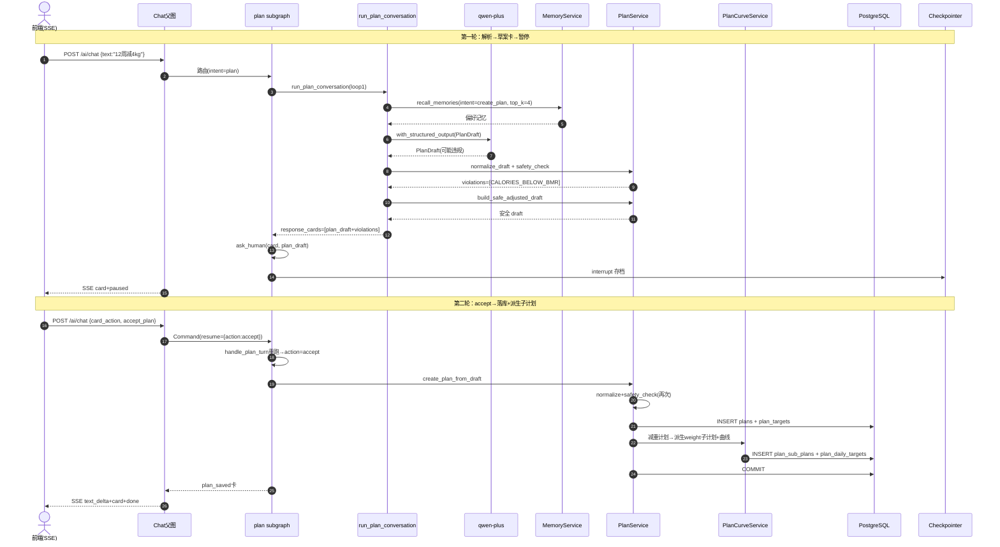
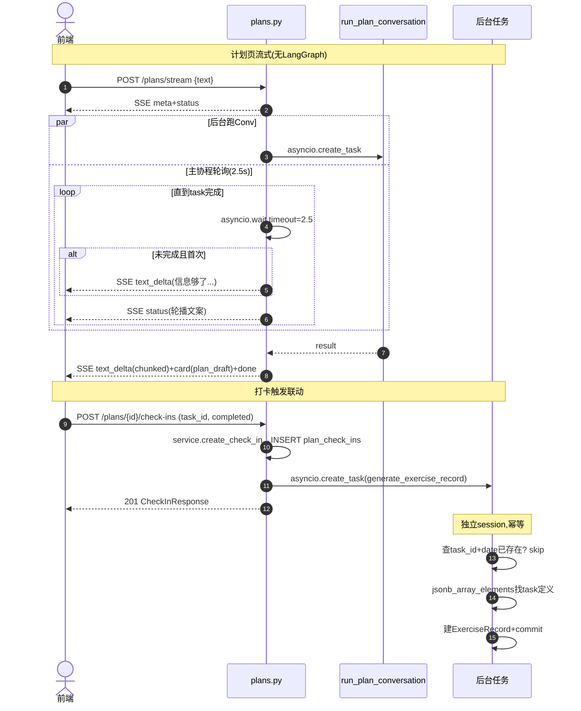

# Plan（计划）模块深度分析

> 基于 PROJECT_MAP 的单模块深度分析。所有结论基于 `health-agent/backend/` 真实代码，推断内容已标注【推断】。
> 分析模板见 `2.md`。Plan 是 PROJECT_MAP 中 ★★★★★ 业务最复杂的模块。

## 关键技术栈澄清（务必先记住）

| 模板假设 | 本项目实际 |
|---------|-----------|
| Redis | **Postgres checkpointer**（暂停态），无 Redis |
| MySQL | **PostgreSQL + JSONB**（tasks/phases/proposed_changes 都用 JSONB） |
| MQ | **asyncio.create_task**（打卡后台→生成运动记录） |
| 一次性 JSON | **三套入口并存**：JSON CRUD（`/plans/*`）+ 自定义 SSE（`/plans/stream`）+ 子图 SSE（`/ai/chat`） |
| LLM | **通义千问 qwen-plus**（DashScope OpenAI 兼容，结构化输出 PlanDraft） |

## ⚠️ 重要：三套入口、三个 graph、八张表

Plan 模块是 PROJECT_MAP 里**最复杂**的模块，原因：

1. **三套对外入口并存**：
   - `POST /plans`（结构化创建）→ 走 `build_plan_agent` **5 节点流水线** graph（`graph.py`）。
   - `POST /plans/stream`（计划页 SSE）→ 直接调 `run_plan_conversation`，**不经 LangGraph**，自定义 SSE 包装。
   - `/ai/chat`（自然语言）→ Chat 父图路由到 plan subgraph（`subgraph.py`，单节点 + interrupt 循环）。
2. **三个 graph 装配**：
   - `build_plan_agent`（`graph.py`）：5 节点静态流水线，仅供 `POST /plans` 用。
   - `build_modification_subgraph`（`graph.py`）：2 节点，分析偏差+建议（**当前未被路由调用**【推断】）。
   - `build_plan_subgraph`（`subgraph.py`）：1 节点 `handle_plan_turn` 内部 interrupt 循环，挂到 Chat 父图。
3. **八张数据表**：plans、plan_targets、plan_sub_plans、plan_daily_targets、plan_executions、plan_check_ins、plan_analyses、plan_adjustment_proposals。
4. **三大辅助 Service**：
   - `PlanService`（CRUD + 安全校验 + 进度）
   - `PlanCurveService`（目标曲线展开：linear/constant/phased）
   - `PlanComplianceService`（完成率：任务型 vs 数值型口径）
5. **后台任务**：`plan_check_in_task`（运动任务打卡 → 异步生成 ExerciseRecord，幂等）。

---

# 一、模块职责

> 基于：`api/v1/plans.py`、`agents/plan/{subgraph,graph,nodes,conversation}.py`、`services/plan_*.py`

## 1.1 该模块解决什么问题

Plan 模块负责**健康计划的全生命周期**，从制定到执行追踪到调整：

1. **目标转计划**：把用户模糊目标（"12 周减 4kg"、"改善饮食结构"、"早睡"）拆成结构化的多阶段计划——含主计划、维度子计划（运动/体重/饮水…）、每日目标曲线、阶段任务。
2. **安全校验**：制定时硬性校验（热量低于 BMR、减重过快、周期不合理），不通过则**自动修正**为安全版本。
3. **执行追踪**：用户打卡 → 写 `plan_check_ins`；运动任务打卡后台自动生成 `body_exercise_records`（幂等）。
4. **完成率计算**：任务型维度（exercise）按"应做次数 vs 已完成"，数值型维度（weight/water/sleep…）按容差带计算单日达成度，加权聚合成整体完成率。
5. **AI 调整提议**：对偏差大的子计划生成调整提议（pending），用户接受后应用变更并重新生成曲线。
6. **多入口对话**：自然语言"帮我定个减脂计划" → Chat 父图路由到 plan subgraph，多轮澄清 + 草案确认。

## 1.2 处于整个系统什么位置

```
              ┌─ 自然语言入口: /ai/chat → Chat父图 → plan subgraph(handle_plan_turn) ─┐
              ├─ 计划页 SSE:    /plans/stream → run_plan_conversation(无 LangGraph) ──┤
用户 ────────┤                                                                       ├─→ PlanService
              ├─ 结构化创建:    POST /plans → build_plan_agent(5节点graph) ───────────┤      │
              └─ 其它 CRUD:     /plans/{id}/* (progress/check-ins/sub-plans/...) ──────┘      │
                                                                                              │
                                ┌──────────────┬──────────────┬──────────────────────────┐   │
                                ▼              ▼              ▼                          ▼   │
                          PlanCurveService  PlanCompliance  plan_check_in_task    DietService(联动)
                          (展开目标曲线)    Service        (打卡→运动记录,异步)   on_diet_record_created
                                                                                              │
                                                                                              ▼
                                                                          PostgreSQL: 8 张表
```

Plan 是 PROJECT_MAP 中的 ★★★★★ 模块——**业务最复杂**（多角色入口、多服务协同、跨模块联动），但**技术深度**略低于 Memory（无独立向量召回）。

## 1.3 上下游是谁

| 方向 | 对象 | 关系 |
|------|------|------|
| 上游（NLP） | Chat 父图 `route_after_intent` | intent=plan 路由到 plan subgraph |
| 上游（计划页 SSE） | 前端计划页 | `POST /plans/stream` 多轮澄清 + 草案 |
| 上游（其它 CRUD） | 前端表单/详情/打卡 | `/plans/*` 一系列端点 |
| 下游（曲线生成） | PlanCurveService | 减重/饮水等子计划 → DailyTarget |
| 下游（完成率） | PlanComplianceService + BodyRepository | 整体+维度完成率 |
| 下游（运动联动） | plan_check_in_task | 后台异步生成 ExerciseRecord |
| 下游（饮食联动） | `on_diet_record_created`（被 Diet 调用） | 饮食落库后更新当日 PlanExecution |
| 下游（LLM） | qwen-plus | 草案结构化输出（PlanDraft schema） |
| 下游（记忆召回） | MemoryService | 起草前召回历史偏好（intent=create_plan，top_k=4） |

## 1.4 一句话总结

**Plan 模块 = 三入口 + 三 graph + 八表的全生命周期计划系统**：从"目标拆解→安全校验→曲线展开→打卡追踪→完成率计算→AI 调整"全链路覆盖；对内 PlanService 单点拥有 CRUD/校验/进度，对外通过 LangGraph/SSE/CRUD 三套门面适配不同前端形态。

---

# 二、功能清单

## 2.1 三套入口对应的功能

| 入口 | 功能 | 路径 | 走的 graph |
|------|------|------|-----------|
| Chat 自然语言 | 多轮澄清 + 草案确认 + interrupt | `POST /ai/chat`(intent=plan) | plan subgraph（`handle_plan_turn` interrupt 循环） |
| 计划页流式 | 计划页对话框，纯 SSE | `POST /plans/stream` | **不走 graph**，直调 `run_plan_conversation` |
| 结构化创建 | 表单一次性提交 | `POST /plans` | plan agent（`build_plan_agent` 5 节点流水线） |

## 2.2 CRUD 与子资源功能

| 功能 | 端点 | 目的 |
|------|------|------|
| 列表/详情/更新/终止主计划 | `GET/PUT/DELETE /plans/{id}` | 计划生命周期 |
| 打卡 | `POST /plans/{id}/check-ins` | 任务/子计划/计划级打卡，运动型任务异步生成运动记录 |
| 进度查询 | `GET /plans/{id}/progress` | 当前阶段/今日完成/达标率/连续天数 |
| 执行记录列表 | `GET /plans/{id}/execution` | 按日聚合的饮食执行记录（`PlanExecution`） |
| 子计划 CRUD | `GET/POST/PUT /plans/{id}/sub-plans/...` | 维度子计划（运动/体重等） |
| 每日目标曲线 | `GET /plans/{id}/daily-targets` | 数据模块叠加趋势图用 |
| 整体完成率 | `GET /plans/{id}/compliance` | 加权聚合维度完成率 |
| AI 分析历史 | `GET /plans/{id}/analyses` | 最近 N 条 PlanAnalysis |
| 调整提议列表 | `GET /plans/{id}/proposals` | pending/accepted/rejected |
| 接受/拒绝提议 | `POST /plans/{id}/proposals/{pid}/accept|reject` | 应用 patch 并重生成曲线 / 置 rejected |

## 2.3 计划核心域功能

| 功能 | 实现 | 说明 |
|------|------|------|
| 安全校验 | `PlanService.safety_check` | 5 类规则：CALORIES_BELOW_BMR / WEIGHT_LOSS_TOO_FAST / WEIGHT_ANCHOR_PACE_TOO_FAST / PLAN_DURATION_INVALID / PLAN_DRAFT_MISSING |
| 自动修正 | `PlanService.build_safe_adjusted_draft` | 安全检查不通过时把草案调到安全区间 |
| 体重子计划自动派生 | `PlanService._derive_weight_sub_plan` | 减重计划落库后自动生成"每日体重"子计划 + 线性目标曲线 |
| 目标曲线策略 | `PlanCurveService.generate_curve` | linear（体重）/ constant（饮水/运动时长）/ phased（按 phases 分段插值） |
| weight_anchors LLM 直出 | `PlanDraft.targets.weight_anchors` | 优先用 LLM 给的 3-5 个锚点插值，校验失败回退线性 |
| LLM 日期重锚 | `_normalize_draft_dates` | LLM 训练期日期不可信，强制以今天为起点保留周期长度，平移 phases |
| 完成率口径 | `PlanComplianceService` | 任务型（exercise）按 schedule.weekdays 推算应做次数；数值型按容差带（weight ±0.5kg / water ±20% / sleep ±30min / nutrition ±10%） |
| 运动打卡联动 | `plan_check_in_task` | 任务级 completed=true 后台异步建 ExerciseRecord，按 (task_id, date) 幂等 |
| 饮食联动 | `PlanService.on_diet_record_created` | Diet 落库后更新当日 PlanExecution 的卡路里/营养 |

## 2.4 三种"模式"对应的对话语义（`run_plan_conversation`）

| 模式 | 触发关键词 | 行为 |
|------|----------|------|
| `create` | "减/瘦/增 N kg"、"计划"、"减脂"、"早睡"… | 起草 PlanDraft + 安全校验 + 出 plan_draft 卡片 |
| `query` | "进度/完成/打卡/当前计划"… | 查 active plan progress + 出 plan_progress 卡片 |
| `modify` | "调整/修改/太难/不适合"… | 跑 `run_modification_rules` + 出 progress 卡片 + 文字建议 |
| `unknown` | 闲聊/招呼/身份询问 | 不同的兜底回复（identity_response/greeting_response/clarify…） |

## 2.5 功能边界（Plan 不做什么）

- **不直接修改 Diet/Body 数据**：靠 `on_diet_record_created` 等回调被动更新执行记录。
- **不强制立即接受提议**：`PlanAdjustmentProposal` 是 pending 状态，等用户 accept 才应用。
- **不在 Service 层调 LLM**：LLM 调用在 `agents/plan/` 节点和 `conversation.py` 内。
- **不限制每日完成率刷新频率**：每次查询实时计算（无缓存）。
- **`build_modification_subgraph` 当前未被入口调用**【推断】（`api/v1/plans.py` 没有路由调用它）。

---

# 三、代码结构分析

## 3.1 分层映射总览

| Java 概念 | 本模块对应 | 文件 | 职责 |
|-----------|-----------|------|------|
| Controller | API 路由 | `app/api/v1/plans.py` | 19 个端点（CRUD + 1 个 SSE + 子资源） |
| —（特有）| Agent 编排 | `app/agents/plan/{subgraph,graph,nodes,conversation,tools}.py` | 三套 graph + 决策引擎 |
| DTO/VO | Pydantic Schema | `app/schemas/plan.py` | PlanDraft/PlanResponse/PlanProgress/SubPlan/DailyTarget… |
| Service | 业务服务 | `app/services/plan_service.py` 等 4 个 | CRUD + 校验 + 进度 + 曲线 + 完成率 + 联动 |
| DAO/Repository | 仓储 | `app/db/repositories/plan_repo.py` | user_id 隔离的 8 表读写 |
| Entity | ORM 模型 | `app/db/models/plan.py` | 8 张表 |
| Consumer/Producer | **无 MQ** | — | `plan_check_in_task` asyncio 后台 |
| Scheduler | **无定时任务** | — | （AI 分析理论上需要每日跑，但当前未见调度器代码）【推断】 |

## 3.2 Controller 层 — `app/api/v1/plans.py`

prefix `/plans`，共 19 个端点：
- 主计划 5 个：POST/list/get/PUT/DELETE。
- 计划 SSE 1 个：`POST /plans/stream`（带状态文案、长等待提示、错误事件）。
- 打卡 1 个：`POST /{id}/check-ins`，写后**异步触发** `generate_exercise_record_from_check_in`。
- 进度/执行 2 个：`GET /{id}/progress`、`GET /{id}/execution`。
- 子计划 3 个：list/POST/PUT。
- 每日目标曲线 1 个：`GET /{id}/daily-targets`。
- 完成率 1 个：`GET /{id}/compliance`。
- AI 分析 1 个：`GET /{id}/analyses`。
- 调整提议 3 个：list/accept/reject。

**特殊点**：
- `POST /plans` 用 `plan_agent.ainvoke({...})` 跑 5 节点流水线。
- `POST /plans/stream` 用 `asyncio.create_task` 跑 `run_plan_conversation` + 并发 sleep 期间发 status 文案 + "信息够了"长等待提示。

## 3.3 Schema 层 — `app/schemas/plan.py`【根据 conversation.py 引用推断】

主要类型（按引用收集）：
- 草案：`PlanDraft`（含 name/goal/type/dates/targets/tasks/phases）、`PlanPhaseDraft`、`PlanTaskUpdate`、`PlanTargets`、`TargetCurveStrategy`。
- 响应：`PlanResponse`、`PlanPhase`、`PlanTask`、`PlanProgress`、`SubPlanResponse`、`DailyTargetCurve`、`DailyTargetPoint`、`OverallCompliance`、`DimensionCompliance`、`PlanAnalysisResponse`、`AdjustmentProposalResponse`、`CheckInResponse`、`DailyExecution`。
- 入参：`PlanCreate`、`PlanUpdate`、`PlanStreamRequest`、`PlanTerminateRequest`、`SubPlanCreate`/`SubPlanUpdate`、`CheckInCreate`、`PlanConversationMessage`。
- 枚举：`PlanType`（weight_loss/nutrition_adjustment/habit_formation）、`PlanStatus`、`PlanDimension`（exercise/weight/water/sleep/measurement/nutrition）、`ProposalStatus`、`ExecutionStatus`、`TargetCurveStrategy`（linear/constant/phased）。

## 3.4 Service 层（4 个）

| Service | 文件 | 职责 |
|---------|------|------|
| `PlanService` | `plan_service.py` | 主 Service：CRUD + 安全校验 + draft 规范化 + 减重子计划派生 + 进度查询 + 饮食联动 |
| `PlanCurveService` | `plan_curve_service.py` | 目标曲线展开（linear/constant/phased），生成 `DailyTarget` 列表 |
| `PlanComplianceService` | `plan_compliance_service.py` | 完成率计算（任务型/数值型口径，加权聚合） |
| `plan_check_in_task` | `plan_check_in_task.py` | 后台任务（不是 class）：打卡→运动记录幂等生成 |

**严格无 LLM**：所有 LLM 调用在 `agents/plan/` 内，Service 层只做确定性计算与 CRUD。

## 3.5 Agent 层（3 个 graph + 1 个对话引擎）

| 文件 | 角色 | 内容 |
|------|------|------|
| `subgraph.py` | 给 Chat 父图用 | `build_plan_subgraph()`：单节点 `handle_plan_turn` 内部 interrupt 循环（最多 8 轮） |
| `graph.py` | 给 `POST /plans` 用 | `build_plan_agent()`：5 节点静态流水线 confirm_goal→analyze_status→draft_plan→safety_validate→persist_plan；另含 `build_modification_subgraph`（**未被路由调用**【推断】） |
| `nodes.py` | 5 节点 + 修改子图 2 节点 | confirm_goal/analyze_status/draft_plan/safety_validate/persist_plan + analyze_deviation/suggest_modification |
| `conversation.py` | **决策引擎核心** | `run_plan_conversation`：模式识别 + 校验 + 草案生成 + 安全调整 + 卡片输出，~700 行 |
| `tools.py` | Service 胶水 | `persist_plan_tool`、`safety_check_tool` 【推断】 |
| `state.py` | PlanState | `build_plan_agent` 用，TypedDict 含 goal/profile/draft/violations/result |

## 3.6 Repository / Entity 层

- `plan_repo.py`：`PlanRepository(session, user_id)`，user_id 隔离。含 8 表 CRUD：has_active_plan/get_active_plan/create_plan/list_plans/get_plan/update_plan/list_sub_plans/.../list_executions/list_check_ins/list_analyses/list_proposals 等。
- `plan.py`（model）：8 张表，主表 `plans` 用 JSONB 存 tasks/phases；`SubPlan.tasks` JSONB；`PlanAdjustmentProposal.proposed_changes` JSONB。所有外键 `ondelete=CASCADE`。

## 3.7 异步机制

- `plans.py` 模块级 `_BACKGROUND_TASKS` set，打卡后 `asyncio.create_task(generate_exercise_record_from_check_in)`，`add_done_callback(_BACKGROUND_TASKS.discard)`。
- 后台任务**自管 session**（`AsyncSessionLocal()`），不复用请求 session（避免 session 提前关闭）。
- 后台任务**幂等**：按 (task_id, date) 查 `body_exercise_records`，已存在则 skip。

---

# 四、接口清单

## 4.1 接口总表（19 个）

| # | 接口 | 路径 | 方法 | 功能 |
|---|------|------|------|------|
| 1 | 创建主计划 | `/plans` | POST | 走 `build_plan_agent` 5 节点流水线 |
| 2 | 计划页 SSE | `/plans/stream` | POST | `run_plan_conversation` + 自定义 SSE |
| 3 | 主计划列表 | `/plans` | GET | 按 status 分页 |
| 4 | 主计划详情 | `/plans/{id}` | GET | — |
| 5 | 更新主计划 | `/plans/{id}` | PUT | — |
| 6 | 终止主计划 | `/plans/{id}` | DELETE | 带 reason |
| 7 | 打卡 | `/plans/{id}/check-ins` | POST | 异步建 ExerciseRecord |
| 8 | 进度查询 | `/plans/{id}/progress` | GET | 当前阶段+完成数+达标率+连续天数 |
| 9 | 执行记录 | `/plans/{id}/execution` | GET | 按日聚合 |
| 10-12 | 子计划 list/POST/PUT | `/plans/{id}/sub-plans/...` | — | 维度子计划 |
| 13 | 每日目标曲线 | `/plans/{id}/daily-targets` | GET | 按 dimension/start/end 过滤 |
| 14 | 整体完成率 | `/plans/{id}/compliance` | GET | 加权聚合 |
| 15 | AI 分析历史 | `/plans/{id}/analyses` | GET | 最近 N 条 |
| 16 | 提议列表 | `/plans/{id}/proposals` | GET | 按 status |
| 17 | 接受提议 | `/plans/{id}/proposals/{pid}/accept` | POST | 应用 patch + 重生成曲线 |
| 18 | 拒绝提议 | `/plans/{id}/proposals/{pid}/reject` | POST | 终态 rejected |
| 19 | （AI 入口） | `/ai/chat` | POST | intent=plan 时进入 plan subgraph |

## 4.2 `POST /plans/stream`（计划页 SSE）

请求 `PlanStreamRequest`：`type` ∈ text/choice_response/card_action，外加 `messages` 历史、`plan_type_hint`、`action_id/payload`。
SSE 事件流：
1. `meta`（message_id/session_id/started_at）
2. `status`（"正在理解你的计划需求..."）
3. **长等待场景**：超过 2.5s 未完成 → 发一段长文 `text_delta`（"信息够了，正在结合档案起草草案..."）+ 轮播 5 段 status 文案。
4. 完成 → `text_delta`（chunk_size=80）→ 各 `card`（plan_draft 前还会发一段引语）→ 各 `choice` → `done`。
5. 异常 → `error`（ValidationException 不可重试，其它可重试）。

## 4.3 `POST /plans`（结构化创建）

走 `plan_agent`（5 节点）：
- `confirm_goal`：检查 goal_description 非空。
- `analyze_status`：拼 profile 摘要（current_weight/target_weight/height）。
- `draft_plan`：LLM 结构化输出 PlanDraft，失败回退 `_default_draft`。
- `safety_validate`：调 `safety_check_tool`。
- `persist_plan`：违规则报错，否则调 `persist_plan_tool`。

返回 `result.model_dump`（PlanResponse）。

## 4.4 `/ai/chat` plan 子图入口

子图节点 `handle_plan_turn` 用 interrupt 循环（最多 8 轮）：
- 跑 `run_plan_conversation` 取本轮响应。
- 响应里有 `plan_draft` 卡片 → `ask_human(card)`：accept/confirm 落库；revise/edit 把诉求回灌为下轮 user_message 继续循环。
- 有 `choice_prompts` → `ask_human(choice)`：用户选择回灌。
- 否则终态返回。

---

# 五、Agent 分析（三个 graph + 决策引擎）

## 5.1 Graph 1：plan_agent（`graph.py`，5 节点静态流水线）

`build_plan_agent()` 给 `POST /plans` 用，无 interrupt：

```
START → confirm_goal → analyze_status → draft_plan → safety_validate → persist_plan → END
```

**特点**：
- `StateGraph(PlanState)`，独立 state（不复用 ChatState）。
- 全静态边，**无条件边、无 interrupt**。
- 失败靠节点写 `state["error"]` + persist_plan 检测 violations 提前返回。
- 与计划页 SSE 路径**功能重叠**（都是"目标→草案→安全→落库"）但走的代码完全不同——历史包袱【推断】。

## 5.2 Graph 2：modification_subgraph（`graph.py`，2 节点）

```
START → analyze_deviation → suggest_modification → END
```

`build_modification_subgraph` 当前**未被路由调用**【推断】（grep `api/v1/plans.py` 无引用）。代码保留可能为后续接入或测试用。

## 5.3 Graph 3：plan subgraph（`subgraph.py`，1 节点 interrupt 循环）

挂到 Chat 父图的子图，**只有 1 个节点** `handle_plan_turn`，但内部是循环：

```
START → handle_plan_turn ─(loop with interrupt)─→ END
```

`handle_plan_turn` 内部循环（最多 `_MAX_PLAN_TURNS=8` 轮）：
1. `run_plan_conversation` 跑一轮 → 得到 `{ai_response, response_cards, choice_prompts}`。
2. 响应含 `plan_draft` 卡片 → `ask_human(card)` interrupt：
   - accept/confirm → `plan_service.create_plan_from_draft` 落库 + 出 plan_saved 卡 → 返回终态。
   - revise/edit → 把 `free_text` 作为下轮 user_message → continue。
3. 响应含 `choice_prompts` → `ask_human(choice)` interrupt → 用户答案作为下轮 user_message → continue。
4. 否则终态（纯文本/进度卡）→ 返回。

**对比 Diet 的 interrupt**：Diet 是**多节点 + Command 路由 + 多次 interrupt**（节点级粒度）；Plan 是**单节点 + 内部循环 + 多次 interrupt**（节点内粒度）。

## 5.4 决策引擎 — `run_plan_conversation`（`conversation.py`）

这是 Plan 模块的**核心智能**所在，~700 行。被三处用：
- plan subgraph `handle_plan_turn` 内部
- `POST /plans/stream` 直接调
- 不被 `POST /plans` 用（那条走 plan_agent）

**入参**：user_message + messages（历史）+ profile + plan_service + memory_service + plan_type_hint + request_type + action_id/payload。

**控制流**（按优先级短路）：
1. **action_id 短路**：accept_plan_draft → 直接落库；revise_plan_draft → 提示用户描述修改诉求。
2. **特殊文本短路**：`_is_identity_question`（你是谁）/`_is_affirmative_only`（"是的"等含糊确认）/`_is_greeting_only`（"你好"）。"是的"会从 transcript 找最近的 `[plan_draft]` 续接落库。
3. **mode 识别**：`_infer_request_mode` 用关键词判断 query/modify/create/unknown。
4. **active_plan 分流**：
   - active+query → `get_progress` + plan_progress 卡片。
   - active+modify → `run_modification_rules` + 文字建议 + progress 卡片。
   - active+create → 提示已有计划，建议先调整。
5. **意图缺失**：`_has_plan_intent` 否 → `_unknown_plan_page_response`（首次给 starter chips）。
6. **细节缺失**：`_has_concrete_goal` 或 `_has_timeframe_or_constraints` 否 → `_clarify_missing_details_response` 出 duration chips。
7. **召回记忆**：`memory_service.recall_memories(intent="create_plan", top_k=4)`。
8. **生成草案**：`_generate_draft` 调 LLM `with_structured_output(PlanDraft)`，失败回退 `_build_default_draft`，最后 `_normalize_draft_dates` 重锚日期。
9. **规范化 + 安全校验**：`plan_service.normalize_draft` + `plan_service.safety_check`。
10. **违规调整**：`build_safe_adjusted_draft` + `_violation_message` 解释（含 BMR 估算）→ 出 plan_draft 卡片（带 violations）。
11. **干净草案**：直接出 plan_draft 卡片。

## 5.5 State

| graph | state |
|------|------|
| plan_agent | `PlanState`（独立 TypedDict：goal_description/plan_type/profile/draft/violations/result/error） |
| plan subgraph | **共享 ChatState**（读 chat_history/profile/user_message + 写 ai_response/response_cards/choice_prompts） |

## 5.6 Tool

`tools.py`（推断）封装两个工具：
- `safety_check_tool(service, draft, profile)` → `service.safety_check(...)`。
- `persist_plan_tool(service, draft)` → `service.create_plan_from_draft(...)`。
均**确定性调用**，非 LLM 自主。

## 5.7 Memory（计划专属召回）

- 起草前 `memory_service.recall_memories(combined_user_text, intent="create_plan", top_k=4)` 召回历史偏好（如"用户偏好低强度运动"）。
- 失败静默降级，不打断起草。
- 未见 plan 模块**主动写记忆**（与 Diet 的 trigger_memory 不同），相关记忆由 Chat 父图的 trigger_memory_extract 在通用对话路径产生【推断】。

## 5.8 Conditional Edge / Command

- plan_agent：**无条件边**，全静态。
- modification_subgraph：无条件边。
- plan subgraph：**唯一节点 `handle_plan_turn` 内部 interrupt + 循环**（不是 graph 条件边，而是 Python while loop + ask_human）。

## 5.9 interrupt 机制

plan subgraph 的 interrupt 在节点内循环里发：
1. 草案确认：`kind="card", prompt_id="plan_draft"`，actions=accept_plan_draft/revise_plan_draft。
2. 选项澄清：`kind="choice", prompt_id="plan_intent|plan_starter|plan_duration|..."`，多种 prompt_id 复用 choice 通道。

**幂等关键**：`run_plan_conversation` 内部是**纯函数式**的（每次跑都从 messages+user_message 重新推导），落库只在 accept 分支调一次。但与 Diet/Chat 不同的是，**这里 interrupt 是节点内循环**——节点本身重跑时会从循环开头重新跑 `run_plan_conversation`，可能再次出同一张草案卡。这是为什么需要 `_MAX_PLAN_TURNS=8` 兜底。

---

# 六、完整执行流程

## 6.1 流程 A：自然语言定计划（Chat → plan subgraph）

**典型场景**：用户在对话框说"帮我定个 12 周减 4kg 的计划"。

### 第一轮：解析 → 出草案卡 → 暂停
1. **Chat 父图** identify_intent → "plan" → 路由到 plan subgraph。
2. **handle_plan_turn 第 1 次循环**：
   - `run_plan_conversation(user_message="...12周减4kg")`。
   - 不是 action_id 短路、不是特殊文本、不是 active_plan、有 plan_intent、有具体目标和周期。
   - `memory_service.recall_memories(intent="create_plan", top_k=4)` 召回偏好。
   - `_generate_draft` LLM 结构化输出 PlanDraft → `_normalize_draft_dates` 重锚到今天。
   - `plan_service.normalize_draft` + `safety_check`。
   - 假设 LLM 给出的热量低于 BMR → violations=[CALORIES_BELOW_BMR] → `build_safe_adjusted_draft`。
   - `_violation_message` 解释（"你的热量目标低于估算 BMR ≈X kcal，已调整到安全的 Y kcal..."）。
   - 返回 `{ai_response, response_cards: [plan_draft 卡(violations)], choice_prompts: []}`。
3. 节点内**有 plan_draft 卡** → `ask_human(card, prompt_id="plan_draft")` **interrupt 暂停**。
4. **Chat 父图**：`emit_interrupt_events` 发 `card`（草案）+ `paused`，**不发 done**。

### 第二轮：用户点确认 → 落库
5. 用户点"确认创建" → `POST /ai/chat {type:card_action, action_id:"accept_plan"}`。
6. Chat 端 `build_resume_payload` 映射 action_id="accept_plan" → `{action:"accept"}`。
7. **handle_plan_turn 重跑**：interrupt 直接返回 `{action:"accept"}` → `card_action(decision)="accept"` → 取 `draft_card.payload.draft` + 浅合并 `decision.patch` → `PlanDraft.model_validate` → `plan_service.create_plan_from_draft`。
8. **PlanService.create_plan_from_draft**：
   - `normalize_draft` 二次规范化。
   - `safety_check`，违规直接 `ValidationException`。
   - `Plan` 行 + `PlanTarget` 行落库。
   - **`_derive_weight_sub_plan`**：减重计划自动派生"每日体重"`SubPlan` + `DailyTarget` 曲线（优先用 LLM weight_anchors，回退线性插值）。
   - commit。
9. 返回 `plan_saved` 卡 + 文字反馈 → wrap_response → SSE done。

### 第二轮替代：用户点"继续调整"
6'. 用户点"继续调整" + 文本"训练强度太大" → `Command(resume={action:"revise", free_text:"训练强度太大"})`。
7'. handle_plan_turn 重跑：action="revise" → `messages.append(user="训练强度太大")` → continue 下一轮循环。
8'. 第 2 轮 `run_plan_conversation` 拿到带新诉求的 transcript，重新生成草案 → 又出 plan_draft 卡 → 再次 interrupt。
   循环直到用户 accept 或达到 8 轮上限。

## 6.2 流程 B：计划页 SSE（无 LangGraph）

**场景**：用户在计划页对话框输入文本。

1. 前端 `POST /plans/stream {type:"text", message:"...", messages:[历史]}`。
2. `_resolve_stream_message` 取出文本。
3. yield META → yield STATUS（"正在理解你的计划需求..."）。
4. `asyncio.create_task(run_plan_conversation(...))`，主协程 `asyncio.wait({task}, timeout=2.5)` 循环。
5. 每 2.5s 未完成：第一次发"信息够了..."长 text_delta + 轮播 5 段 status 文案。
6. 完成后：text_delta（chunk_size=80）→ cards（plan_draft 前发引语）→ choices → DONE。
7. ValidationException → ERROR(retriable=False)；其它异常 → ERROR(retriable=True)。

**对比 Chat SSE**：本流程**不走 LangGraph、不走 checkpointer、不走 interrupt**——多轮交互靠前端把 messages 历史回传，**无暂停态**。每次请求是独立的"一来一回"。

## 6.3 流程 C：结构化创建（plan_agent 5 节点）

1. `POST /plans {goal_description:"...", plan_type:"weight_loss"}`。
2. `service.has_active_plan()` 检查冲突 → ConflictException(PLAN_ALREADY_ACTIVE)。
3. `plan_agent.ainvoke({user_id, goal_description, plan_type, profile, plan_service})`。
4. 5 节点流水线：confirm_goal → analyze_status → draft_plan(LLM 结构化) → safety_validate → persist_plan。
5. 任一节点写 error → 在 persist_plan 检测 error 提前返回。
6. 成功 → result(PlanResponse)。

## 6.4 流程 D：打卡 + 异步运动记录联动

1. `POST /plans/{id}/check-ins {task_id, date, completed:true, note}`。
2. `service.create_check_in(...)` → `INSERT plan_check_ins`，返回 CheckInResponse。
3. **打卡条件触发后台任务**：completed=true 且 task_id 非空 → `asyncio.create_task(generate_exercise_record_from_check_in(user.id, data.id))`。
4. 后台任务（独立 session）：
   - 查 PlanCheckIn → 校验 completed/task_id。
   - 按 (task_id, date) 查 ExerciseRecord 防重。
   - 用 PostgreSQL JSONB 函数 `jsonb_array_elements + ->>'id'` 在 `SubPlan.tasks` 找到对应 task。
   - 取 task.exercise_type/target.duration_minutes/target.calories → 建 `ExerciseRecord(source="plan_task", plan_id, sub_plan_id, task_id)`。
   - body_repo.create_exercise + commit。
5. 失败 log+rollback，不影响主请求。

## 6.5 流程 E：饮食联动（Diet → Plan）

Diet 模块的 `POST /diet/records` 与 `PUT /diet/records/upsert` 落库后调 `plan_service.on_diet_record_created(date, daily_nutrition)`，更新当日 `PlanExecution` 的 calories/protein/fat/carbs/status。

## 6.6 与模板链路对应

| 模板 | 本项目实际 |
|------|-----------|
| Controller/Service/Graph/Node/Tool | plans.py / 4 个 plan service / 三套 graph / 7 个节点 / 2 个 tool |
| **Redis** | **Postgres checkpointer**（仅 plan subgraph 路径用） |
| **MySQL** | **PostgreSQL + JSONB**（tasks/phases/proposed_changes 嵌入式） |
| **MQ** | **asyncio.create_task**（打卡→运动联动；plan_stream 长等待） |
| 返回 | JSON CRUD / 自定义 SSE / 子图 SSE 三套 |

---

# 七、Mermaid 时序图

## 7.1 自然语言定计划（plan subgraph，含 interrupt 循环）



## 7.2 计划页 SSE + 打卡联动



## 7.3 时序图阅读要点

- **三条入口三种节奏**：`/ai/chat` 经 LangGraph + checkpointer 暂停恢复；`/plans/stream` 自定义 SSE 不暂停（前端轮回 messages）；`POST /plans` 全同步流水线。
- **interrupt 循环 vs 多节点**：plan subgraph 单节点循环最多 8 轮，每次循环都重跑整个 `run_plan_conversation`。
- **后台任务幂等且独立 session**：避免与请求 session 冲突，按 (task_id, date) 防重。
- **JSONB 查询**：`generate_exercise_record_from_check_in` 用 `jsonb_array_elements` + `->>'id'` 在 SubPlan.tasks 数组里找具体 task。

---

# 八、数据库分析

> 基于：`app/db/models/plan.py`

## 8.1 八张表全景

| 表 | 主用途 | Mixin |
|----|------|-------|
| `plans` | 主计划，含 tasks/phases JSONB | UUID+Timestamp+SoftDelete |
| `plan_targets` | 主计划数值目标（1对1，UNIQUE plan_id） | UUID+Timestamp |
| `plan_sub_plans` | 维度子计划（exercise/weight/water/...） | UUID+Timestamp+SoftDelete |
| `plan_daily_targets` | 每日目标曲线（按子计划+日期 UNIQUE） | UUID+Timestamp |
| `plan_executions` | 每日执行记录（按 plan+date UNIQUE，被 Diet 联动写入） | UUID+Timestamp |
| `plan_check_ins` | 任务/计划级打卡（按 plan+task+date UNIQUE，task 可空） | UUID+Timestamp |
| `plan_analyses` | AI 分析历史（按 plan+date UNIQUE，每日一条） | UUID+Timestamp |
| `plan_adjustment_proposals` | AI 调整提议（pending/accepted/rejected/expired） | UUID+Timestamp |

## 8.2 关键字段与索引

### `plans`（主表）
- 字段：name/goal_description/plan_type/status/start_date/target_date/**tasks(JSONB)**/**phases(JSONB)**/terminated_at/termination_reason。
- 索引：`(user_id, status)`、`(user_id, created_at)`。
- 设计选择：tasks/phases **内嵌 JSONB**，不拆独立表——读取时无需 join，写入时整体更新。

### `plan_targets`（数值目标）
- 字段：daily_calories/protein_target/fat_target/carbs_target/weight_target。
- 约束：`UNIQUE(plan_id)`，1 对 1。
- 设计：与 plans 拆开，便于以后扩展无需改主表。

### `plan_sub_plans`（维度子计划）
- 字段：dimension（6 类）/name/goal_description/status/**tasks(JSONB)**/weight（用于完成率加权）。
- 索引：`(plan_id)`、`(user_id, dimension)`。
- 设计选择：tasks **内嵌 JSONB**，与 Plan 风格一致。`weight` 默认 1.0，可调权。

### `plan_daily_targets`（每日目标曲线）
- 字段：dimension/date/target_value/unit。
- 约束：`UNIQUE(sub_plan_id, date)`。
- 索引：`(user_id, dimension, date)`、`(plan_id, date)`。
- 数据量：N 个子计划 × M 天；如 12 周减重计划 → 1 个体重子计划 × 84 天 = 84 行。

### `plan_executions`（饮食执行）
- 字段：date/calories_consumed/calories_target/protein/fat/carbs/status。
- 约束：`UNIQUE(plan_id, date)`。
- 写入触发：Diet `on_diet_record_created` 回调。

### `plan_check_ins`（打卡）
- 字段：task_id（可空）/date/completed/note。
- 约束：`UNIQUE(plan_id, task_id, date)`，相同任务同一天只能打一次。
- 注意：task_id 是**逻辑指向**（指向 SubPlan.tasks JSONB 里某条 task 的 UUID），无库级外键。

### `plan_analyses` / `plan_adjustment_proposals`（AI 工件）
- analyses：每日一条，存 overall_compliance + dimension_compliance(JSONB) + summary。
- proposals：reason + proposed_changes(JSONB patch) + status + resolved_at。

## 8.3 表关系

```
                   plans (主)
                     │
       ┌─────────────┼──────────────┬──────────────┬─────────────┐
       ▼             ▼              ▼              ▼             ▼
  plan_targets  plan_sub_plans  plan_executions plan_check_ins plan_analyses
  (UNIQUE)         │                                              │
                   ▼                                              ▼
          plan_daily_targets                          plan_adjustment_proposals
                   (UNIQUE sub_plan+date)
```
所有外键 `ondelete=CASCADE`：删主计划级联清理所有子表。

## 8.4 数据流转

**创建主计划（落库链）**：
```
PlanService.create_plan_from_draft
  → INSERT plans (含 tasks/phases JSONB)
  → INSERT plan_targets (1对1)
  → if weight_loss → _derive_weight_sub_plan
       → INSERT plan_sub_plans(dimension=weight)
       → PlanCurveService.generate_curve(linear)
       → INSERT plan_daily_targets × N 天
  → COMMIT
```

**打卡链**：
```
POST /check-ins → INSERT plan_check_ins
   → asyncio.create_task → 后台
       → SELECT body_exercise_records (幂等检查)
       → SELECT plan_sub_plans + jsonb_array_elements (找 task)
       → INSERT body_exercise_records (source=plan_task)
```

**接受调整提议**：
```
POST /proposals/{pid}/accept
  → 应用 proposed_changes patch 到 SubPlan
  → 重新生成 plan_daily_targets（先删旧 + 写新）
  → UPDATE plan_adjustment_proposals.status='accepted', resolved_at=now
```

## 8.5 多租户隔离

- `PlanRepository(session, user_id)` 构造时绑定。
- 所有表都有 `user_id` 索引；查询带 `user_id == self.user_id`。
- 主表 + soft delete 子表（plans/plan_sub_plans）查询带 `deleted_at IS NULL`。

## 8.6 与模板"MySQL"差异

PostgreSQL 特有：
- **JSONB 嵌入**：tasks/phases/proposed_changes/dimension_compliance 都用 JSONB 不拆表。
- **JSONB 查询**：`jsonb_array_elements + ->>'id'` 在 task JSONB 数组找具体 task。
- **复合 UNIQUE**：(plan_id, task_id, date)、(plan_id, date)、(sub_plan_id, date) 防重。

---

# 十一、异常处理分析

## 11.1 分级降级

| 位置 | 异常 | 处理 | 影响 |
|------|------|------|------|
| `draft_plan` 节点 | LLM 失败 | 回退 `_default_draft`（按 plan_type 写死的模板） | 草案质量降级，仍可保存 |
| `_generate_draft`（conversation） | LLM 失败 | 回退 `_build_default_draft` | 同上 |
| `memory_service.recall_memories` | 召回失败 | log+空列表 | 无个性化偏好 |
| `_violation_message` BMR 估算 | profile 缺字段 | 降级"已先调整为更安全 X kcal" | 解释文案少 BMR 数值 |
| `safety_check` 违规 | 制定时违规 | `build_safe_adjusted_draft` 自动修正 + 告知用户 | 不阻塞，给用户最终选择权 |
| `create_plan_from_draft` 安全二次校验 | 违规 | `ValidationException(violation code)` | 拒绝落库 |
| `has_active_plan` 冲突 | 已有 active | `ConflictException(PLAN_ALREADY_ACTIVE)` | 拒绝创建 |
| 后台 `generate_exercise_record` | 任意异常 | `logger.exception + session.rollback` | 不影响主请求 |
| `POST /plans/stream` | ValidationException | SSE error(retriable=False) | 终止流 |
| `POST /plans/stream` | 其它异常 | SSE error(retriable=True) | 终止流，前端可重试 |
| handle_plan_turn 循环 | 超过 8 轮 | log warning + 返回最后结果 | 防死循环 |

## 11.2 重试机制

- LLM 调用：底层 `get_chat_model` 的 `max_retries`。
- SSE error：`retriable` 字段告诉前端是否重试。
- 后台任务：**不重试**（log+rollback 直接放弃）。

## 11.3 补偿机制

- **安全自动修正**：`build_safe_adjusted_draft` 是隐式补偿（违规 → 安全版）。
- **draft 恢复**：plan subgraph interrupt 暂停时草案在 checkpointer，恢复时 `decision.patch` 浅合并。
- **打卡幂等**：(task_id, date) 查重，重复触发不会重复建记录。
- **草案续接（"是的"短路）**：`_latest_plan_draft_from_transcript` 从 transcript 找最近 `[plan_draft]` JSON 续接落库。

## 11.4 幂等

| 场景 | 幂等保证 |
|------|---------|
| 打卡 | `UNIQUE(plan_id, task_id, date)` 数据库级 |
| 后台运动记录 | (task_id, date) 业务级查重 |
| 每日目标 | `UNIQUE(sub_plan_id, date)` |
| 每日 AI 分析 | `UNIQUE(plan_id, analysis_date)` |
| 接受提议 | status 终态 + resolved_at |
| handle_plan_turn 循环 | _MAX_PLAN_TURNS=8 兜底 |

## 11.5 反模式规避

- **不在 service 直接 LLM**：所有 LLM 在 agents 层。
- **后台任务独立 session**：避免与请求 session 生命周期纠缠。
- **LLM 日期重锚**：`_normalize_draft_dates` 强制以今天为起点（LLM 训练期日期不可信）。
- **ConflictException 抢占**：创建前先 `has_active_plan` 防止双 active。
- **interrupt 循环上限**：防 LLM 反复出草案不收敛。

---

# 十二、项目亮点

## 12.1 技术亮点

1. **三套入口同一 Service**：`/ai/chat` interrupt 子图、`/plans/stream` 自定义 SSE、`POST /plans` 静态流水线，最终汇到 PlanService 单点落库。
2. **节点内 interrupt 循环**：plan subgraph 用单节点 + Python while + ask_human 实现多轮澄清，避免 LangGraph 多节点条件边膨胀（与 Diet 多节点 + Command 路由形成对比）。
3. **LLM 日期重锚**：`_normalize_draft_dates` 解决 LLM 训练期日期不可信问题，保留周期长度同步平移 phases。
4. **weight_anchors 优先 + 线性回退**：LLM 直出 3-5 个体重锚点 → 校验失败回退线性，体现"LLM 优先 + 确定性兜底"的混合策略。
5. **安全自动修正**：`build_safe_adjusted_draft` 不直接拒绝，而是修正后让用户确认，平衡 UX 与安全。
6. **JSONB 数组定位 task**：`jsonb_array_elements + ->>'id'` 在 SubPlan.tasks 嵌入数组里精准查 task。
7. **草案续接短路**：用户回"是的"时从 transcript 找最近 `[plan_draft]` JSON 自动续接落库。
8. **`_violation_message` 可解释性**：把违规码翻译成带 BMR 估算的人话解释（比直接给"违规"友好得多）。

## 12.2 架构亮点

1. **Service 三件套分工**：PlanService(核心 CRUD+校验) + PlanCurveService(曲线) + PlanComplianceService(完成率)，单一职责。
2. **打卡 → 数据模块的反向联动**：plan_check_in_task 把"任务打卡"转成 body 模块的"运动记录"，统一数据源。
3. **饮食 → 计划的正向联动**：Diet `on_diet_record_created` 回调更新 PlanExecution，计划完成率实时反映。
4. **JSONB 嵌入式策略**：tasks/phases/proposed_changes 都用 JSONB，避免过早拆表；DailyTarget 才用独立行（曲线查询频繁）。
5. **三类完成率口径分离**：任务型按"应做次数"、数值型按"容差带"，加权聚合，避免一刀切。

## 12.3 性能优化点

- 复合 UNIQUE 充当幂等约束 + 加速查询。
- 打卡后台任务 fire-and-forget，主请求 < 50ms 返回。
- `text_delta` 按 chunk_size=80 切分，避免大 SSE 块卡顿。
- `_chunk_text` 短文本不切，长文本按段切。
- LLM 长等待 2.5s 阈值发"信息够了"安抚 + 轮播 status，提升体感。

## 12.4 可扩展性设计

- **新增维度**：`PlanDimension` 枚举加值 + Compliance 容差表加项。
- **新曲线策略**：`TargetCurveStrategy` 加值 + curve_service 加分支。
- **新安全规则**：在 `safety_check` 加规则 + `_violation_message` 加解释。
- **modification_subgraph 已预留**：未来可接入 LLM 偏差分析节点替换确定性 `run_modification_rules`。

---

# 十三、面试讲解版

## 13.1 三分钟讲解版

> Plan 模块是产品业务最复杂的模块，负责健康计划从制定到执行追踪到调整的全生命周期。它有 **三套对外入口**、**三个 LangGraph**、**八张数据表**，但核心智能由一个叫 `run_plan_conversation` 的决策引擎统一收口。

最特别的是入口设计：**自然语言**走 Chat 父图路由到 plan subgraph（用 interrupt 暂停问"是减重还是改善饮食？"或"确认这版草案吗？"）；**计划页**走自定义 SSE，前端把历史回传，无 checkpointer 暂停；**结构化创建**走 5 节点静态 LangGraph 流水线。三种入口最终都汇到 PlanService 落库。

业务上有几个亮点：① **安全自动修正**——LLM 给出的草案如果热量低于 BMR，不直接拒绝，而是调整到安全版本并向用户解释（含 BMR 估算）；② **目标曲线**——减重计划落库后自动派生"每日体重"子计划，按 LLM 给出的 weight_anchors 锚点插值，失败回退线性；③ **打卡反向联动**——运动任务打卡后，asyncio 后台幂等地建一条 ExerciseRecord，让计划与数据模块统一数据源。

数据库上 `tasks/phases/proposed_changes` 都用 JSONB 嵌入，不拆独立表；只有需要按天精确查询的 `plan_daily_targets` 才用独立行。

## 13.2 十分钟讲解版

**一、定位与体量**：Plan 是 PROJECT_MAP 里 ★★★★★ 的最复杂模块。19 个 HTTP 端点、3 个 LangGraph、4 个 Service、8 张表。复杂度来自"业务规则多 + 入口形态多 + 跨模块联动多"。

**二、三套入口**：
- `POST /plans`（结构化创建）：用 `build_plan_agent` 的 5 节点静态流水线，confirm_goal→analyze_status→draft_plan→safety_validate→persist_plan。
- `POST /plans/stream`（计划页 SSE）：直接调 `run_plan_conversation`，**不走 LangGraph**，自定义 SSE 包装。多轮交互靠前端把 messages 历史回传，无 checkpointer 暂停。长等待时主协程会发"信息够了..."安抚文案 + 轮播 5 段 status。
- `/ai/chat` plan 子图：单节点 `handle_plan_turn` 内部 `while` 循环最多 8 轮，每轮跑 `run_plan_conversation`，遇到草案卡或 choice 用 `ask_human` interrupt 暂停。

**三、核心智能 `run_plan_conversation`**（~700 行）：
- 先按优先级短路：action_id（accept/revise）、特殊文本（identity/affirmative/greeting）、active_plan + mode（query/modify/create）。
- 然后判定意图与细节：`_has_plan_intent` + `_has_concrete_goal` + `_has_timeframe_or_constraints`，缺啥追问啥。
- 起草：召回记忆 → LLM `with_structured_output(PlanDraft)` → `_normalize_draft_dates` 重锚日期 → safety_check → 违规则 `build_safe_adjusted_draft` 自动修正 + 解释 → 出 plan_draft 卡。

**四、安全校验五条规则**：CALORIES_BELOW_BMR / WEIGHT_LOSS_TOO_FAST / WEIGHT_ANCHOR_PACE_TOO_FAST / PLAN_DURATION_INVALID / PLAN_DRAFT_MISSING。校验不通过自动修正，`_violation_message` 把违规码翻译成人话（含 BMR 估算）。

**五、子计划与目标曲线**：减重计划落库时自动派生"每日体重"子计划。曲线策略 linear/constant/phased 三选一：体重默认 linear（current_weight → target_weight），饮水/运动 constant，按 phases 分段则 phased。LLM 直出 weight_anchors 优先（3-5 个锚点插值），校验失败回退线性。

**六、完成率两套口径**：任务型维度（exercise）按 schedule.weekdays 推算应做次数 vs 已完成；数值型（weight ±0.5kg、water ±20%、sleep ±30min、nutrition ±10%）按容差带算单日达成度。整体 = Σ(子计划完成率 × weight) / Σ(weight)。

**七、跨模块联动**：
- **打卡 → 运动记录**：completed=true 且 task_id 非空 → asyncio 后台 → 用 PostgreSQL JSONB 函数 `jsonb_array_elements + ->>'id'` 在 SubPlan.tasks 找具体 task → 按 (task_id, date) 幂等建 ExerciseRecord(source=plan_task)。
- **饮食 → 计划**：Diet 模块 `on_diet_record_created` 回调更新 PlanExecution 的卡路里营养。

**八、interrupt 节点内循环**：与 Diet 的"多节点 + Command 路由"不同，plan subgraph 是"单节点 + 内部 while + 多次 ask_human"，每次循环重跑整个决策引擎。`_MAX_PLAN_TURNS=8` 兜底防死循环。

**九、亮点**：① LLM 日期重锚（训练期日期不可信，强制以今天为起点保留周期长度）；② 安全自动修正而非拒绝；③ 草案续接短路（用户回"是的"时从 transcript 找最近 plan_draft JSON 续接落库）；④ JSONB 嵌入策略（tasks/phases 不拆表）；⑤ 后台任务独立 session 避免请求 session 冲突。

**十、技术栈**：PostgreSQL + 大量 JSONB + 复合 UNIQUE 防重；asyncio 后台任务（无 MQ）；DashScope qwen-plus；checkpointer 仅在 plan subgraph 路径上参与。

---

# 十四、新人阅读路线（只看 20% 代码）

> Plan 代码量大，建议把 8 个文件作为 20% 入口：

| 优先级 | 文件 | 为什么优先读 |
|--------|------|-------------|
| ① | `app/agents/plan/conversation.py` | **核心智能 700 行**。所有自然语言决策都在这（`run_plan_conversation`）。读懂这个就懂 70% |
| ② | `app/agents/plan/subgraph.py` | **AI 入口节点**。看 handle_plan_turn 的 interrupt 循环 |
| ③ | `app/api/v1/plans.py` | **19 个端点全图**。看三套入口怎么分流 |
| ④ | `app/services/plan_service.py` | **CRUD+校验+子计划派生**。`create_plan_from_draft` 是核心 |
| ⑤ | `app/db/models/plan.py` | **8 张表全景**。理解 JSONB 嵌入与 cascade 关系 |
| ⑥ | `app/agents/plan/graph.py` | **5 节点流水线**（仅 `POST /plans` 用） |
| ⑦ | `app/services/plan_check_in_task.py` | **打卡联动**。后台任务 + JSONB 数组查询 |
| ⑧ | `app/services/plan_compliance_service.py` 顶部 | **完成率口径**。看任务型 vs 数值型容差表 |

**阅读理由**：先 conversation 因为它定义了"对话语义"；再 subgraph 看怎么把它接入 LangGraph；再 plans.py 看三入口分流；再 service/model 看落库；最后看 graph/check_in/compliance 这三个相对独立的"周边"。

**可延后**：`plan_curve_service.py`（曲线展开算法，看 docstring 即可懂）；`plan_compliance_service.py` 完整实现（口径理解后看具体代码很快）；`schemas/plan.py`（按需查字段）；`db/repositories/plan_repo.py`（标准 ORM）；`agents/plan/state.py`+`tools.py`（很短）；`prompts/plan_*.py`（调 prompt 时看）。

**阅读心法**：① 三入口对应三种节奏，**搞清当前在哪条路**；② plan subgraph 是"单节点 + 内部循环"特殊设计，不要找多个节点；③ JSONB 嵌入是核心数据策略，看到 tasks/phases/proposed_changes 不要找独立表；④ `run_plan_conversation` 内部按优先级短路——读时**带着"这一段要短路什么"**思考。

---

# 十五、带我读代码的流程（循序渐进读码指南）

## 15.1 有序阅读清单（从外到内）

| 顺序 | 文件 | 角色 | 排此位置原因 |
|------|------|------|-------------|
| 1 | `app/api/v1/plans.py` | Controller | 先看入口全貌（19 端点 + 三套入口分流） |
| 2 | `app/schemas/plan.py` | Schema | PlanDraft/PlanResponse/枚举（按需扫读） |
| 3 | `app/db/models/plan.py` | Model | 8 张表（核心数据形状） |
| 4 | `app/db/repositories/plan_repo.py` | Repository | user_id 隔离的 8 表 CRUD |
| 5 | `app/services/plan_service.py` | Service 主 | CRUD + 安全校验 + 子计划派生 |
| 6 | `app/services/plan_curve_service.py` | Service 曲线 | linear/constant/phased 算法 |
| 7 | `app/services/plan_compliance_service.py` | Service 完成率 | 任务型 vs 数值型容差 |
| 8 | `app/services/plan_check_in_task.py` | 后台任务 | 打卡→运动联动 |
| 9 | `app/agents/plan/graph.py` | 静态流水线 | `POST /plans` 走的 5 节点 |
| 10 | `app/agents/plan/state.py` + `nodes.py` | 节点实现 | 5 节点 + 修改子图 2 节点 |
| 11 | `app/agents/plan/conversation.py` | **决策引擎** | 700 行核心智能 |
| 12 | `app/agents/plan/subgraph.py` | AI 子图 | 单节点 interrupt 循环 |
| 13 | `app/agents/plan/tools.py` | tool 胶水 | safety_check/persist 包装 |
| 14 | `app/agents/prompts/plan_draft.py`/`plan_confirm.py`/`plan_analyze.py` | LLM prompt | 起草/确认/分析 |

## 15.2 分阶段阅读

**阶段 1：摸清三入口（1）**——目标：搞清 19 端点的形态分类。
读完应能回答：① 哪些端点走 LangGraph？② SSE 端点是哪个、怎么发事件？③ 打卡为何要异步任务？

**阶段 2：吃透数据形状（2~5）**——目标：8 张表关系 + Service 主流程。
读完应能回答：① tasks/phases 为何用 JSONB 不拆表？② plan_check_ins 主键唯一约束是什么？③ 减重计划落库时还会做什么（提示：派生子计划）？④ safety_check 五条规则是哪些？

**阶段 3：辅助 Service（6~8）**——目标：曲线/完成率/打卡联动三大独立模块。
读完应能回答：① linear 与 phased 曲线算法差异？② 任务型完成率怎么算"应做次数"？③ 后台任务为何要按 (task_id, date) 防重？

**阶段 4：AI 编排（9~14）**——目标：三套 graph + 决策引擎。
读完应能回答：① `POST /plans` 与 `/ai/chat` 走的 graph 有何不同？② `run_plan_conversation` 按什么顺序短路？③ plan subgraph 的 interrupt 循环最多几轮、为何要这个上限？④ LLM 日期为何要重锚？

## 15.3 每个文件"重点看什么"

| 文件 | 重点看 | 可略过 |
|------|--------|--------|
| `plans.py` | 三套入口分流；`POST /stream` 长等待轮播；打卡后 `asyncio.create_task` | Annotated 类型别名 |
| `schemas/plan.py` | 三类枚举（PlanType/PlanStatus/PlanDimension）；PlanDraft.targets.weight_anchors | 字段细节按需查 |
| `models/plan.py` | 8 张表的 UNIQUE 约束 + JSONB 字段 + cascade | TimestampMixin 内部 |
| `plan_repo.py` | `_base_stmt` 用户隔离；list_sub_plans/list_executions/list_proposals | SQL 拼装细节 |
| `plan_service.py` | `create_plan_from_draft`、`_derive_weight_sub_plan`、`safety_check`、`build_safe_adjusted_draft`、`on_diet_record_created` | _to_response 转换 |
| `plan_curve_service.py` | `generate_curve` 三策略分支；`build_curve_from_anchors` 锚点插值 | _phase_segments 边界处理 |
| `plan_compliance_service.py` | 容差表 `_TOLERANCE_ABS`/`_TOLERANCE_RATIO`；`compute_overall` 加权 | 单维度细节 |
| `plan_check_in_task.py` | `jsonb_array_elements + ->>'id'` 找 task；幂等校验；独立 session | log 文案 |
| `agents/plan/graph.py` | 5 节点拓扑；`build_modification_subgraph`（**未被调用**） | cast(Any,...) |
| `agents/plan/nodes.py` | `draft_plan` 的 fallback；`safety_validate`；`persist_plan` 的 violations 拒绝 | log 文案 |
| `conversation.py` | **优先级短路顺序**；`_normalize_draft_dates`；`_violation_message` BMR 估算 | 各种 _xxx_response 分支文案 |
| `subgraph.py` | `handle_plan_turn` 的 8 轮循环；草案 accept/revise 分支 | _saved_card 文案 |
| `tools.py` | safety_check_tool/persist_plan_tool 各封装哪个 service 方法 | docstring |
| `prompts/plan_*.py` | system prompt 让 LLM 输出什么 schema | 示例文案 |

## 15.4 最短验证路径（用一个真实请求串起来）

**追踪一句话**：`POST /ai/chat {type:"text", message:"帮我定个 12 周减 4kg 的计划"}`，按调用顺序：

```
1. ai.py:send_message                              ← Chat 入口
2.   chat/nodes.py:identify_intent → "plan"
3.   chat/nodes.py:route_after_intent → plan 子图
4.     plan/subgraph.py:handle_plan_turn (loop 1)
5.       plan/conversation.py:run_plan_conversation
6.         _is_identity_question? 否
7.         _is_affirmative_only? 否
8.         active_plan? 否
9.         _has_plan_intent? 是; _has_concrete_goal+timeframe? 是
10.        memory_service.recall_memories(intent=create_plan,top_k=4)
11.        _generate_draft → qwen-plus.with_structured_output(PlanDraft)
12.        _normalize_draft_dates (重锚到今天)
13.        plan_service.normalize_draft + safety_check
14.        假设违规 → build_safe_adjusted_draft + _violation_message
15.        返回 {ai_response, response_cards:[plan_draft+violations]}
16.      handle_plan_turn 检测到 plan_draft → ask_human(card)
17.      interrupt() → checkpointer 存档
18. Chat: SSE card+paused
```
（用户点确认）
```
19. POST /ai/chat {type:card_action, action_id:"accept_plan"}
20. ai.py:build_resume_payload → {action:accept}
21. handle_plan_turn 重跑 (loop 1)
22. ask_human 直接返回 {action:accept}
23. card_action(decision)="accept"
24. plan_service.create_plan_from_draft(draft)
25.   normalize+safety_check
26.   INSERT plans + plan_targets
27.   _derive_weight_sub_plan → INSERT plan_sub_plans + plan_curve_service.generate_curve(linear)
28.   INSERT plan_daily_targets × 84 天
29.   COMMIT
30. 返回 {ai_response:"...已保存", response_cards:[plan_saved]}
31. wrap_response → SSE done
```

跟完这 31 步，就把 AI 路径的 Schema→Subgraph→Conversation→Service→CurveService→Repository→DB 全链路串通了。

**进阶验证**（三入口对比）：
- 再追 `POST /plans {goal_description, plan_type}`，看走的是 `build_plan_agent` 5 节点流水线，无 interrupt。
- 再追 `POST /plans/stream`，看自定义 SSE + 长等待轮播，**不经 LangGraph**。
- 再追 `POST /plans/{id}/check-ins {task_id, completed:true}`，看 asyncio 后台 + JSONB 数组定位 task。

## 15.5 可以暂时跳过的文件/分支

| 跳过项 | 原因 |
|--------|------|
| `build_modification_subgraph` (`graph.py`) + `analyze_deviation`/`suggest_modification` 节点 | 当前未被路由调用，预留 |
| `_starter_choice_prompts`/`_clarify_xxx_response` 等十几种 _xxx_response 文案构造 | 各种兜底场景文案，主链路不依赖 |
| `prompts/plan_confirm.py`/`plan_analyze.py` | 未在主路径上 |
| `schemas/plan.py` 字段一一映射 | 当字典查 |
| 后台任务的具体 SQL 拼装 | 看注释和函数名足够 |
| `agents/plan/state.py` PlanState | 字段已在 graph.py/nodes.py 用到 |
| `_BACKGROUND_TASKS` set 管理细节 | 通用模式 |
| 各种异常 log 文案 | 不影响主流程 |

先抓主干（阶段 1+2 的 5 个文件 + conversation + subgraph），其余按需深入。

