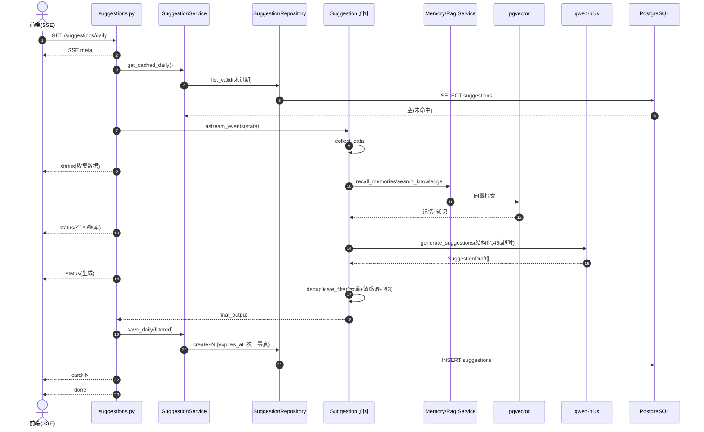
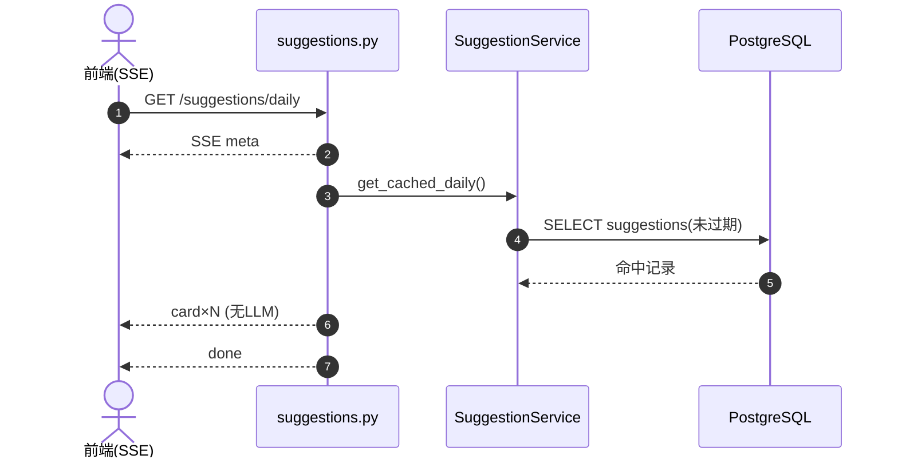

# Suggestion 建议模块 · 深度分析

> 基于 PROJECT_MAP，对 **Suggestion（建议）模块** 的单模块深度分析。
> 所有结论基于 `health-agent/backend/` 真实代码，推断内容已标注【推断】。分析模板见 `2.md`。

**一句话定位**：Suggestion 模块是产品"主动关心"价值的承载者——生成三类个性化健康建议（每日建议/餐食建议/趋势洞察）。它用一个 LangGraph 子图（收集数据→召回记忆→检索知识→LLM 生成→去重过滤）产出结构化建议，配合 SSE 流式下发和"缓存优先"策略，把多源数据聚合成有依据的建议。PROJECT_MAP 标注 ★★★☆☆。

---

## 一、模块职责

### 1.1 解决什么问题
1. **主动建议生成**：不等用户问，主动给"今天先完成饮水 2000ml"这类可执行建议（每日）。
2. **餐食推荐**：按餐次（早/午/晚/加餐）推荐吃什么 + 营养缺口分析。
3. **趋势洞察**：基于近期数据完整性/趋势，给出"连续记录 7 天能更准判断热量目标"这类洞察。
4. **个性化 + 安全**：结合用户档案、记忆、知识库做个性化；用敏感词过滤规避医疗越界。
5. **性能优化**：每日/洞察建议**缓存**（到次日零点/下周一），命中直接返回不跑 LLM。

### 1.2 系统位置
```
前端(首页/餐食页) ──SSE──▶ 【suggestions API】
                              │
            缓存命中 ─────────┤直接 emit card（极快，无 LLM）
            缓存未命中 ───────▶ Suggestion 子图(LangGraph)
                                  collect_data → recall_memories → search_knowledge
                                  → generate_suggestions(LLM) → deduplicate_filter
                                       │           │              │
                                  UserProfile  MemoryService   RagService
                              ──save──▶ SuggestionService ─▶ suggestions 表(带 expires_at)
```
属于**AI 输出层**，聚合 User/Body/Diet/Memory/Knowledge 多源数据（PROJECT_MAP：Suggestion 依赖 Memory+Knowledge+Body+Diet）。

### 1.3 上下游

| 方向 | 对象 | 关系 |
|------|------|------|
| 上游（SSE） | 前端首页/餐食页 | `/suggestions/daily`、`/meal`、`/insights` |
| 下游（数据源） | UserProfile（state.profile）、MemoryService、RagService | 个性化输入 |
| 下游（持久化/缓存） | SuggestionService → SuggestionRepository → `suggestions` 表 | 缓存建议 + 反馈 |
| 下游（LLM） | `get_chat_model` qwen-plus（结构化输出） | 生成建议 |
| 旁路（异步） | Memory 子图 | 反馈提交后 fire-and-forget 提取记忆 |

---

## 二、功能清单

### 2.1 对外 HTTP 功能

| # | 功能 | 入口 | 缓存 | 目的 | 业务价值 |
|---|------|------|------|------|---------|
| 1 | 每日建议 | `GET /suggestions/daily` | ✓到次日零点 | 主动给当日可执行建议 | "主动关心"核心体验 |
| 2 | 餐食建议 | `GET /suggestions/meal?meal_type=` | ✗每次生成 | 按餐次推荐+营养缺口 | 记饮食时的决策辅助 |
| 3 | 趋势洞察 | `GET /suggestions/insights` | ✓到下周一 | 基于趋势的深度洞察 | 数据价值变现 |
| 4 | 建议反馈 | `POST /suggestions/{id}/feedback` | — | 收集 helpful/not_helpful/dismissed | 反馈驱动记忆，优化后续 |

> **反馈评分（FeedbackRating）**：`helpful`（有帮助）/ `not_helpful`（没帮助）/ `dismissed`（忽略），**不是** like/dislike 二元。
> **免责声明（DISCLAIMER）**：所有响应（Daily/Meal/Insight）都内置 `disclaimer` 字段——"本建议仅用于日常健康管理参考，不能替代专业医疗诊断或治疗。"

### 2.2 内部功能（子图节点）

| 节点 | 功能 | 目的 |
|------|------|------|
| `collect_data` | 收集档案轻量上下文 | 取体重/目标/热量等 |
| `recall_memories` | 召回相关记忆 | 个性化（失败返空） |
| `search_knowledge` | 检索健康知识 | RAG 依据（失败返空） |
| `generate_suggestions` | LLM 结构化生成 | 产出 SuggestionDraft（45s 超时回退） |
| `deduplicate_filter` | 去重 + 敏感词过滤 + 限量 | 质量与安全闸 |

### 2.3 三类建议的差异

| 类型 | suggestion_type | 缓存有效期 | 数量上限 | 落库类型 |
|------|----------------|-----------|---------|---------|
| 每日 daily | daily | 次日零点 | 3 | proactive_insight |
| 餐食 meal | meal | 不缓存 | 5 | diet_advice |
| 洞察 insight | insight | 下周一 | 3 | trend_advice |

> **SuggestionType 共 4 个值**：`diet_advice`（餐食）、`trend_advice`（洞察）、`proactive_insight`（每日）、`goal_advice`。其中 `goal_advice` **已定义但当前缓存映射未使用**（三类建议各自固定映射上表的落库类型）。
> 缓存读取按落库类型查：daily 查 `proactive_insight`、insight 查 `trend_advice`（见 `get_cached_daily/get_cached_insights`）。

### 2.4 功能边界（不做什么）
- **Service 不调 LLM**：注释明确"LLM orchestration belongs to app.agents.suggestion"。SuggestionService 只做缓存持久化和反馈。
- **医疗越界过滤**：`deduplicate_filter` 过滤含"诊断/治疗/处方/停药/断食"的建议。

---

## 三、代码结构分析

| Java 概念 | 本模块对应 | 文件 | 职责 |
|-----------|-----------|------|------|
| Controller | API 路由 | `app/api/v1/suggestions.py` | 4 端点（3 SSE + 1 反馈），缓存判断 + 流式编排 |
| DTO/VO | Pydantic Schema | `app/schemas/suggestion.py` | Draft/Item/Response/Feedback + 枚举 |
| Service | 业务服务 | `app/services/suggestion_service.py` | 缓存读写 + 反馈 + fallback（**无 LLM**） |
| DAO/Repository | 仓储 | `app/db/repositories/suggestion_repo.py` | list_valid(缓存查) + create + 反馈，user_id 隔离 |
| Entity | ORM 模型 | `app/db/models/suggestion.py` | `suggestions` 表 |
| —（特有 Agent）| Suggestion 子图 | `app/agents/suggestion/{graph,nodes,state,tools}.py` | 5 节点线性建议生成流 |
| —（特有 Prompt）| 三套 prompt | `app/agents/prompts/suggestion_{daily,meal,insight}.py` | 三类建议的提示词 |
| Consumer/MQ | **无** | — | 反馈记忆用 asyncio 后台 |
| Scheduler | **无** | — | 无定时；缓存靠 expires_at 被动失效 |

### 各层要点
- **Controller**（`suggestions.py`）：三个 SSE 端点结构一致——`gen()` 先发 META，缓存命中直接 emit card，未命中跑 `_stream_suggestion_agent`（翻译 status 事件 + 取 final_output）→ save → emit card → done。`_stream_suggestion_agent` 监听 `on_chain_start`(发 status) 和 `deduplicate_filter` 的 `on_chain_end`(取结果)。
- **Service**（`suggestion_service.py`）：缓存读（get_cached_*）、缓存写（save_*，算 expires_at）、反馈（submit_feedback）、各类 fallback draft。`_save_many` 做内容去重。
- **Repository**（`suggestion_repo.py`）：`list_valid` 是缓存核心——按 user_id + 未过期(`expires_at IS NULL OR > now`) + 类型查最新；user_id 隔离。
- **Agent**（子图）：5 节点纯线性，无条件边、无 interrupt（与 Chat/Body 子图不同）。

---

## 四、接口清单

> `router = APIRouter(prefix="/suggestions")`，全部需 JWT（含 profile）。实际路径含全局前缀（通常 `/api/v1`）。

| # | 接口名称 | 路径 | 方式 | 功能说明 |
|---|---------|------|------|---------|
| 1 | 每日建议 | `/suggestions/daily` | GET(SSE) | 缓存优先；未命中跑子图；返回 card×N |
| 2 | 餐食建议 | `/suggestions/meal?meal_type=` | GET(SSE) | meal_type∈{breakfast,lunch,dinner,snack}；无缓存每次生成 |
| 3 | 趋势洞察 | `/suggestions/insights` | GET(SSE) | 缓存优先；未命中跑子图 |
| 4 | 建议反馈 | `/suggestions/{id}/feedback` | POST | 204 No Content；后台触发记忆提取 |

### SSE 事件序列
```
meta → [status(×N, 节点切换)] → card(×M, 建议卡) → done
```
> 注意：suggestion agent 用 `with_structured_output`，**不产生 text_delta**（无逐字流），只有 status（节点状态）和最终 card。这是与 Chat 通用对话流的关键区别。

---

## 五、Agent 分析（Suggestion 子图）

### 5.1 Graph
`build_suggestion_agent()`（`graph.py`）：5 节点纯线性图。
```
set_entry_point → collect_data → recall_memories → search_knowledge → generate_suggestions → deduplicate_filter → END
```
> 与 Chat 父图区别：① **独立 agent**（有自己的入口，被 API 直接 astream_events 驱动，非作为 Chat 子节点）；② 无条件边、无 interrupt。

### 5.2 Node

| 节点 | 输入(读 SuggestionState) | 输出 | 职责 |
|------|--------------------------|------|------|
| `collect_data` | profile, suggestion_type | recent_data | 抽档案关键字段 |
| `recall_memories` | memory_service, suggestion_type, meal_type | memories | 召回记忆，失败返空 |
| `search_knowledge` | rag_service, suggestion_type | knowledge | 检索知识，失败返空 |
| `generate_suggestions` | recent_data/memories/knowledge/meal_type | raw_suggestions, reasoning | LLM 结构化生成，45s 超时回退 fallback |
| `deduplicate_filter` | raw_suggestions, suggestion_type | filtered_suggestions | 去重+敏感词过滤+限量(meal 5/其余 3) |

### 5.3 State
`SuggestionState`（`state.py`，TypedDict）：user_id、suggestion_type(daily/meal/insight)、meal_type、profile、各 Service、recent_data、memories、knowledge、raw_suggestions、filtered_suggestions、reasoning、error。Service 直接放 state（非 configurable，因子图无 checkpointer/interrupt）。

### 5.4 Tool / Memory / Conditional Edge
- **Tool**：`recall_memories_tool`、`search_knowledge_tool`（`suggestion/tools.py`，对 MemoryService/RagService 薄封装）。
- **Memory**：子图召回记忆做个性化；反馈提交后由 API 层后台触发 Memory 子图提取。
- **Conditional Edge**：无（纯线性）。建议类型分支在节点内（`_messages_for_state` 按 suggestion_type 选 prompt）。

### 5.5 与 Chat/Body 子图的本质区别
- **无 interrupt**：建议生成是"一次性产出"，不需要 human-in-the-loop。
- **无 text_delta**：用 `with_structured_output` 出结构化 Draft，前端以 card 呈现，不逐字流。
- **独立驱动**：API 直接 `agent.astream_events(state)`，不挂在 Chat 父图下。

---

## 六、完整执行流程

> 模板含 Redis/MySQL/MQ，本项目实际：无 Redis（缓存用 suggestions 表 + expires_at）、用 PostgreSQL、无 MQ（asyncio 后台）。

### 6.1 链路 A：每日建议缓存未命中（`GET /suggestions/daily`）

```
Step1 User→Controller: GET /suggestions/daily (SSE)
Step2 gen(): yield META
Step3 service.get_cached_daily() → repo.list_valid(proactive_insight, 未过期) → None(未命中)
Step4 _build_state(profile/memory_service/rag_service)
Step5 _stream_suggestion_agent → agent.astream_events(state):
        collect_data → status事件"正在收集健康数据"
        recall_memories → MemoryService → pgvector → status
        search_knowledge → RagService → pgvector → status
        generate_suggestions → qwen-plus 结构化(45s超时→fallback) → status
        deduplicate_filter → 去重+敏感词+限3 → on_chain_end取final_output
Step6 service.save_daily(filtered) → 算 expires_at(次日零点) → repo.create×N → commit
Step7 yield card×N → yield DONE
```

### 6.2 链路 B：缓存命中

```
Step1 gen(): yield META
Step2 service.get_cached_daily() → repo.list_valid → 命中(未过期记录)
Step3 直接 yield card×N（无 LLM，极快）
Step4 yield DONE
```

### 6.3 链路 C：建议反馈（`POST /{id}/feedback`）

```
Step1 Controller→service.submit_feedback(id, rating)
Step2 repo.get(id)（user_id隔离）→ 找不到抛 SUGGESTION_NOT_FOUND
Step3 repo.set_feedback(row, rating) → 写 user_feedback+feedback_at → commit
Step4 asyncio.create_task(Memory子图) 后台提取记忆(fire-and-forget)
Step5 return 204 No Content
```

### 6.4 数据流向
```
[未命中] 前端 → suggestions.py → Suggestion子图(collect→recall→knowledge→LLM→filter)
                                    └ recall/knowledge → Memory/Rag → pgvector
                                    └ generate → qwen-plus(结构化, 45s超时→fallback)
                              → SuggestionService.save_* → suggestions表(expires_at)
                              → SSE: meta→status×N→card×M→done
[命中] 前端 → suggestions.py → service.get_cached_* → suggestions表(未过期) → SSE: meta→card→done
[反馈] 前端 → service.submit_feedback → suggestions表 → 后台Memory子图
```

---

## 七、Mermaid 时序图

### 7.1 每日建议缓存未命中（跑子图）


### 7.2 缓存命中（极快路径）


### 7.3 阅读要点
- **缓存优先是性能关键**：daily/insights 命中直接走表查 + emit card，省掉整个 LLM 子图。
- **45s 超时双保险**：`asyncio.wait_for(45s)` 包在 LangChain `timeout=60` 之上，确保 DashScope 波动时一定走 fallback，不被 SSE 总超时强杀。
- **status 而非 text_delta**：结构化输出无逐字流，前端看到的是节点进度 + 最终卡片。

---

## 八、数据库分析

### 8.1 涉及的表（1 张）

| 表 | 模型 | 作用 |
|----|------|------|
| `suggestions` | Suggestion | 建议缓存 + 反馈元数据 |

### 8.2 `suggestions` 表结构

| 字段 | 类型 | 说明 |
|------|------|------|
| `id` | UUID | PK |
| `user_id` | UUID | NOT NULL, index, 隔离键 |
| `suggestion_type` | String(40) | index；proactive_insight/diet_advice/trend_advice |
| `title` | String(120) | 建议标题 |
| `content` | Text | 建议正文（餐食的 foods 用逗号分隔存这里） |
| `basis` | Text? | 建议依据 |
| `priority` | String(20) | low/medium/high，默认 medium |
| `meal_type` | String(100)? | index；餐次（餐食建议用） |
| `dimension` | String(50)? | 洞察维度（如 data_completeness） |
| `context` | JSONB | 默认 {} |
| `data_support` | JSONB | 洞察数据支撑，默认 {} |
| `user_feedback` | String(20)? | helpful/not_helpful/dismissed |
| `feedback_at` | DateTime? | 反馈时间 |
| `expires_at` | DateTime? | **缓存过期时间**，index；NULL 表示不过期 |

### 8.3 索引与缓存机制
- **复合索引** `idx_suggestions_user_type_expires`(user_id, suggestion_type, expires_at)：直接支撑 `list_valid` 的缓存查询。
- **缓存即表查**：无 Redis，缓存就是"查未过期的 suggestions 记录"。`list_valid` 条件 `expires_at IS NULL OR expires_at > now`。
- **过期策略**：daily → 次日零点（`_next_midnight`）；insights → 下周一（`_next_monday`）；meal → 不读缓存（每次新建）。**无主动清理**，过期记录靠查询条件被动忽略（【推断】可能需额外清理任务，当前代码未见）。

### 8.4 表关系与数据流转
- 单表，无外键。user_id 逻辑隔离。
- **写**：子图产出 → save_* → create（带 expires_at）→ commit。
- **读**：list_valid（缓存命中判断）。
- **反馈**：set_feedback 更新 user_feedback/feedback_at。
- **无软删**：表无 deleted_at（与 Body/Chat 不同），靠 expires_at 控制可见性。
- 与模板 MySQL 差异：PostgreSQL + JSONB（context/data_support），无 Redis（缓存用表）。

---

## 十一、异常处理分析

### 11.1 异常捕获

| 位置 | 异常/处理 | 说明 |
|------|----------|------|
| `recall_memories`/`search_knowledge` 失败 | try/except → 返回空列表 | AI 增强降级，不影响生成 |
| `generate_suggestions` 超时 | `asyncio.TimeoutError`(45s) → `_fallback_output` | 走兜底建议 |
| `generate_suggestions` 其它异常 | except → `_fallback_output` | 无 API key 本地也能跑 |
| `submit_feedback` 找不到 | `NotFoundException(SUGGESTION_NOT_FOUND)` | — |
| 反馈后记忆提取失败 | try/except pass | 不影响 204 返回 |
| `save_*` drafts 为空 | Service 用 `_fallback_*_draft` 兜底 | 保证总有建议 |

### 11.2 三层 fallback（亮点）
1. **节点层**：`generate_suggestions` 超时/异常 → `_fallback_output`（按类型给默认建议）。
2. **过滤层**：`deduplicate_filter` 全部被过滤掉时，filtered 为空。
3. **Service 层**：`save_*` 收到空 drafts → `_fallback_daily/insight/meal_draft`。
三层保证**永远有建议返回**，不会空响应。

### 11.3 重试 / 补偿 / 幂等

| 维度 | 情况 |
|------|------|
| 重试 | 无显式重试；靠 45s 超时 + fallback |
| 补偿 | 无事务补偿 |
| 幂等 | 反馈幂等（覆盖式写 user_feedback）；缓存命中天然幂等（同一天多次请求返回同一批）；`_save_many` 内容去重防重复 |

### 11.4 超时设计细节（重要）
注释明确：LangChain 的 `timeout=60` 透传到 httpx 在"连接复用 + DashScope 波动"时**可能不触发**，导致节点永久 hang 最终被 SSE total_timeout 强杀。故用 `asyncio.wait_for(45s)` 在 asyncio 层强制超时，确保 fallback 一定走到。

---

## 十二、项目亮点

### 技术亮点
1. **三层 fallback 兜底**：节点超时回退 + 过滤兜底 + Service 兜底，保证任何情况都有建议返回，体验不空窗。
2. **asyncio 显式超时**：用 `wait_for(45s)` 补 LangChain httpx 超时不可靠的坑，避免节点 hang 死，工程经验沉淀。
3. **缓存优先 + 表即缓存**：无 Redis，用 suggestions 表 + expires_at 实现缓存，命中直接 emit card 省掉 LLM。
4. **医疗安全闸**：`deduplicate_filter` 敏感词过滤（诊断/治疗/处方/停药/断食），规避医疗越界。
5. **结构化输出**：`with_structured_output(SuggestionAgentOutput)` 让 LLM 产出可确定性过滤的 Draft。

### 架构亮点
1. **独立 agent + 直接驱动**：Suggestion 子图有独立入口，API 直接 astream_events，与 Chat 父子图模式区分。
2. **Service/Agent 分离**：Service 纯缓存+反馈零 LLM，编排在 agents，边界清晰。
3. **多源数据聚合**：collect_data(档案)+recall(记忆)+knowledge(RAG) 三源汇入 prompt，个性化与依据兼顾。
4. **反馈闭环**：反馈→后台记忆提取，形成"建议→反馈→记忆→更好建议"的数据飞轮。

### 性能 / 可扩展性
- **缓存命中零 LLM**：daily/insights 命中极快。
- **不同过期策略**：daily 日级、insights 周级，匹配建议时效性。
- **限量**：meal 5 条、其余 3 条，控制输出与成本。
- **可扩展**：新增建议类型 = 加 prompt + state 的 SuggestionKind + 节点内分支，子图骨架不变。

---

## 十三、面试讲解版

### 3 分钟版
> Suggestion 模块承载产品"主动关心"的价值，生成三类建议：每日建议、餐食建议、趋势洞察。它的核心是一个 LangGraph 子图——收集用户档案、召回记忆、检索知识库、调 LLM 结构化生成、再去重过滤，把多源数据聚合成有依据的个性化建议。

输出走 SSE 流式，但和对话不同——它用结构化输出，不逐字流，前端看到的是节点进度和最终的建议卡片。

性能上做了**缓存优先**：每日建议缓存到次日零点、洞察缓存到下周一，命中直接从表里返回卡片，完全跳过 LLM。这里没用 Redis，缓存就是带 expires_at 的 suggestions 表记录。

最值得说的是**三层 fallback**：LLM 超时走兜底、过滤后为空走兜底、保存时空 drafts 还走兜底，保证任何情况都有建议返回。还有个工程细节——用 asyncio.wait_for 显式 45 秒超时，补 LangChain httpx 超时在连接复用时不可靠的坑，避免节点 hang 死被 SSE 总超时强杀。

安全上有医疗敏感词过滤，规避"诊断/处方"这类越界建议。反馈接口还会后台触发记忆提取，形成数据飞轮。

### 10 分钟版（要点提纲）
1. **定位**：三类建议(daily/meal/insight)生成，"主动关心"价值，★★★☆☆。
2. **子图**：5 节点纯线性 collect→recall→knowledge→generate→filter，独立 agent 非 Chat 子节点。
3. **多源聚合**：档案+记忆+知识三源汇入 prompt。
4. **结构化输出**：with_structured_output→Draft，无 text_delta，前端 card 呈现。
5. **缓存优先**：daily 次日零点/insights 下周一，表+expires_at 实现，无 Redis；meal 不缓存。
6. **三层 fallback**：节点超时/过滤空/save 空，永远有建议。
7. **asyncio 超时**：wait_for(45s) 补 httpx 超时不可靠。
8. **安全过滤**：敏感词(诊断/治疗/处方/停药/断食)规避医疗越界 + 限量。
9. **反馈闭环**：feedback→后台 Memory 子图，数据飞轮。
10. **数据层**：suggestions 单表，JSONB(context/data_support)，复合索引支撑缓存查，无软删靠 expires_at。
11. **技术栈**：PostgreSQL（非MySQL）、缓存非 Redis（表）、异步非 MQ（asyncio）。

---

## 十四、新人阅读路线（只看 20% 代码）

### 必读 5 文件（按优先级）

| 优先级 | 文件 | 为什么优先 |
|--------|------|-----------|
| ① | `app/api/v1/suggestions.py` | **入口+编排**。缓存判断 + SSE 流式 + 子图驱动，主流程全在这 |
| ② | `app/agents/suggestion/nodes.py` | **核心逻辑**。5 节点 + fallback + 超时 + 敏感词过滤 |
| ③ | `app/agents/suggestion/graph.py` | **拓扑**。5 节点线性流，~37行 |
| ④ | `app/services/suggestion_service.py` | **缓存+反馈**。save/get_cached/fallback draft |
| ⑤ | `app/db/repositories/suggestion_repo.py` | **缓存查询**。list_valid 的未过期条件 |

### 可延后
- `app/agents/suggestion/state.py`（字段参考，~30行）
- `app/db/models/suggestion.py`（表结构，~40行）
- `app/agents/prompts/suggestion_*.py`（想调 prompt 时）
- `app/schemas/suggestion.py`（Draft/Item 契约手册）

### 阅读心法
1. **抓住"缓存优先"主线**：先看命中路径（极快），再看未命中路径（跑子图）。
2. **理解三层 fallback**：节点→过滤→Service，每层都兜底。
3. **对比 Chat 子图**：本子图无 interrupt、无 text_delta、独立驱动。
4. **三个"不是"**：缓存不是 Redis（表+expires_at）、不是 MySQL（PostgreSQL）、异步不是 MQ（asyncio）。

---

## 十五、带我读代码的流程

> 所有路径真实存在于 `health-agent/backend/`。

### 15.1 有序阅读清单（从外到内）

| 顺序 | 文件 | 角色 | 排序理由 |
|------|------|------|---------|
| 1 | `app/api/v1/suggestions.py` | Controller | 入口，看 4 端点 + 缓存判断 + SSE 编排 |
| 2 | `app/agents/suggestion/state.py` | State | 看子图共享字段 |
| 3 | `app/agents/suggestion/graph.py` | Graph 装配 | 看 5 节点线性拓扑 |
| 4 | `app/agents/suggestion/nodes.py` | Node 实现 | **核心**，5 节点 + fallback + 超时 + 过滤 |
| 5 | `app/agents/suggestion/tools.py` | Tool | 看记忆/知识封装 |
| 6 | `app/services/suggestion_service.py` | Service | 缓存读写 + 反馈 + fallback draft |
| 7 | `app/db/repositories/suggestion_repo.py` | Repository | list_valid 缓存查 + user_id 隔离 |
| 8 | `app/db/models/suggestion.py` | Model | suggestions 表 + expires_at |
| 9 | `app/agents/prompts/suggestion_daily.py` | Prompt | 看每日建议怎么提示 |

### 15.2 分阶段阅读

**阶段 1：跑通缓存优先主链路（文件 1, 6, 7, 8）**
目标：搞清"缓存命中和未命中两条路怎么走"。
读完应能回答：
- [ ] 缓存命中和未命中的 SSE 事件序列分别是什么？
- [ ] 缓存是怎么实现的？为什么没用 Redis？`list_valid` 的未过期条件是什么？
- [ ] daily/meal/insights 三类的缓存策略有何不同？
- [ ] 反馈接口为什么返回 204？记忆提取怎么不阻塞响应？

**阶段 2：看子图建议生成（文件 2~5, 9）**
目标：搞懂建议怎么被 LLM 生成出来。
读完应能回答：
- [ ] 5 个节点分别干什么？为什么是纯线性无条件边？
- [ ] 三类建议怎么选不同 prompt？（`_messages_for_state`）
- [ ] 为什么用 `with_structured_output`？和 Chat 的 text_delta 有何区别？
- [ ] 45s 超时为什么要用 asyncio.wait_for 而不只靠 LangChain timeout？
- [ ] 三层 fallback 分别在哪？敏感词过滤过滤什么？

### 15.3 每个文件"重点看什么"

| 文件 | 重点看 | 可略过 |
|------|--------|--------|
| `suggestions.py` | `gen()` 的缓存命中/未命中分支、`_stream_suggestion_agent` 的 status/final_output 提取、反馈后台任务 | `_meta_event` 等小工具 |
| `state.py` | suggestion_type/meal_type/各 Service 字段 | — |
| `graph.py` | 5 节点 add_edge 顺序 | cast |
| `nodes.py` | `generate_suggestions`(超时+fallback)、`deduplicate_filter`(去重+敏感词+限量)、`_messages_for_state`(选prompt) | `_fallback_output` 文案 |
| `tools.py` | 两个 tool 封装哪个 Service | — |
| `suggestion_service.py` | `save_daily/insights/meal`(算expires_at)、`get_cached_*`、`_save_many`去重 | `_item`/`_insight` 转换 |
| `suggestion_repo.py` | `list_valid` 的 expires_at 条件 + user_id | — |
| `models/suggestion.py` | expires_at、复合索引、JSONB 字段、无软删 | Mixin |
| `prompts/suggestion_daily.py` | 输出要求哪些字段 | 措辞 |

### 15.4 最短验证路径（用一个真实请求串起来）

**追踪**：`GET /suggestions/daily`（缓存未命中）

```
1. suggestions.py:get_daily_suggestions / gen()   ← 请求进入,发META
2.   suggestion_service.py:get_cached_daily         ← 查缓存
3.     suggestion_repo.py:list_valid                ← SELECT 未过期(None)
4.   suggestions.py:_build_state                    ← 组装state
5.   suggestions.py:_stream_suggestion_agent        ← astream_events
6.     suggestion/graph.py 节点链:
       collect_data → recall_memories → search_knowledge
       → generate_suggestions → deduplicate_filter
7.       nodes.py:generate_suggestions → base.py:get_chat_model ← LLM(45s超时)
8.     on_chain_end(deduplicate_filter) → final_output
9.   suggestion_service.py:save_daily               ← 算expires_at
10.    suggestion_repo.py:create×N                  ← INSERT(次日零点过期)
11. suggestions.py: yield card×N → done             ← SSE返回
```

跟完这 11 步，Controller→缓存判断→子图→LLM→save→SSE 全链路就通了。

**进阶**：再追缓存命中路径（极快，2→3 命中直接 emit card），和反馈接口（service→后台 Memory 子图），对比三条路差异。

### 15.5 可以暂时跳过

| 跳过项 | 原因 |
|--------|------|
| `suggestions.py` 的 meal/insights 端点 | 与 daily 结构一致（meal 无缓存、insights 周缓存） |
| `nodes.py` 的 `_fallback_output` 各类型文案 | 兜底内容，知道"会兜底"即可 |
| `prompts/suggestion_meal.py`、`suggestion_insight.py` | 看懂 daily 一套即可 |
| `suggestion_service.py` 的 `_fallback_*_draft` | 兜底 draft，主链路不依赖 |
| Memory/Rag 子系统内部 | 属于其它模块，知道"被调用"即可 |
