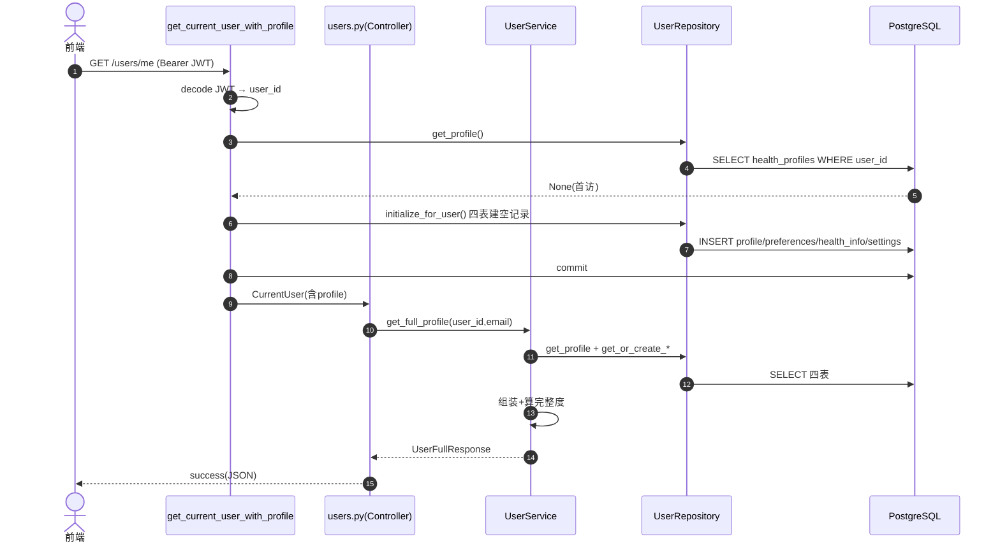
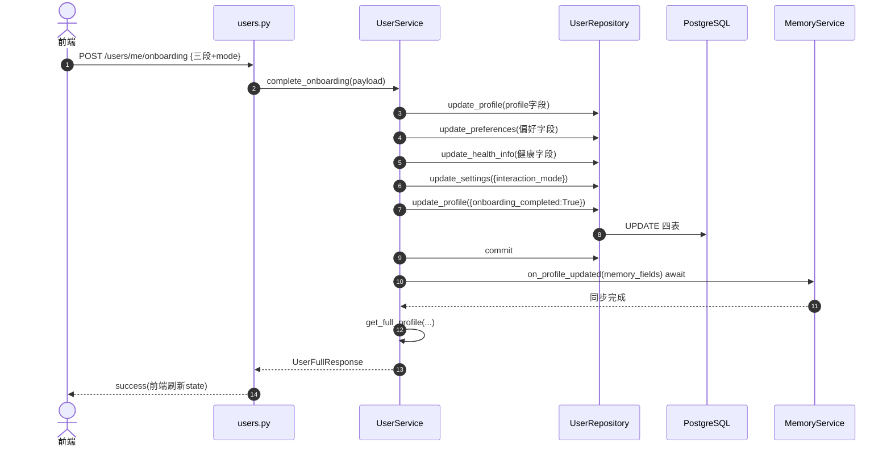

# User 用户系统模块 · 深度分析

> 基于 PROJECT_MAP，对 **User（用户系统）模块** 的单模块深度分析。
> 所有结论基于 `health-agent/backend/` 真实代码，推断内容已标注【推断】。分析模板见 `2.md`。

**一句话定位**：User 模块管理用户的"四件套"档案数据——健康档案、饮食偏好、健康信息、用户设置，外加 Onboarding 聚合提交。它是其它模块的**基础数据供给方**（身高/性别/目标体重给 Body 算 BMI、交互模式给 Chat 调风格、偏好/疾病给建议做个性化）。**不做认证**（认证是 Supabase Auth + JWT 解析），档案更新后可选同步到 Memory。PROJECT_MAP 标注 ★★★☆☆。

---

## 一、模块职责

### 1.1 解决什么问题
1. **用户档案管理**：维护用户基础身体信息（昵称/性别/生日/身高/体重/目标/活动量/热量目标）。
2. **个性化偏好沉淀**：饮食类型、过敏原、忌口、不喜欢的食物。
3. **健康信息记录**：疾病史、用药、医嘱限制（影响建议的安全边界）。
4. **交互模式设置**：efficiency/confirmation/learning，决定 AI 回复风格。
5. **Onboarding 聚合**：新用户一次性提交三段档案 + 选交互模式，标记完成。
6. **AI 数据供给**：`get_interaction_mode` 给 Chat 注入交互模式（**实际在用**，`ai.py:215`）；`get_profile_for_ai` 提供脱敏档案——**已核对：当前全项目无调用方，为预留方法**。

### 1.2 系统位置
```
前端(注册/设置页) ──REST──▶ 【UserService】─▶ UserRepository ─▶ 4 张用户表
                                  │
   认证(Supabase Auth+JWT) ──────┘（user_id 来自 JWT，不在本模块管理）
                                  │
   档案数据 ──供给──▶ Body(身高/性别算BMI)、Chat(交互模式)、Suggestion/Plan(偏好/疾病/目标)
                                  │
   档案更新 ──可选同步──▶ Memory(结构化 profile 记忆)
```
属于**基础数据层**，几乎所有上层模块都依赖它的档案数据。

### 1.3 上下游

| 方向 | 对象 | 关系 |
|------|------|------|
| 上游（认证） | Supabase Auth + JWT | user_id/email 来自 JWT 解析，**非本模块产生** |
| 上游（REST） | 前端注册/设置页 | `/users/me*` 系列 |
| 上游（AI 调用） | Chat 的 `get_interaction_mode`（`ai.py:215`） | 取交互模式注入 chat state |
| 下游 | `UserRepository` → PostgreSQL | 4 张表读写 |
| 下游（可选） | MemoryService.`on_profile_updated` | 档案更新同步记忆 |
| 被依赖 | Body（HealthProfile 注入算 BMI/体脂）、Suggestion/Plan（偏好/疾病/目标） | 提供个性化基础数据 |

---

## 二、功能清单

### 2.1 对外 HTTP 功能

| # | 功能 | 入口 | 目的 | 业务价值 |
|---|------|------|------|---------|
| 1 | 获取完整用户信息 | `GET /users/me` | 档案+偏好+健康信息+设置聚合 | 前端加载用户全量状态；首访自动建档 |
| 2 | Onboarding 提交 | `POST /users/me/onboarding` | 一次性写三段+交互模式 | 新用户引导流程，幂等 |
| 3 | 更新健康档案 | `PUT /users/me/profile` | 改基础身体信息 | 设置页编辑 |
| 4 | 更新饮食偏好 | `PUT /users/me/preferences` | 改饮食类型/过敏/忌口 | 个性化基础 |
| 5 | 更新健康信息 | `PUT /users/me/health-info` | 改疾病/用药/医嘱 | 建议安全边界 |
| 6 | 更新用户设置 | `PUT /users/me/settings` | 改交互模式 | 调 AI 回复风格 |

### 2.2 对内 Service 功能

| 方法 | 功能 | 被谁调用 |
|------|------|---------|
| `get_full_profile` | 聚合四件套（缺失子记录自动创建） | 接口1、Onboarding 返回 |
| `get_profile_for_ai` | **脱敏档案**（不含 user_id/email） | **当前无调用方（预留）** |
| `get_interaction_mode` | 取交互模式（无设置回退 confirmation） | Chat 的 `ai.py` |
| `get_profile_completeness` | 档案完整度（7 字段填充率） | 引导提示 |
| `complete_onboarding` | 聚合写三段 + 设交互模式 + 标记完成 | 接口2 |
| `update_*` | 分片更新 + 可选记忆同步 | 接口3~6 |

### 2.3 派生/业务逻辑
- **档案完整度**：`_calculate_completeness` 按 7 个必填字段（nickname/gender/birth_date/height/current_weight/target_weight/activity_level）算填充率（0~1）。
- **记忆同步**：`update_profile/preferences/health_info` 后调 `_sync_profile_memory` → `MemoryService.on_profile_updated`（preferences/health_info 字段加前缀）。**settings 更新不同步记忆**。

### 2.4 功能边界（不做什么）
- **不做认证/注册/登录**：注释明确"通过 user_id 与 auth.users 关联，Supabase Auth 托管，本服务不维护该表"。后端只验 JWT。
- **不做 LLM 编排**：Service 注释"不做 LLM 编排"，仅可选注入 MemoryService 同步记忆。
- **无删除接口**：用户档案只增改不删（账号注销【推断】由 Supabase 侧处理）。

---

## 三、代码结构分析

| Java 概念 | 本模块对应 | 文件 | 职责 |
|-----------|-----------|------|------|
| Controller | API 路由 | `app/api/v1/users.py` | 6 个端点，薄委托 |
| DTO/VO | Pydantic Schema | `app/schemas/user.py` | 5 枚举 + Update/Response + Onboarding |
| Service | 业务服务 | `app/services/user_service.py` | 聚合查询、完整度、脱敏、Onboarding、记忆同步（**无 LLM**） |
| DAO/Repository | 仓储 | `app/db/repositories/user_repo.py` | 4 表 get/get_or_create/update + initialize_for_user |
| Repository 基类 | 基类 | `app/db/repositories/base.py` | 注入 user_id，强制隔离 |
| Entity | ORM 模型 | `app/db/models/user.py` | 4 张表 |
| 认证依赖 | DI | `app/dependencies.py` | JWT 解析 + 首访自动建档 |
| Agent/Graph | **无** | — | 纯 Service，不含 LangGraph |
| Consumer/Scheduler/MQ | **无** | — | 记忆同步是 await 直调，非后台/队列 |

### 各层要点
- **Controller**（`users.py`）：6 端点全部薄委托。`/me` 和 `/onboarding` 用 `CurrentUserWithProfileDep`（确保档案存在），PUT 用 `CurrentUserDep`。
- **Service**（`user_service.py`）：核心是 `complete_onboarding`（聚合写）、`get_profile_for_ai`（脱敏）、`_calculate_completeness`（完整度）、`_sync_profile_memory`（记忆同步）。各 `_xxx_to_response` 做 ORM→Schema 转换。
- **Repository**（`user_repo.py`）：继承 `BaseRepository`（构造注入 user_id）。HealthProfile 用 `update`（不存在返 None），其余三表用 `get_or_create_xxx`（按需建）。`initialize_for_user` 在四表各建一条空记录。`_apply_updates` 忽略 None（PUT 语义）。
- **认证依赖**（`dependencies.py`）：`get_current_user` 从 JWT 解析；`get_current_user_with_profile` 首访时 `initialize_for_user` 自动建档；`get_user_service` 注入 MemoryService。

---

## 四、接口清单

> `router = APIRouter(prefix="/users")`，全部需 JWT 鉴权。实际路径含全局前缀（通常 `/api/v1`）。

| # | 接口名称 | 路径 | 方式 | 功能说明 | 鉴权依赖 |
|---|---------|------|------|---------|---------|
| 1 | 获取当前用户 | `/users/me` | GET | 返回 UserFullResponse（四件套聚合）；首访自动建档 | CurrentUserWithProfile |
| 2 | Onboarding 提交 | `/users/me/onboarding` | POST | OnboardingPayload→聚合写+标记完成，幂等 | CurrentUserWithProfile |
| 3 | 更新档案 | `/users/me/profile` | PUT | UserProfileUpdate→改基础信息 | CurrentUser |
| 4 | 更新偏好 | `/users/me/preferences` | PUT | UserPreferencesUpdate | CurrentUser |
| 5 | 更新健康信息 | `/users/me/health-info` | PUT | UserHealthInfoUpdate | CurrentUser |
| 6 | 更新设置 | `/users/me/settings` | PUT | UserSettingsUpdate（交互模式） | CurrentUser |

### 关键约定
- **PUT 语义**：所有 Update 字段 Optional，未传字段保持原值（`_apply_updates` 跳过 None）。
- **入参校验**：身高 100~250cm、体重 30~300kg、热量 500~6000kcal、昵称 2~20 字、过敏≤20 项、忌口/不喜欢≤50 项。
- **响应统一**：`success(data.model_dump(mode="json"))`，包在 `ApiResponse[T]`。

---

## 五、Agent 分析

**本模块不涉及 LangGraph，无 Graph/Node/State/Tool/Conditional Edge。** 它是纯 Service 层。

与 AI 的关联仅两点（被动供给）：
1. **被 Chat 读取**：`ai.py:215` 调 `user_service.get_interaction_mode()` 把交互模式注入 chat state，影响 system prompt 风格（efficiency/confirmation/learning）。
2. **写后同步 Memory**：档案/偏好/健康信息更新后 `await memory_service.on_profile_updated(fields)`，把结构化档案变更同步成记忆。这是**直接 await 调用**，非 LangGraph、非后台任务。

---

## 六、完整执行流程

> 模板含 Redis/MySQL/MQ，本项目实际：无 Redis、用 PostgreSQL、无 MQ（记忆同步是 await 直调）。

### 6.1 链路 A：首次访问 `GET /users/me`（含自动建档）

```
Step1 User→Controller: GET /users/me (Bearer JWT)
Step2 依赖 get_current_user_with_profile:
        - get_current_user: decode JWT → CurrentUser(id,email)
        - UserRepository(session, user_id).get_profile() → None(首访)
        - initialize_for_user(): 四表各建空记录 → commit
Step3 Controller→UserService.get_full_profile(user.id, email)
Step4 Service: get_profile + get_or_create_preferences/health_info/settings → commit
Step5 组装 UserFullResponse(profile含完整度 + 偏好 + 健康信息 + 设置)
Step6 Controller: success(JSON)
```

### 6.2 链路 B：Onboarding 提交 `POST /users/me/onboarding`

```
Step1 User→Controller: POST onboarding {profile, preferences, health_info, interaction_mode}
Step2 Service.complete_onboarding:
        - payload.profile → repo.update_profile(非None字段) + 收集 memory_fields
        - payload.preferences → repo.update_preferences + memory_fields(加 preferences.前缀)
        - payload.health_info → repo.update_health_info + memory_fields(加 health_info.前缀)
        - repo.update_settings({interaction_mode})
        - repo.update_profile({onboarding_completed: True})
        - session.commit()
Step3 _sync_profile_memory(memory_fields) → MemoryService.on_profile_updated (await)
Step4 return get_full_profile(...) → 前端刷新本地 state
```

### 6.3 链路 C：分片更新 `PUT /users/me/profile`

```
Step1 Controller→Service.update_profile(user_id, data)
Step2 data.model_dump(exclude_unset=True) → 只取传了的字段
Step3 repo.update_profile(fields): get_profile → _apply_updates(忽略None) → flush
        (profile 不存在 → 抛 NotFoundException USER_NOT_FOUND)
Step4 session.commit()
Step5 _sync_profile_memory(fields) → MemoryService (await)
Step6 return _profile_to_response(含重新计算的完整度)
```

### 6.4 数据流向
```
[认证] JWT → get_current_user → user_id（贯穿全链路隔离键）
[读] users.py → UserService.get_full_profile → UserRepository(4表) → PostgreSQL
[写] users.py → UserService.update_* → UserRepository(_apply_updates忽略None) → PostgreSQL
                                     → MemoryService.on_profile_updated (await同步)
[供给] Chat ai.py → get_interaction_mode → user_settings 表
```

---

## 七、Mermaid 时序图

### 7.1 首访 GET /users/me（自动建档）


### 7.2 Onboarding 提交（聚合写 + 记忆同步）


### 7.3 阅读要点
- **首访自动建档**发生在认证依赖层（`get_current_user_with_profile`），早于 Controller，对业务透明。
- **记忆同步是 await 直调**（阻塞在请求内），与 Body/Chat 的 fire-and-forget 后台模式不同——【推断】因档案变更频率低、量小，无需异步化。
- Onboarding 用多次 `update_*` + 单次 commit，保证一次提交原子性。

---

## 八、数据库分析

### 8.1 涉及的表（4 张，全部 user_id 唯一）

| 表 | 模型 | 作用 | 关键字段 |
|----|------|------|---------|
| `health_profiles` | HealthProfile | 健康档案 | nickname/gender/birth_date/height/current_weight/target_weight/activity_level/goal_type/daily_calorie_target/**onboarding_completed** |
| `user_preferences` | UserPreference | 饮食偏好 | diet_type/allergies[]/forbidden_foods[]/disliked_foods[] |
| `user_health_info` | UserHealthInfo | 健康信息 | diseases[]/medications/medical_restrictions |
| `user_settings` | UserSetting | 用户设置 | interaction_mode(默认 confirmation) |

### 8.2 表设计要点
- **统一基类**：4 张表均混入 `UUIDPrimaryKeyMixin`+`TimestampMixin`（**无 SoftDeleteMixin**，不软删）。
- **user_id unique**：每表 `user_id` 都是 `unique=True`——一个用户每类档案**仅一条**（1:1 关系，非 1:N）。这是与 Body/Diet（1:N 记录流水）的本质区别。
- **数组字段**：allergies/forbidden_foods/disliked_foods/diseases 用 PostgreSQL `ARRAY(String)`，default `{}`。
- **无外键到 auth.users**：user_id 逻辑关联 Supabase Auth 的 auth.users，跨库无 DB 外键。

### 8.3 表关系与数据流转
```
auth.users(Supabase托管) ──user_id(逻辑1:1)──▶ health_profiles
                                              ├─▶ user_preferences
                                              ├─▶ user_health_info
                                              └─▶ user_settings
```
- 4 张表互相独立、无外键，靠 user_id 逻辑聚合成"一个用户的四件套"。
- **创建**：首访 `initialize_for_user` 四表各建空记录；或 get_or_create 按需建。
- **更新**：`_apply_updates` 忽略 None，PUT 语义（部分更新）。
- **无删除**：表无软删字段，业务无删除接口。
- 与模板 MySQL 差异：PostgreSQL，UUID 主键，`ARRAY` 类型。

---

## 十一、异常处理分析

### 11.1 异常捕获

| 位置 | 异常 | 处理 |
|------|------|------|
| `get_full_profile` profile 为 None | `NotFoundException(USER_NOT_FOUND)` | 理论上不会触发（首访已建档） |
| `update_profile` profile 为 None | `NotFoundException(USER_NOT_FOUND)` | HealthProfile 不 get_or_create |
| JWT 无效/过期 | `UnauthorizedException(AUTH_TOKEN_INVALID)` | 认证层（dependencies.py） |
| 入参越界 | Pydantic ValidationError | Schema 层（身高/体重/热量范围等） |

### 11.2 设计差异：profile vs 其余三表
- **HealthProfile**：`update_profile` 找不到返 None → Service 抛 NotFoundException（档案是核心，必须先建）。
- **preferences/health_info/settings**：用 `get_or_create_*`，更新时不存在就**自动建**，不报错（容错性更高）。

### 11.3 重试 / 补偿 / 幂等

| 维度 | 情况 |
|------|------|
| 重试 | 无显式重试 |
| 补偿 | 无事务补偿；Onboarding 多次 update + 单次 commit 保原子性 |
| 幂等 | **Onboarding 幂等**（注释明确：已完成用户再次调用等价一次聚合更新）；PUT 天然幂等（覆盖式更新）；`get_or_create` 幂等（已存在直接返回） |

### 11.4 记忆同步的容错
`_sync_profile_memory` 在 `memory_service is None or not fields` 时直接返回（无 MemoryService 或无变更字段就跳过），不会因记忆功能缺失而阻断档案更新。

---

## 十二、项目亮点

### 技术亮点
1. **首访自动建档**：`get_current_user_with_profile` 在认证依赖层透明完成"JWT 校验 + 缺档案则初始化四表"，业务代码无需关心"用户是否已建档"。
2. **PUT 部分更新语义**：`_apply_updates` 统一忽略 None + `model_dump(exclude_unset=True)`，精确实现"只改传了的字段"。
3. **脱敏供给 AI（预留）**：`get_profile_for_ai` 剥离 user_id/email，隐私边界清晰——但**当前无调用方**，是为未来 AI 个性化预留的能力。
4. **完整度量化**：7 必填字段填充率，驱动前端引导补全。
5. **get_or_create 容错**：偏好/健康/设置三表按需建，避免"子记录缺失"导致的空指针。

### 架构亮点
1. **认证与档案解耦**：认证（Supabase Auth/JWT）不在本模块，本模块只管 user_id 之后的业务数据，职责清晰。
2. **1:1 档案设计**：user_id unique 保证每用户单条档案，区别于 Body/Diet 的 1:N 流水，语义明确。
3. **可选记忆同步**：MemoryService 可注入可不注入（`memory_service | None`），档案模块不强依赖记忆系统。
4. **基础数据中枢**：作为身高/性别/目标/偏好/交互模式的唯一来源，被 Body/Chat/Suggestion/Plan 复用。

### 可扩展性
- 新增档案字段 = 加 model 列 + Schema 字段 + （可选）加入完整度必填集，模式简单。
- 新增交互模式 = 改 InteractionMode 枚举 + Chat 的 prompt 映射。
- 【推断】记忆同步从 await 改后台 = 仿 Body 的 `asyncio.create_task` 模式即可。

---

## 十三、面试讲解版

### 3 分钟版
> User 模块管理用户的"四件套"档案：健康档案（身高体重目标等）、饮食偏好（过敏忌口）、健康信息（疾病用药）、用户设置（交互模式），外加新用户的 Onboarding 聚合提交。

它是整个产品的**基础数据中枢**——身高性别给 Body 算 BMI 和体脂，交互模式给 Chat 调回复风格，偏好和疾病给建议做个性化和安全边界。但它本身**不做认证**，用户身份来自 Supabase Auth 的 JWT，后端只验签拿 user_id。

有个巧妙设计：**首访自动建档**。用户第一次调后端时，认证依赖层发现没档案就自动在四张表建空记录，业务代码完全不用关心"用户建没建档"。

数据上四张表都是 user_id 唯一的 1:1 关系——一个用户每类档案只有一条，区别于身体数据那种 1:N 流水。PUT 更新都是部分更新语义，只改传了的字段。档案更新后还会可选地同步到记忆系统，让 AI 记住用户偏好的变化。

### 10 分钟版（要点提纲）
1. **定位**：用户四件套档案 + Onboarding，基础数据中枢，★★★☆☆，纯 CRUD 无 LLM 无 Agent。
2. **四张表**：health_profiles / user_preferences / user_health_info / user_settings，全部 user_id **unique（1:1）**。
3. **6 个端点**：GET /me、POST /onboarding、PUT profile/preferences/health-info/settings。
4. **认证解耦**：user_id 来自 Supabase JWT，本模块不管注册登录；首访 `get_current_user_with_profile` 自动建档。
5. **Onboarding**：聚合写三段 + 交互模式 + 标记完成，幂等，多 update 单 commit 保原子。
6. **PUT 语义**：`_apply_updates` 忽略 None + `exclude_unset`，部分更新。
7. **profile vs 其余**：profile 不 get_or_create（找不到报错），其余三表 get_or_create 容错。
8. **AI 供给**：`get_interaction_mode` 给 Chat（在用）；`get_profile_for_ai` 脱敏档案（预留未用）。
9. **记忆同步**：update 后 await `on_profile_updated`（settings 不同步），可选依赖。
10. **完整度**：7 必填字段填充率驱动引导。
11. **技术栈**：PostgreSQL+ARRAY（非 MySQL），无 Redis/MQ，记忆同步是 await 非后台。

---

## 十四、新人阅读路线（只看 20% 代码）

### 必读 4 文件（按优先级）

| 优先级 | 文件 | 为什么优先 |
|--------|------|-----------|
| ① | `app/services/user_service.py` | **核心**。聚合查询、Onboarding、完整度、脱敏、记忆同步全在这 |
| ② | `app/db/models/user.py` | **数据契约**。四张表 1:1 结构，~90行，秒懂 |
| ③ | `app/dependencies.py`(63~128) | **认证+建档+DI**。理解 user_id 哪来的、首访怎么自动建档 |
| ④ | `app/db/repositories/user_repo.py` | **数据访问**。get_or_create 模式 + _apply_updates 部分更新 |

### 可延后
- `app/api/v1/users.py`（6 端点极薄）
- `app/schemas/user.py`（枚举+字段参考手册）
- `app/db/repositories/base.py`（BaseRepository，~30行）

### 阅读心法
1. **抓住"基础数据供给"主线**：谁用这些档案、用来干什么（Body 算 BMI、Chat 调风格）。
2. **理解 1:1 vs 1:N**：本模块四表都是 user_id 唯一的 1:1，和 Body/Diet 的流水表本质不同。
3. **看清认证边界**：user_id 来自 JWT，本模块不管认证，只管 user_id 之后的业务。
4. **两个"不是"**：不是 MySQL（PostgreSQL+ARRAY）、记忆同步不是后台（await 直调）。

---

## 十五、带我读代码的流程

> 所有路径真实存在于 `health-agent/backend/`。

### 15.1 有序阅读清单（从外到内）

| 顺序 | 文件 | 角色 | 排序理由 |
|------|------|------|---------|
| 1 | `app/api/v1/users.py` | Controller | 入口，6 端点一览 |
| 2 | `app/schemas/user.py` | Schema | 看 5 枚举 + Update/Response + Onboarding 契约 |
| 3 | `app/dependencies.py`(56~128) | 认证+DI | 看 user_id 来源 + 首访自动建档 + Service 装配 |
| 4 | `app/services/user_service.py` | Service | **核心**业务逻辑 |
| 5 | `app/db/repositories/user_repo.py` | Repository | get_or_create + _apply_updates + initialize_for_user |
| 6 | `app/db/repositories/base.py` | 基类 | user_id 注入 |
| 7 | `app/db/models/user.py` | Model | 四张表结构 |

### 15.2 分阶段阅读

**阶段 1：跑通 GET /me + 自动建档（文件 1~3, 7）**
目标：搞清"用户第一次访问怎么自动有了档案"。
读完应能回答：
- [ ] user_id 是哪来的？本模块管认证吗？
- [ ] `get_current_user_with_profile` 和 `get_current_user` 区别？
- [ ] 首访没档案时，谁、在什么时机建了四张表的空记录？
- [ ] `CurrentUserWithProfileDep` 和 `CurrentUserDep` 分别用在哪些端点？为什么？

**阶段 2：看更新与 Onboarding（文件 4~5）**
目标：搞懂部分更新语义和聚合提交。
读完应能回答：
- [ ] PUT 的"未传字段不改原值"怎么实现的？（`_apply_updates` + `exclude_unset`）
- [ ] HealthProfile 和其余三表在"找不到记录"时行为有何不同？为什么？
- [ ] Onboarding 怎么保证一次提交的原子性？为什么幂等？
- [ ] 哪些更新会同步记忆？哪个不会？

**阶段 3：看数据模型（文件 6~7）**
读完应能回答：
- [ ] 四张表为什么 user_id 都 unique？这表示什么关系（1:1 还是 1:N）？
- [ ] 数组字段（过敏/疾病）用什么类型存？
- [ ] 为什么这些表没有软删除字段？

### 15.3 每个文件"重点看什么"

| 文件 | 重点看 | 可略过 |
|------|--------|--------|
| `users.py` | 6 端点的依赖（CurrentUser vs WithProfile） | success 包装 |
| `schemas/user.py` | UserProfileUpdate 的范围校验、OnboardingPayload 结构、InteractionMode | 全部枚举值 |
| `dependencies.py` | `get_current_user_with_profile` 的自动建档、`get_user_service` 注入 MemoryService | JWT 解码细节 |
| `user_service.py` | `complete_onboarding`、`get_profile_for_ai`、`_calculate_completeness`、`_sync_profile_memory` | `_xxx_to_response` 字段搬运 |
| `user_repo.py` | `_apply_updates`(忽略None)、`get_or_create_*`、`initialize_for_user`、profile 不 get_or_create | — |
| `base.py` | 构造注入 user_id | flush |
| `models/user.py` | 四表 user_id **unique**、ARRAY 字段、onboarding_completed、无软删 | Mixin 内部 |

### 15.4 最短验证路径（用一个真实请求串起来）

**追踪**：新用户首次 `GET /users/me`

```
1. dependencies.py:get_current_user          ← decode JWT → user_id
2. dependencies.py:get_current_user_with_profile
3.   user_repo.py:get_profile()              ← SELECT health_profiles → None(首访)
4.   user_repo.py:initialize_for_user()      ← 四表建空记录
5.     create_empty_profile + get_or_create_preferences/health_info/settings
6.   session.commit()
7. users.py:get_me                            ← Controller
8.   user_service.py:get_full_profile         ← Service
9.     user_repo.py: get_profile + get_or_create_* ← SELECT 四表
10.    _profile_to_response → _calculate_completeness ← 算完整度
11. users.py:success(UserFullResponse)        ← 返回
```

跟完这 11 步，认证→建档→Controller→Service→Repository→响应全链路就通了。

**进阶**：再追 `POST /users/me/onboarding`，看 `complete_onboarding` 怎么聚合写四表 + 同步记忆 + 标记完成。

### 15.5 可以暂时跳过

| 跳过项 | 原因 |
|--------|------|
| `users.py` 的 PUT preferences/health-info/settings | 与 update_profile 模式一致 |
| `user_service.py` 的 `_xxx_to_response` 系列 | 纯 ORM→Schema 搬运 |
| `schemas/user.py` 的全部枚举值列举 | 用到再查 |
| JWT 解码内部（`decode_supabase_jwt`） | 属于认证基础设施，知道"产出 user_id"即可 |
| MemoryService 内部 | 属于 Memory 模块，知道"被 await 同步"即可 |
